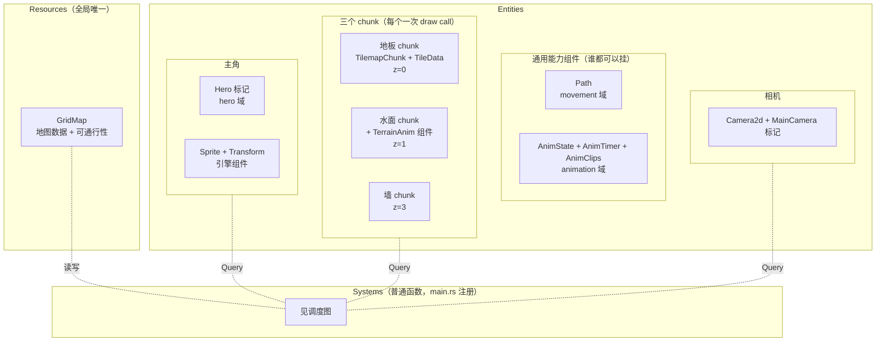
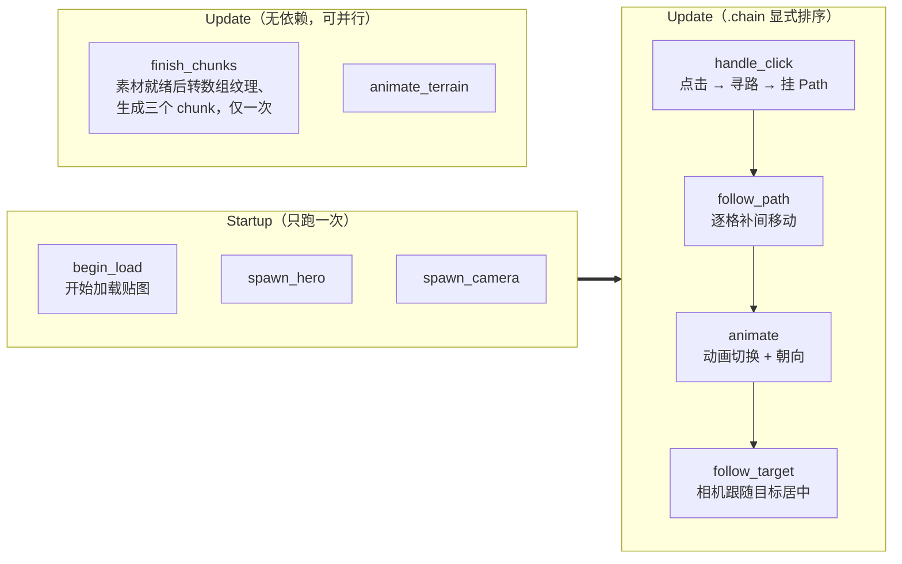
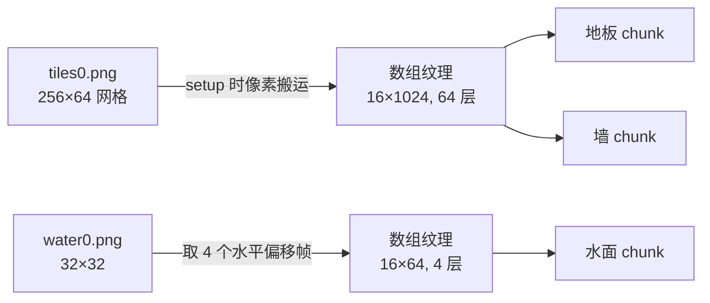
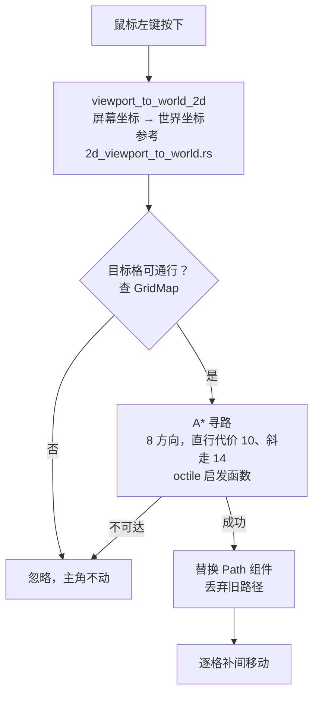
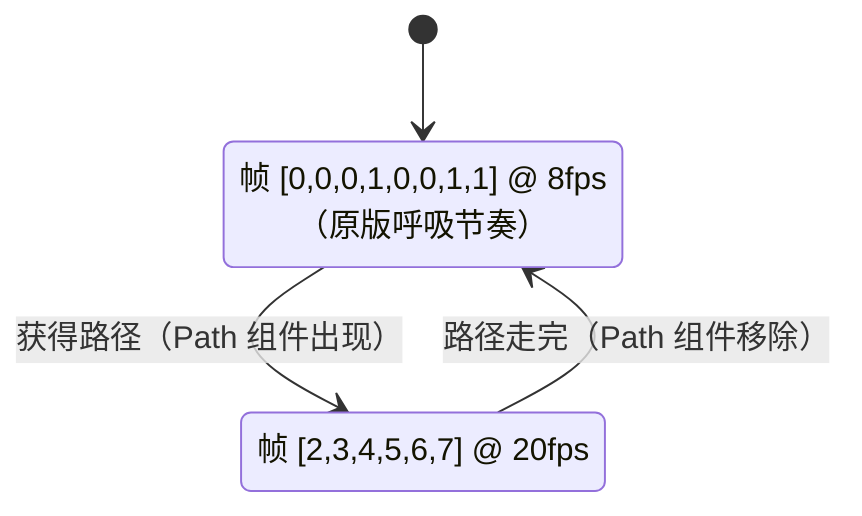

# Design: mvp-room-hero-movement

## Context

`new-tome2/` 目前只有空的 git 仓库。本 change 从零搭建 Bevy 0.19 桌面工程，素材取自 `../pixel-dungeon/assets/`（GPLv3）：

- `warrior.png` 256×128 — 主角精灵表，帧 12×15，每行一套装备外观（tier）；idle = 帧 0/1 交替，run = 帧 2–7 @20fps（参考 `HeroSprite.java` 的 `updateArmor()`）
- `tiles0.png` 256×64 — 下水道风格 tile 集，16×16 每格，共 16 列 × 4 行 = 64 个 tile。**瓦片索引直接等于原版 `Terrain` 常量值**（`Tilemap.updateRenderData` 里 `tileset.get(data[pos])`，地板=1、墙=4、水=48–63）
- `water0.png` 32×32 — 水面平铺纹理（原版用 `SkinnedBlock` 滚动 + 透明度脉动，见 `GameScene.java`）

参考资料：

- Bevy 官方入门文档（getting-started/）：App/ECS/Plugin/Resource 概念摘要已录入 `openspec/config.yaml`
- `../bevy` v0.19.1 examples：`2d/tilemap_chunk.rs`（内置 chunk 瓦片渲染，一次 draw call）、`sprite_animation.rs`、`2d_viewport_to_world.rs`、`app/plugin.rs`
- 插件定位调研结论已作为架构原则录入 `openspec/config.yaml`（内核不拆插件；Plugin 是编译期装配单元）

工程依赖用 crates.io 的 `bevy = "0.19"`。

## Goals / Non-Goals

**Goals:**
- 1280×720 桌面窗口，2× 相机缩放（视野 640×360 世界像素）；房间 64×48 格（1024×768 px）大于视野，触发滚屏
- 格子地图含地形类型与可通行属性；水池作为不可通行的房内障碍
- 鼠标左键点击 → A\* 8 方向寻路 → 主角逐格补间移动（还原原版步进手感）
- 主角 idle/run 帧动画切换、朝向翻转
- 水面动画（还原原版流动效果）
- 相机始终跟随主角居中；地图外区域显示为背景色（与原版一致）

**Non-Goals:**
- 关卡生成、多楼层、门/陷阱/楼梯等地形语义
- 战斗、物品、UI、音效
- 视野迷雾（fog of war）
- 墙沿前景遮挡（原版 1.9.1 没有此效果；Shattered 风格 raised walls 留待后续独立 change）
- 拖动持续移动、键盘移动、手柄/触屏
- CI、headless 渲染测试（只做单元测试 + 人工运行验证）

## Bevy 概念映射

要点：有依赖的系统用 `.chain()` 显式排序（点击先于移动、移动先于相机），无依赖的水面动画不 chain（参考 `ecs.md`）。`GridMap` 是 Resource；主角、chunk、相机是 entity；**瓦片不是 entity**。`Path` 归 movement 域、`AnimState` 等归 animation 域——这两个能力怪物也会用，不绑定在主角域里。

## Decisions

### Decision 1: 工程结构——内核按域组织

单 bin crate。游戏内核按域分目录，域内按 ECS 侧面分子目录——完整规范见 `openspec/config.yaml` 架构原则，**具体目录落位以代码为准**，本文不列目录树（避免与代码漂移）。

本 change 的域划分与职责：

- `map/`：静态世界数据及基于它的一切——GridMap、可通行性、坐标换算、寻路、tileset 构建、chunk 生成、地形动画（渲染管线由 map 收口）
- `movement/`：通用能力——Path 组件、沿路径逐格补间（不认识 Hero，不认识可通行性）
- `animation/`：通用能力——AnimState/AnimClips/AnimTimer、帧驱动、flip_x（单向依赖 movement 的 Path）
- `hero/`：Hero 标记、生成（含战士帧表）、点击输入（点击 → 寻路 → 挂 Path）
- `camera/`：MainCamera、CameraTarget 标记、跟随（只认 CameraTarget，不认识 hero）

依赖方向（无环）：movement → map；animation → movement；hero → movement / map / camera；camera 自足。

注册约定：每域 mod.rs 里定义 `register`（裸函数即 Plugin），只注册域内自治系统；跨域 `.chain()`（点击→移动→动画→相机）属装配级，留在 main.rs。

### Decision 2: 渲染用内置 TilemapChunk

采用 Bevy 0.19 内置的 `TilemapChunk`（`bevy::sprite_render`，参考 `examples/2d/tilemap_chunk.rs`）：整个房间 64×48 格装一个 chunk，一次 draw call；瓦片位置由 chunk 原点 + 整数索引计算，无逐格浮点累积，不会错位。不引入 `bevy_ecs_tilemap`（第三方版本跟随约束；其分块思路与内置 chunk 一致，无需依赖）。

约束与对策：chunk 的 tileset 必须是**纵向堆叠的数组纹理**（`ImageArrayLayout::RowCount`），而素材是网格图。对策：运行时转换——setup 系统从 `Assets<Image>` 读出已加载的网格图像素，搬运成堆叠数组纹理（tiles0.png 256×64 → 16×1024，64 层；water0.png 32×32 → 4 个水平偏移 8px 的 16×16 帧堆叠）。约 40 行，无外部工具依赖。

### Decision 3: 固定 z 层

地板 0 / 水面 1 / 主角 2 / 墙 3。主角 12×15 精灵底对齐装在 16px 格内（`CharSprite` 定位代码），与上方墙格像素不重叠；原版 1.9.1 也是整个 tilemap 画完才画角色（`GameScene.create()` 中 terrain 组先于 mobs 组），固定层序与原版视觉效果一致。Shattered PD 的 raised walls（墙沿盖住贴墙站立的主角头顶）留作后续 change。

### Decision 4: 地图数据

- `GridMap` 是 **Resource**：`width / height` + `Vec<TileKind>`；`TileKind` 分 `Floor / Wall / Water`，`walkable()` 只有 `Floor` 为 true
- chunk 的 `TilemapChunkTileData` 是 `GridMap` 的渲染投影：逻辑查询一律走 `GridMap`，chunk 数据只在生成和动画时写
- 世界坐标约定：格子 (x, y) 的中心 = `(x·16+8, -(y·16+8))`（Bevy 2D 世界 Y 轴向上，地图行号向下，故取负）
- 房间硬编码生成：64×48，四周墙，中央偏下挖一个 8×5 水池，其余地板。`GridMap` 本身不绑定硬编码，后续换生成器时数据结构不变
- 瓦片索引直接用原版 Terrain 常量（地板=1、墙=4），不做自动拼接（auto-tiling 留待后续）

### Decision 5: 点击 → 寻路 → 移动

- A\* 自实现（约 80 行，不引第三方 crate）；斜走只要求目标格本身可通行，允许从两面墙的夹角斜穿过去（与 PD 原版一致）
- 移动是逐格补间（tween）：每步从当前格中心补间到下一格中心；步时长 = `TILE_TIME × 步长`（直行步长 1、斜走 √2），`TILE_TIME = 0.15s`，直线速度恒定约 107 px/s，还原原版一步一顿的手感（参考 `CharSprite.move()`）。补间进度存在 `Path` 组件里，每帧用 `Time` 资源推进
- 移动中收到新目标：立即中断当前步，以当前位置所在格为起点重新寻路

### Decision 6: 主角动画状态机

- `TextureAtlasLayout::from_grid(12×15, 21 列, 8 行)` 直接加载整张 warrior.png（右下留白自动裁掉）；行号 = tier，MVP 固定 tier 0
- `AnimState`（Idle/Run）、`AnimClips`（帧表）、`AnimTimer`（内含 `Timer`，参考 `resources.md` 的 Timer 用法）由 animation 域提供，作为组件挂在任何需要帧动画的实体上：

- 朝向：水平位移为负时 `flip_x = true`，为正时取消（原版 `CharSprite.flipHorizontal`）

### Decision 7: 地形动画配置化

动画地形是**配置，不是子域**：一张配置表（`TerrainAnimSpec`：贴图路径、帧偏移、fps、透明度脉动范围、对应 TileKind、所在 z 层），水只是第一个条目。通用机制只有两份：通用的 `offset_frames` 纯函数（从平铺纹理按偏移序列抽帧，构建数组纹理）；通用的 `TerrainAnim` 组件 + 一个动画系统，驱动所有动画地形的覆盖 chunk（帧循环 + alpha 脉动）。

新增岩浆、毒气等动画地形 = 配置表加一行 + 放入贴图，零结构改动（开闭原则）。水的条目：water0.png，偏移 [0,8,16,24]，4fps，alpha 0.8–1.0，z=1（原版是整个水层统一脉动，`TileData` 恰好支持每格颜色，等效实现）。动画只读写 chunk 的瓦片数据，不为水格建 entity。

### Decision 8: 相机

相机 entity 挂 `Camera2d` + `MainCamera` 标记组件（点击系统和跟随系统用查询获取，参考 `2d_viewport_to_world.rs`）。每帧把相机位置设为主角位置，主角始终居中；地图外区域显示为背景色（与原版一致）。

## Risks / Trade-offs

- **Bevy 首次编译慢**（全量约 5–15 分钟）：接受，后续可考虑动态链接 feature 加速迭代，不纳入本 change
- **运行时转换数组纹理**：启动时多一步等待素材加载；实现上用加载状态轮询，失败时报错退出
- **水面动画只修改 chunk 的瓦片数据**：未来新增地形动画照此扩展（数据驱动）；只有带状态的地形（将来的门）才稀疏建 entity
- **水动画是帧切换而非像素级连续滚动**：视觉近似原版的流动效果；要完全还原需自定义材质，留待后续
- **允许斜穿墙角**：与原版一致，但后续做"门"等地形时可能需要禁止，届时在寻路里加规则
- **墙层不做前景遮挡**：与原版 1.9.1 一致；若将来要 Shattered 风格 raised walls，加一个前景条带 chunk 即可，不影响现有结构
