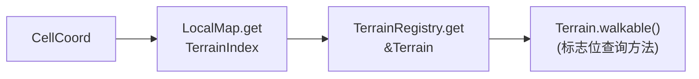
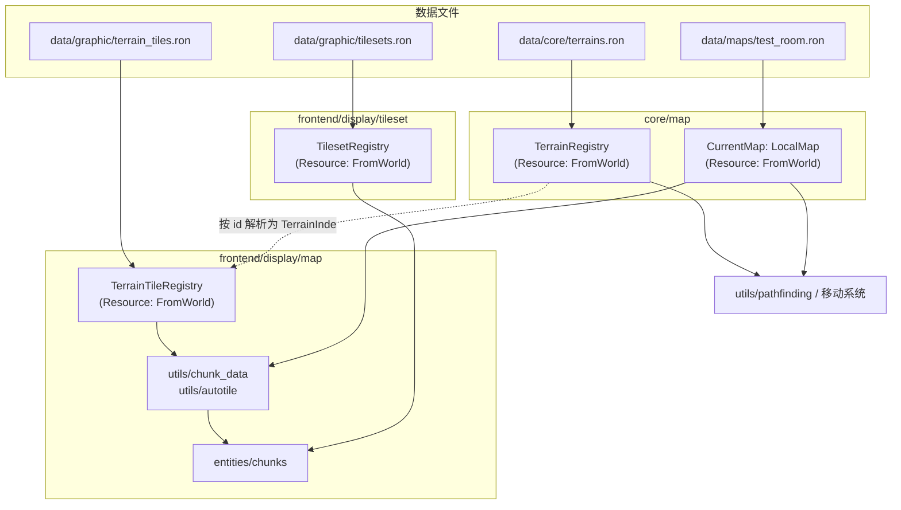
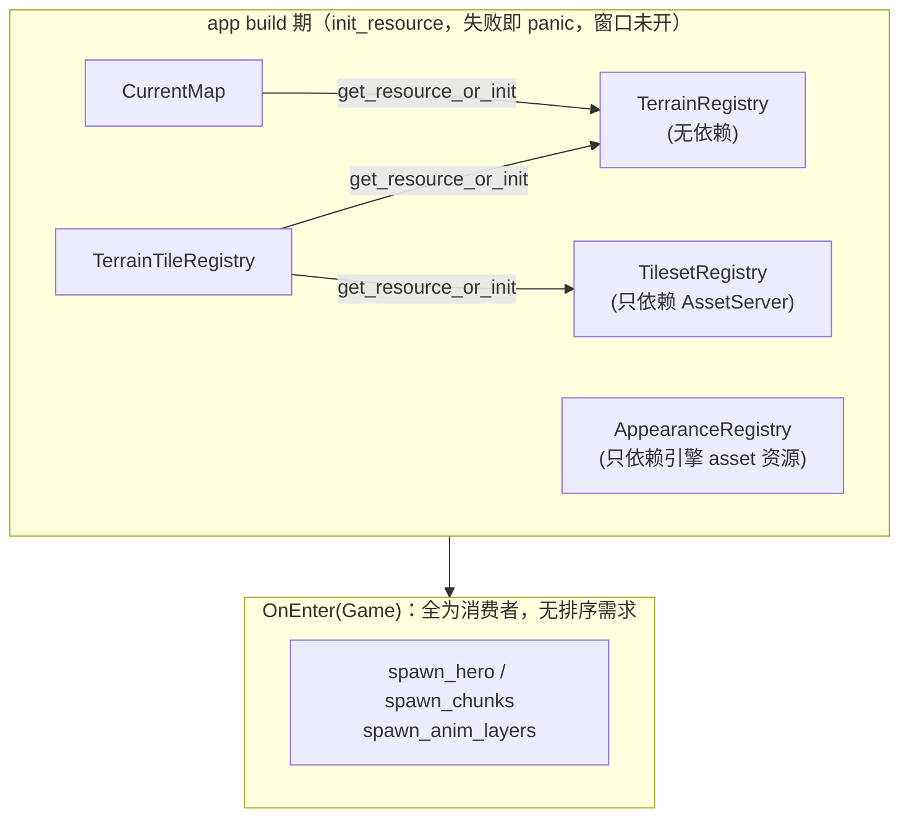

# Design: data-driven-local-map

## Context

现状：房间地图由 `GridMap::demo_room()` 在代码里铺出（围墙边 + 中央水池），地形是 `TileKind` 三值枚举，宽高是 `MAP_W/MAP_H` 常量；显示侧按枚举 match 把格子分流进 floor/wall 两个 chunk，岸线按"邻居非地板"推导，tileset 帧号写死在常量里（`TILE_FLOOR/TILE_WALL/TILE_SHORE_BASE`）。动机见 proposal.md。

已确认的规格基线：`specs/grid-map/spec.md`（本 change 的 delta）——地形注册表、地图数据文件、数据校验、测试房间的空间性质。

## Goals / Non-Goals

**Goals:**

- 地形种类与属性全部由数据文件定义，代码只持有位标志常量与运行时句柄，新增地形零代码改动。
- 地图内容全部由数据文件定义，字符铺图直观可读。
- 显示素材（图集、地形画法）全部由数据文件定义，core 不感知任何像素概念。
- 运行表现与现状完全一致；加载失败在窗口打开前 panic 且报错定位到文件与位置。

**Non-Goals:**

- WorldMap、随机地图、前景物品、地图切换与持久化、Bevy Asset 管线与热重载。
- 出生点数据化（`HERO_START` 维持代码常量）、`terrain_animation` 与 `appearance` 域的配置化。

## Decisions

### D1 地形即数据：注册表 + 标志位

地形种类定义在 `data/core/terrains.ron`，每个条目是字符串 id 加一组标志位（`PASSABLE`、`LIQUID`）。代码里只有 `TerrainFlags` 位标志常量（bitflags）与 `TerrainIndex(u16)` 运行时句柄；句柄按加载顺序分配，代码不出现任何数字常量与地形 id 字符串的逻辑分支。

参考来源：pixel-dungeon `levels/Terrain.java`（地形常量 + `flags[]` 标志表，PASSABLE/LIQUID 用词沿用）；tome2 `lib/edit/f_info.txt`（地形完全数据文件化的先例）。

备选方案：保留枚举、仅房间内容数据化——否决，新增地形仍需改动枚举、`match` 分支等多个既有文件，违反开闭原则。

### D2 属性查询三段式：LocalMap 不暴露 walkable

`LocalMap` 是纯容器，只提供 `get(cell) -> Option<TerrainIndex>`。属性判断由调用方组合完成：



寻路与移动系统同时持有 `Res<CurrentMap>` 与 `Res<TerrainRegistry>`。

备选方案：加载时把标志物化成逐格位图（pixel-dungeon `levels/Level.java` `buildFlagMaps()` 的路线）——否决，本次地图加载后不变，物化只带来数据冗余；将来动态地形（门、陷阱换格子）落地时再评估。

### D3 地图文件格式：legend + rows

固定地图文件用 legend 表把字符映射到地形 id，rows 逐行铺图；宽为行长、高为行数，不单独声明。字符铺图让房间形状在文件里肉眼可见，是 roguelike 数据文件的传统（参考 tome2 `lib/edit/*.map` 的 ASCII 地图惯例）。越界查询视为不可通行，沿用现状。

### D4 id 的边界：文件用字符串，代码用句柄

`TerrainIndex` 的值是注册表内部数组的下标，按 terrains.ron 条目出现的顺序从 0 分配（查表即数组索引，O(1)）。由此得到一条核心不变量：**编号不具备稳定性**——同一地形的编号随文件条目顺序变化而变化，两次加载之间没有任何一致性保证。编号不是身份，id 才是；编号只是进程内临时的、廉价的数组指针。

因此：代码 MUST NOT 出现地形编号的常量，MUST NOT 以编号或 id 判断地形身份（逻辑只查标志位）；地形的字符串 id（如 `"town_floor"`）只出现在三个地方：数据文件之间的互相引用、加载时的解析表、错误信息与将来的存档映射表。

存档由此不能存裸编号——编号在写入和读取的两次加载之间可能已指代不同地形。序列化时输出"编号 → id 字符串"映射表，地图格存编号流；反序列化按映射表把编号翻译回 id、再向当次注册表换取新句柄。映射表是编号不稳定性的唯一合法出口。

参考来源：pixel-dungeon `DungeonTilemap.java` 的"地形编号即贴图帧号"约定——本设计不沿用，编号与帧号解耦，画法由显示侧显式绑定（D5）。

### D5 显示侧双配置 + 显式分层



- `tilesets.ron`：文件名即 id，含行列数；帧像素尺寸==`TILE_SIZE` 是**定义**而非校验——`ImageArrayLayout::GridSize` 必须在图片加载前提供帧尺寸，无法从图片反推，故帧尺寸不配置、不校验，加载器直接用常量。
- `terrain_tiles.ron`：每个地形一条绑定——`terrain`（join key，与 core 表同名）、`tileset`、`tile_index`、`layer`、`alpha`、`autotile`。`layer` 显式声明格子画在 ground（地平面，角色之下，地板/水/墙根）还是 overhead（高起遮挡物）层；`alpha`（`opaque` 默认 / `blend`）声明该绑定所在 chunk 的混合方式（岸线帧含半透明像素，水绑定配 `blend`）；`autotile: true` 时 `tile_index` 是 16 帧岸线组首帧。
- 分层依据显式声明而非标志推导：分层是显示概念，归显示配置；"不可走但画在 ground 层"的地形（水、栏杆、陷阱）不受标志组合限制。类别概念的先例是 tome2 f_info 的 `FLOOR/WALL/DOOR` 标志，本设计把它放在显示侧而非 core，并按高度角色命名（`Ground`/`Overhead`）而非内容类别。

chunk 分组是**动态**的：`build_chunk_data` 按 `(tileset, alpha, layer)` 三元组聚合，出现几种组合就 spawn 几个 chunk（Bevy `TilemapChunk` 一个 chunk 只能挂一张图集、一种混合模式）。混用多图集因此天然合法——每种组合各自成 chunk，无需单图集校验。

### D6 岸线规则由标志位推导

`autotile` 地形的四邻居掩码规则：邻居不可通行或带 `LIQUID` 标志则置位（不画岸线），地图边缘置位。与现状逐行为对照：墙（不可通行）置位、水（LIQUID）置位、地板（可通行非液体）不置位、图外置位——与现有画面完全等价，无需引入专门的拼接标志。

参考来源：pixel-dungeon `levels/Level.java` `getWaterTile()`（同构的 4 位掩码，用 `UNSTITCHABLE` 标志；本设计用现有两个标志推导出等价结果，不增设该标志）。

### D7 加载形态：注册表 `FromWorld` 递归拉取，CurrentMap 入 Game 构建

注册表之间是**构造依赖（数据流图）而非时序依赖**——`TerrainTileRegistry` 需要 `TerrainRegistry` 存在，这内在于数据本身。因此四个注册表走 `bevy_ecs` 官方的依赖资源范式：`FromWorld` 实现内用 `World::get_resource_or_init` 递归拉取依赖（依赖不存在则当场构建），顺序问题被消解而非被编排——域 register 只写一行 `app.init_resource::<R>()`，注册顺序无关正确性。



- 加载/解析/校验与注册表**一体一文件**：resource 文件容纳 `FromWorld`（fs + 装配）、`parse_*`/`build_*`（校验核心，测试接缝）与其单测，utils 不设加载层、不做函数套函数的组合包装。
- `CurrentMap` 同样 build 期 pull（拉 `TerrainRegistry` 加载测试房间）。它语义上是会话内容物，将来地图切换落地时构造依赖运行时状态（加载哪张图），`FromWorld` 自然退役、改由切换系统替换资源——impl 注释里已留此说明。
- `OnEnter(Game)` 上全是消费者（spawn_hero、spawn_chunks、spawn_anim_layers），无生产者→消费者关系，不需要任何排序设施。
- 既有的 `AppearanceRegistry` 原在 `OnEnter(Game)` 构建，本次统一为 `FromWorld`——五个资源同一形态，不存在第二个加载时机。

备选方案 1：push 式语句序 `init_resource`（顺序=调用序列）——否决，顺序事实隐式且跨侧依赖要求 plugin 顺序敏感。

备选方案 2：Startup 系统 + set 链编排——否决，拿时序工具解构造问题，且为一次性初始化引入标签编排成本；仅存的真时序需求（CurrentMap 入 Game）单独由 `GameEntry` 承担。

备选方案 3：Bevy AssetServer 自定义 AssetLoader（热重载、异步就绪）——否决，本次写死启动加载用不上其生命周期管理，留作地图切换时的演进方向。

### D8 代码落位

```
src/core/map/
  types/local_map.rs         LocalMap（原 GridMap，纯容器）
  types/terrain.rs           Terrain（id + 标志 + walkable()/liquid() 查询方法）
  types/terrain_index.rs     TerrainIndex(u16)（注册表下标句柄）
  types/terrain_entry.rs     terrains.ron 的 serde 结构
  types/map_file.rs          地图文件的 serde 结构
  constants/terrain_flags.rs TerrainFlags 位标志（bitflags）
  constants/layout.rs        删除（宽高来自地图文件）
  constants/tile_kind.rs     删除
  resources/terrain_registry.rs  TerrainRegistry + 表文件解析校验 + FromWorld（一体一文件）
  resources/current_map.rs   CurrentMap + 地图文件解析校验 + FromWorld（拉 TerrainRegistry）
  utils/pathfinding.rs       签名改带 &LocalMap + &TerrainRegistry，三段式在闭包内组合

src/frontend/display/
  constants/layout.rs        TILE_SIZE 与 z 层（自 display/map 上移，跨域共享）
  tileset/                   独立域：图集是通用显示机制，不归 map
    types/tileset.rs         Tileset（纹理句柄 + 网格）
    types/tileset_entry.rs   tilesets.ron 的 serde 结构
    resources/tileset_registry.rs  TilesetRegistry + 表文件解析校验 + FromWorld（一体一文件）
  map/
    types/terrain_tile.rs        TerrainTile（一条画法绑定的运行时形态）
    types/terrain_tile_entry.rs  terrain_tiles.ron 的 serde 结构
    types/chunk_data.rs          ChunkData（一组 chunk 数据：(tileset, alpha, layer) + 格数组）
    constants/chunk_layer.rs     ChunkLayer 枚举（Ground / Overhead，按高度角色命名）+ z()
    constants/alpha_mode.rs      AlphaMode 枚举（Opaque / Blend，serde 小写）
    resources/terrain_tile_registry.rs  TerrainTileRegistry + 绑定解析校验 + FromWorld（一体一文件）
    utils/chunk_data.rs          按 (tileset, alpha, layer) 动态分组聚合
    utils/autotile.rs            按 D6 规则算掩码（shore_index）
    entities/chunks.rs           逐组 spawn，纹理来自 TilesetRegistry
```

serde 结构与纯值类型放 `types/`（无 ECS 角色，符合域组织规范的归类）；加载/解析/校验与注册表一体，同落 resource 文件（`FromWorld` + parse/build 函数 + 测试），utils 不设加载层；原 `utils/cell_queries.rs` 删除——三段式组合只有两处生产调用点，就地闭包/内联表达比共享模块更直白。`hero` 的移动测试用内存小注册表构造测试地图，随迁。

### D10 命名纪律

按名查全量定义的集合型 Resource 一律以 `Registry` 结尾：`TerrainRegistry`、`TilesetRegistry`、`TerrainTileRegistry`。既有的 `Appearances`（display/appearance）更名为 `AppearanceRegistry`，资源文件随类型更名——该域对外只暴露按 `AppearanceKind` 查询的注册表语义，更名不改变任何行为。

配套纪律（已同步落入 `openspec/config.yaml`）：

- **get 纪律**：`get` 只用于可失败查找，返回 `Option`/`Result`，对齐 std（`HashMap::get`）；三个注册表的 `get` 统一改返回 `Option`（运行时不变量处由调用方 `expect` 并注明"加载时已校验"），必然成功的访问器以被取物命名（`CurrentMap::map`），不设 find/get 分工。`TerrainRegistry::id` 更名 `get_index`（类型名 `TerrainIndex` 的方法投影）。
- **值类型归属**：纯值类型一律落 `types/`（`TerrainTile`、`Tileset`、`ChunkData`），不寄生在 resource 文件里；serde 结构文件随结构名（`terrain_entry.rs`、`tileset_entry.rs`、`terrain_tile_entry.rs`）。
- **参数命名**：参数名取类型的完整蛇形名（`terrain_registry`、`current_map`、`local_map`），不省略、不复数。
- 加载逻辑与注册表同文件，校验核心函数以动作命名：`parse_terrain_registry`、`parse_tileset_entries`、`build_terrain_tile_registry`。
- 岸线帧号函数命名 `shore_index`（语义是岸线变体帧号，不是泛指 autotile）；`autotile` 一词保留给绑定字段。

备选方案：复数名词（Terrains、Tilesets）——否决，角色语义不如 Registry 自解释，且三种后缀并存正是本次要消除的不一致。

### D9 测试策略

- 规格对齐测试直接读取仓库里的真实数据文件：加载 `data/maps/test_room.ron`，断言 48×32、四周封闭、水池存在且位置与现状一致、出生点为可通行地形——单测即"测试房间复刻原行为"的证据。
- 机制单测（三段式查询、岸线掩码、校验报错）用内联 RON 字符串构造小注册表与小地图，不依赖磁盘文件。

## Risks / Trade-offs

- [register 阶段 panic 没有恢复路径] → 这是刻意选择（fail-fast）；错误信息必须指明文件与出错位置，已由规格锁定。
- [`data/` 与 `assets/` 平级，发布打包时容易漏带] → 记录为发布清单事项；当前开发阶段无影响。
- [`TerrainIndex(u16)` 上限 65535] → 地形条目量级在数百以内，远期足够；超出时扩为 u32 只动句柄类型。
- [显示绑定要求每个地形都有条目，地形多时维护感强] → 加载校验保证缺失即报错，不会静默渲染异常。

## Migration Plan

一次性替换，无运行时迁移（无存档、无外部消费方）：先落地 core 侧注册表与加载，再替换显示侧取数来源，最后删除枚举与常量并随迁测试。每步保持可编译、测试绿。

## Open Questions

- 热重载与 Asset 管线何时引入——随地图切换 change 再定，不影响本次结构。
- 出生点由地图文件声明（入口格）的时机——随地图切换 change。
- 多 tileset 共存于同一 layer（需要拆 chunk）——出现需求时再设计。
