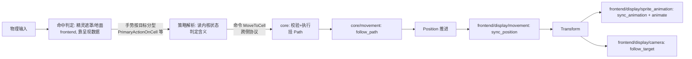

## Context

现状五个域（`map`/`hero`/`movement`/`animation`/`camera`）中，`hero` 与 `map` 把游戏数据、显示数据、输入处理混在同一模块；主角的权威位置只有 `Transform`（世界像素），移动系统直接补间像素；点击系统在自己内部做可通行校验与寻路。动机见 proposal.md - Why。

约束：Bevy 0.19（钉住）；插件三层分类原则（内核是普通模块，可整体替换的实现抽成插件）；域组织规范（侧面子目录、register 约定、归属判定）。

## Goals / Non-Goals

**Goals:**

- core / frontend 两方代码边界；内核不引用界面层具体类型（编译期可验证）。
- 内核以连续格坐标 `Position` 为权威位置；像素换算、Y 翻转、z 层全部归入 frontend。
- 行为与现状逐帧一致：渲染分层、动画帧、移动手感、点击寻路不变。

**Non-Goals:**

- 不交付第二套界面层实现；MUD 文字界面仅作为边界设计的检验参照。
- 不改任何游戏行为、数值与素材。
- 地图数据文件化（后续 change 处理）。

## Decisions

### Decision 1: 两方结构与依赖方向

输入与呈现不可分：输入对显示的依赖（相机投影、视口、坐标换算、hover）是永久且稠密的，模态与呈现天然成对（触控界面=触控布局+触控输入，键盘光标=光标的渲染与移动），可替换的真实单位是整套玩家界面。故 frontend 即单一界面层，内部按主题分区。

```mermaid
graph TD
    frontend[frontend/ 界面层插件<br>display · input · ui(未来)]
    frontend --> core[core/ 内核]
    core --> nothing[不依赖 frontend]
```

```
src/
├── core/
│   ├── app_state.rs  模式协议（States 状态树，协议归内核）
│   ├── game_loop.rs  主循环阶段标签（协议）
│   ├── core_phase.rs 内核子相位 Sense/Plan/Act（协议）
│   ├── map/        GridMap（types/ 纯数据）、CurrentMap（resources/ 当前地图）、TileKind、pathfinding（纯格子语义，无像素概念）
│   ├── appearance/ AppearanceKind（实体携带的形象键，core→display 协议）
│   ├── hero/       Hero 标记、生成、命令执行
│   └── movement/   Position、Path、follow_path、step_duration
└── frontend/
    ├── display/    世界画面呈现：map（静态瓦片 chunks、岸线拼合、像素换算）、terrain_animation（地形动画层）、
    │               appearance（形象注册表、外观补挂）、sprite_animation（生物帧表动画）、movement（位置同步）、
    │               camera、display_phase.rs（Display 子相位）
    ├── input/      输入：gestures/（手势类型）、systems/gestures/（resolver 镜像）、systems/devices/（一设备一文件）
    └── ui/         未来 HUD/菜单落位；界面层内部以目录为替换单元
```

回放、AI、无障碍等"只发手势不看画面"的驱动方不是 frontend 的变体——它们直接朝内核协议发手势，合并不影响它们。

### Decision 2: 权威位置为连续格坐标

`core/movement/components/position.rs` 定义 `Position`（具名 f32 字段 x/y）：1 单位 = 1 格，x = 列、y = 行（向下为正，与地图数组一致）。整数坐标即格中心，`position.round()` 即所在格；非整数坐标只在移动过程中出现，是平滑移动的唯一来源。整数格址的词汇类型为 `CellCoord`（具名 i32 字段 x/y，`core/map/types/cell_coord.rs`），协议与 API 签名一律用它而不用裸数学向量；与 `Position` 词根相异以示离散/连续之别，`Cell` 一名保留给未来的"格子实体"概念。纯值类型归 `types/` 侧面（规范扩展：组件归 components、资源归 resources、值类型归 types）。

- `follow_path` 只推进 `Position`，不触碰 `Transform`；`Path` 的 `step_from`/`step_to` 是当前步的连续端点。每步时长直走与斜走不同（斜走 ×√2），保证直线速度恒定（还原原版步进手感——参考 pixel-dungeon `CharSprite.java` 的逐格补间）。
- `GridMap` 删除像素换算（`cell_center`/`world_to_cell`），只保留格子语义 API（`get`/`walkable`）；格坐标 ↔ 像素的换算函数归 `frontend/display/map/utils/coords.rs`。
- `GridMap` 从 Resource 降为纯数据类型（`types/`），由 `CurrentMap` 资源（`resources/`）持有当前地图——"哪张地图在游玩"与"地图数据"分离。读者只经 `CurrentMap::map()` 取数据：终局多地图切换（持久楼层、世界地图）时 `CurrentMap` 内部变为地图库句柄，读者零改动。
- `frontend/display/movement/systems/sync_position.rs` 每帧把 `Position` 写入 `Transform`：`x = (pos.x + 0.5) × TILE_SIZE`，`y = -(pos.y + 0.5) × TILE_SIZE`（+0.5 即"整数格 = 格中心"的半格偏移），保留既有 z。不额外取整，保持连续像素补间（原版 PD 的移动同样是连续像素而非格跳）。
- `sync_animation`（Sync 相位）的朝向判断改用格坐标：`Path.step_to` 与 `Position` 的差值符号决定 `flip_x`（参考 bevy `examples/2d/sprite_animation.rs` 的帧动画组织）。

### Decision 3: 输入管道——模态、命中判定、策略解析在 frontend，命令协议在 core

原始输入到游戏动作的链条分四级，前三级在 frontend，第四级在 core：



- **命中判定（frontend）**：原始事实是"点在某个屏幕像素"；像素落在怪物精灵遮罩内还是穿透到地面，只有握着遮罩与遮挡顺序的呈现侧能判（Bevy 0.19 内置像素级精灵拾取：`bevy_sprite` picking backend 逐像素查 alpha）。判定产出**按目标分型的手势**：`PrimaryActionOnCell(CellCoord)`；`PrimaryActionOnMonster(Entity)` 作为词族范式落位（`#[allow(dead_code)]` 标记，待第一个可点怪物接入）。一种可命中目标一个类型一个文件（`frontend/input/gestures/`），不开 enum。手势是 frontend 内部消息，不跨侧。
- **策略解析（frontend）**：`frontend/input/systems/gestures/` 下一种手势一个 resolver（与 `gestures/` 一一镜像），读手势与内核状态决定含义（点怪物=攻击还是查看，是界面策略）。今天是恒等映射（一切格子手势→`MoveToCell`）；第一个可点怪物出现时新增对应 resolver，并触发 bevy_picking 的引入。三级各有动词：模态 translate（换表示，含义不变）→ resolve（消解歧义）→ core execute（校验+执行）。
- **命令协议（core）**：`MoveToCell(CellCoord)` 等具体命令由内核持有（`core/hero/commands/move_to_cell.rs`），收到后校验并执行（不可通行/不可达→不动）。界面层对内核状态只读，一切变更请求经命令消息。回放/AI 驱动方跳过手势层直接发命令。命令是解释完毕的产物（歧义已在界面层解析），沿用 roguelike 传统词汇（ToME/Angband 的 `do_cmd_*`）；与 Bevy 的 `Commands` 系统参数同名但语境不冲突。
- **载荷类型**：格子坐标用 `CellCoord`，不用裸数学向量。模态状态（键盘光标位置）留在模态实现内部，不进协议。
- 与原版 PD 的关系：PD 在输入侧直接产出具体命令（`HeroAction.Move/Attack/PickUp`）；本设计同样把解析放在内核之外，但拆出"命中判定"与"策略解析"两级，模态保持无游戏语义，多模态复用同一解析层。
- **resolver 与内核的职责判据**（三个判例）：①敌友判断决定命令**种类**（友→`TalkToMonster`、敌→`AttackMonster`）——语义属性，在命令存续期内稳定，归 resolver；②"攻击要先走近"——距离在命令执行期间每步都变，是执行的时序规则，归内核（`AttackMonster` 的执行=追击+攻击，追击不是独立命令）；③MUD 的 `MoveToLeft` 与图形界面的 `PrimaryActionOnCell` 是各界面自己的手势方言，分别解析到同一命令 `MoveToCell`——手势词族按界面生长，命令协议是所有界面的共同语。一句话判据：**命令开始执行后判断依据还会变的，留内核；不会变的，归 resolver**。

### Decision 4: 集合化装配，集合标签归内核持有

装配层若引用具体系统函数，替换任一实现（输入不再是鼠标、呈现没有动画）都要改 main.rs。Bevy 的 `SystemSet` 正是为此设计（官方 `examples/ecs/ecs_guide.rs`）：各方把系统注册进抽象集合标签，装配层只编排标签。

- 主循环阶段标签定义在 `core::game_loop`：`GameLoop::{Input, Core, Display}`（命令产出、内核逻辑、呈现）。它们是跨侧顺序编排的协议，按"内核持有协议"原则归内核；放在装配层会形成双向依赖（装配层引用插件的 register，插件反向引用装配层的标签）。命名注记：枚举取名自经典 game loop 模式（input → update → present）；GPU 渲染在 Bevy 独立的 render SubApp 执行，主调度里的 `Display` 相位是呈现*准备*（sync/动画/相机/chunks）——不称 Render，也不称 Present（wgpu/Vulkan 的 present 即交换链提交上屏，同样在引擎层），避免与引擎渲染管线撞词。
- 注意标签是主循环阶段而非侧的私产：frontend 一个插件同时把翻译系统放进 `GameLoop::Input`（帧首）、渲染系统放进 `GameLoop::Display`（帧尾）。
- 各方 register 自行展开内部顺序：core 内子相位 `CorePhase::{Sense, Plan, Act}` 链编排——Plan 语义为定向（设置/修改 target：命令执行器校验并物化为 `Path`，世界状态全程只读快照），Act 语义为执行（`follow_path` 推进移动，同相位成员不排序）；Sense 空置，待第一个需要物化感知的 AI。frontend 内 display 各系统在域 register 入 `DisplayPhase::{Attach, Sync, Animate, Camera}`——Attach 相位承载 `Added<>` 结构补挂（外观、相机目标），Sync 把内核状态流入既有呈现组件（位置、播放意图），Animate 推进动画，Camera 跟随。input 侧：设备翻译与 resolver 都在 `Update`，子相位 `InputPhase::{Translate, Resolve}` 链编排（嵌于 `GameLoop::Input`）。翻译在 `Update` 运行：引擎输入系统在 `PreUpdate` 刷新 `ButtonInput`，"PreUpdate 恒在 `Update` 前"的结构保证翻译读到新输入，无需推导 `.after(InputSystems)` 这类引擎内部排序约束。命名约定：动词在函数位、主语在路径位——命令类型在 `commands/<名>.rs`，执行器在镜像的 `systems/commands/<名>.rs#execute`；手势类型在 `gestures/<名>.rs`，解析器在镜像的 `systems/gestures/<名>.rs#resolve`；设备翻译系统在 `systems/devices/<设备>.rs#translate`。按设备而非语义动作组织的原因：单击/双击/长按的消歧是带状态的设备级逻辑，必须共处一个系统；设备内的绑定查询将来从字面量改为查 bindings 表，路径与注册零变化。消息类型的注册下沉到所属域/组的 register（命令消息归域 register，如 `MoveToCell` 在 `hero/mod.rs`；手势归 `gestures/mod.rs`）；注册与编排的分层：编排（`.chain()`、`configure_sets`、`.before/.after`、门控）只在侧根（core、frontend/input、frontend/display）与装配层——编排具有全局性、依赖相关、顺序相关，下放给各域会失序；成员注册（资源、消息、系统入集合）可下沉到域/组的 register——当相位标签本身携带顺序时（如设备翻译入 `InputPhase::Translate`、resolver 入 `InputPhase::Resolve`），"系统入集合"不含编排成分。标签归属规则：core 持有的集合标签 = 跨侧主循环阶段的最小集合（`GameLoop` 三个变体，替换实现时装配层依赖它们保持不动）；侧内子相位（如 `InputPhase`）归各侧自己，不进 core。
- main.rs 只剩一句编排：`configure_sets(Update, (GameLoop::Input, GameLoop::Core, GameLoop::Display).chain())`。

### Decision 5: hero 生成拆为内核生成 + 显示补挂（Attach 相位）

- `core/hero/entities/hero.rs`（`OnEnter(AppState::Game)`）：spawn `Hero` 标记 + `AppearanceKind::Warrior` + `Position(HERO_START)`——纯游戏数据，不含任何显示组件。
- 补挂按职责拆两域，都在 `DisplayPhase::Attach` 以 `Added<>` 反应执行：
  - `frontend/display/appearance`：`attach_appearance` 对 `Added<AppearanceKind>` 补挂 `Sprite`（注册表 handle 克隆）、初始 `Transform`（z = `LAYER_ACTOR`）与 `AnimState`。形象数据集中在 `Appearances` 注册表（Resource）：`AppearanceKind`（内核持有的纯键，变体名"长相"而非生物种类——一种生物可换形象、多种生物可共用形象）→ `Appearance`（贴图 handle + 图集布局 + 动画表）。注册表进 `Game` 时由 `load_appearances` 一次性构建（fire-and-forget，渲染器等待像素，接受短暂 pop-in）；贴图/atlas handle 在补挂时克隆到实例（bevymark 模式），动画表留在注册表按帧查询（`Appearance::clip()`，未定义的动画回退 `Idle`）。
  - `frontend/display/camera`：`attach_target` 对 `Added<Hero>` 补挂 `CameraTarget`。hero 的显示补挂只有外观与相机两类，按职责分属 appearance 与 camera 域，不单设 hero 显示域。
- 帧动画为无状态播放：帧 = `(全局虚拟时间 × fps + frame_offset) % 帧数`，无定时器组件；`AnimState{anim, frame_offset}` 只在动画切换时写（`sync_animation`，Sync 相位），稳态播放零写入（`animate`，Animate 相位，纯函数读取）。`AnimKind` 枚举是全部形象共用的动画词汇超集（Idle/Walk/Run/Attack/Hit/Die，引用发生在代码里故为枚举，serde 映射到数据文件帧表）。
- warrior 显示数据（12×15 精灵表、tier 0、IDLE/RUN 帧序列与帧率：IDLE 8 fps、RUN 20 fps；帧序列参考原版 `HeroSprite.java`）归 `appearance/constants/warrior.rs`。
- 该模式即"内核生成游戏实体、界面层按 Attach 相位补挂呈现"的协议实例，未来怪物等实体沿用。

### Decision 6: 动画域按机制拆分——sprite_animation 与 terrain_animation

- 相位共享、机制私有：随时间前进的视觉变化都入 `DisplayPhase::Animate`，但归域判据是机制与数据，不是时间性。生物帧表动画（atlas.index = f(全局时间)，词汇 `AnimKind`/`AnimClip`/`AnimState`）归 `sprite_animation`；地形动画（材质 `uv_transform` = f(全局时间)，词汇 `TerrainAnim`/`TerrainAnimState`）归 `terrain_animation`。后者与 map 域 chunks 的岸线透明瓦片共生（开放水全透明，透出下层滚动层）；跨域配合由两侧 doc 互相点名维持，z 层契约集中在 `map/constants/layout.rs`（appearance 读 `LAYER_ACTOR` 同例）。
- 地形动画渲染沿用 PD `SkinnedBlock` 思路：每动画地形一张地图大小 REPEAT quad，O(种类数) 次 uniform 写入——优于逐瓦片动画的 O(格子数) 数据重传（"动层不动瓦片"）。已知限制：同图多种动画地形共存时，同 z 全图 quad 无法逐格区分；演进路径为逐格 mesh + 世界坐标 UV，待第二种动画地形落地时再做。当前版本固定水动画（`WATER_ANIM`），"缺种类不生成"的检查将随多类支持以地图构建期的存在性位掩码（O(1) 查询）回归。
- 地图域瘦身为纯静态瓦片：chunks、layout 常量、coords、autotile（岸线 4 位掩码拼合——PD `Level.getWaterTile` 的机制即教科书 4-bit bitmask autotiling，邻居 `Terrain.UNSTITCHABLE` ≈ 我们的"非地板"判定）；`build_chunk_data`（`GridMap` → 瓦片数组）抽出为纯函数转换点，可单测。

## Risks / Trade-offs

- [`Position` 与 `Transform` 两份位置可能不一致] → `Transform` 的 x/y 每帧由 `sync_position` 从 `Position` 重写，不是位置真相来源；z 由显示侧生成时设定并保持。
- [集合内顺序由单方自治，跨侧只有标签级先后] → 跨侧顺序需求只有"输入→内核→呈现"一层；未来出现更细粒度跨侧约束时，在 core::game_loop 增设变体。
- [目录大规模移动期间编译断点较多] → 一次性迁移，以 `cargo check` 收敛；核心逻辑与显示纯函数均有单测（地图、寻路、移动、chunk 数据、岸线拼合等）作为回归网。

## Migration Plan

一次性重组：先移 core（纯数据与逻辑，测试先行通过），再移 frontend，最后改装配与集合。验证方式：`cargo test` 全绿 + 运行游戏手动确认点击移动、动画、相机跟随、水面效果与现状一致。无存档与数据迁移。

## Open Questions

- **多视图与小地图**：小地图是独立渲染（自己的 camera 与表示，可能是探开迷雾的示意图）。视图抽象为"屏幕区域 + 屏幕点→目标的换算"，与渲染实现无关；视图多于一个时迁移到 bevy_picking 或手写视口路由，属输入模态内部重构，内核协议不变。点小地图若意为"移动相机"，属呈现侧行为，不产生内核命令。
- **bevy_picking 引入时机**：第一个可点怪物出现时（需要精灵遮罩命中），`devices/mouse.rs` 的手写换算退役，换成 `Pointer<Click>` 观察者——地面 chunk 观察者发 `PrimaryActionOnCell`，怪物观察者发 `PrimaryActionOnMonster`。手势词族已预留。
- **UI 域的落成**：主菜单与 HUD 同为 bevy_ui 界面部件，归 `frontend/ui/` 域（`ui/menu/`、`ui/hud/`）；display 专指世界画面，input 专指输入，三词各占其位。菜单↔游戏画面的切换走 Bevy `States`（`AppState`）。命名注记：不用 `scene`——`bevy_scene` 已占用该词（序列化实体蓝本资产）。HUD 的可替换性是明示需求，但替换单元是目录而非插件——整套替换的单位统一为 frontend。
- **输入与呈现的中间层**：视图/HUD 增多后，输入对呈现的接触面应收敛到引擎词汇（`Camera`、`Viewport`、bevy_ui `Interaction`、picking hover 状态），而非 frontend 的私有类型——换掉整套 frontend 时输入的类型依赖不动。
- **模式化输入**：战斗画面等无格子模式，用 Bevy `States` 按模式激活不同的输入模态系统与解析层；新模式 = 新手势类型（如位列目标）+ 新 resolver + 新命令 + 新执行，不修改探索模式的既有代码。
- **格子大小随地图变化**：`TILE_SIZE` 将从常量降级为当前地图呈现资源的字段，coords 换算改读资源；属 frontend 内部变化，内核无感。缩放已由相机投影天然支持，无需改动。
