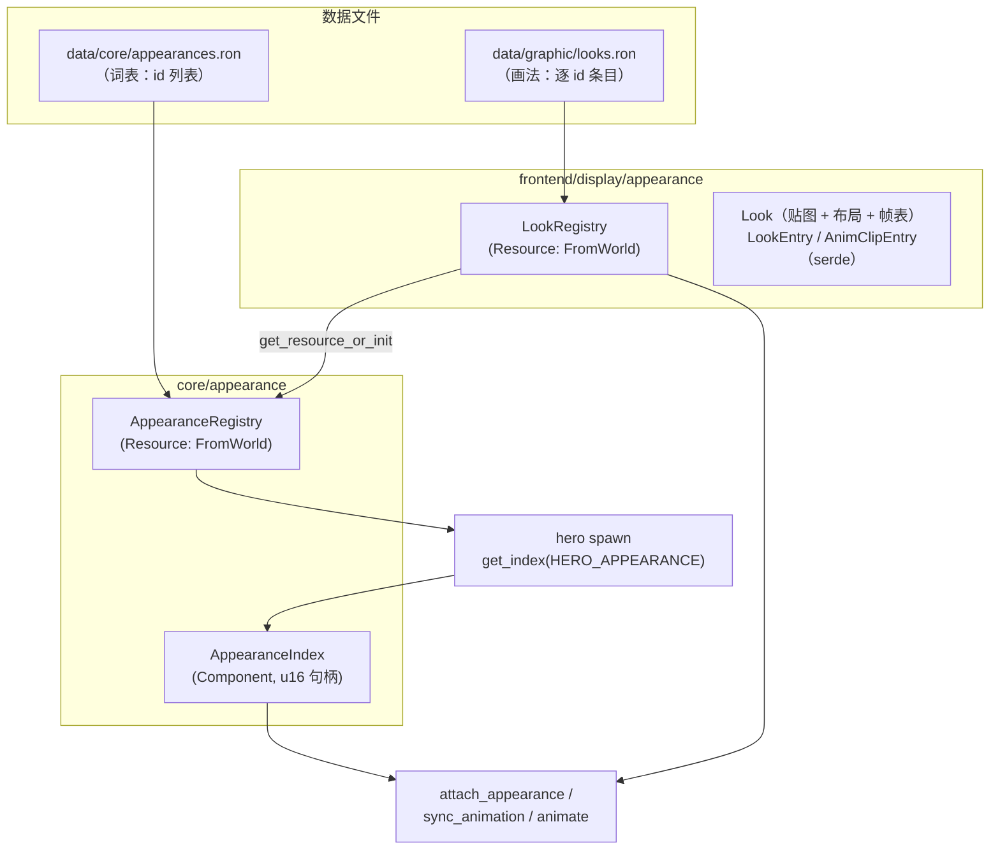
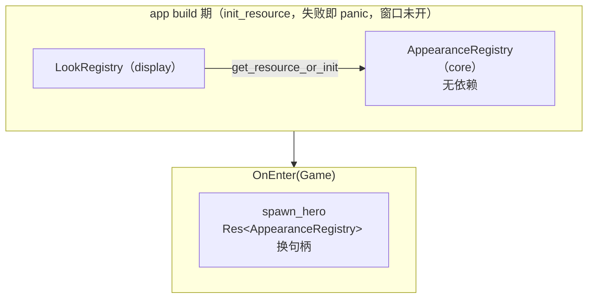

历史归档，不符合先英文后中文规范，请勿参考

# Design: data-driven-appearance

## Context

现状：外观数据硬编码在 `frontend/display/appearance/constants/warrior.rs`（贴图路径、12×15 帧、21×8 网格、idle/run 帧表），`AppearanceRegistry` 的 `FromWorld` 里组装唯一一个条目；core→display 的协议键是 `AppearanceKind` 枚举（core/appearance/components），hero 出生点直接 spawn 枚举变体。新增一种外观要改动枚举、常量文件、注册表三处既有代码，违背开闭原则。

已确认的规格基线：`specs/appearance/spec.md`（本 change 的 delta）——词表注册表、画法数据文件、加载校验、生物穿戴外观、warrior 条目数值。

上一轮 data-driven-local-map 确立了本工程的数据化范式：core 词表注册表（字符串 id + 运行时句柄）+ display 绑定表（按 id join）+ `FromWorld` 递归拉取 + `parse_*`/`build_*` 校验核心与注册表一体一文件。本 change 把同一范式应用到外观域；与地形不同的是外观在 core 没有任何属性语义（core/appearance 的域 doc 自述："the core only names the appearance"），词表文件因此是纯 id 列表。

## Goals / Non-Goals

**Goals:**

- 外观词表与外观画法全部由数据文件定义，新增外观零代码改动。
- 协议键从封闭枚举改为运行时句柄组件，编号纪律与 `TerrainIndex` 一致。
- 加载期校验保证词表与画法一一闭合，失败在窗口打开前 panic 且报错定位到文件与位置。
- 运行表现与现状完全一致（warrior 的 idle/run 逐值复刻）。

**Non-Goals:**

- `terrain_animation` 域的配置化（滚动水面的结构差异大，另起 change）。
- 生物数据化（bestiary）、护甲阶层换肤机制（hero 的 tier 推导）、出生点数据化。
- 存档的外观序列化映射（编号纪律已为它预留接缝，实现随存档 change 落地）。
- Bevy Asset 管线自定义加载器与热重载。

## Decisions

### D1 协议键全数据化：词表即数据，句柄即组件

`AppearanceKind` 枚举删除。core 新增 `data/core/appearances.ron`——纯字符串 id 列表（裸列表，不造单字段 entry：外观在 core 无属性语义，一条 id 就是全部内容，为假想字段预留 entry 结构违反"不为假想需求写实现"）；`AppearanceRegistry`（core 资源）按条目顺序分配 `AppearanceIndex(u16)` 句柄；生物以 `AppearanceIndex` 组件声明穿戴的外观（句柄直接 derive Component，镜像 `LocalMap` 格子直持 `TerrainIndex`——句柄本身就是协议，不加无信息包装层）。

编号纪律沿用 terrain（D4 不变量逐字适用）：句柄是注册表内部数组下标，按文件条目顺序分配，**不具备跨加载稳定性**；代码 MUST NOT 构造或比较具体句柄值、不以句柄或 id 判断外观身份；字符串 id 只出现在数据文件互相引用、加载解析、错误信息与将来的存档映射表。

出生点以 id 换句柄：`spawn_hero` 经 `AppearanceRegistry::get_index("warrior")` 取句柄——这是全代码库唯一一处以 id 指名外观的地方（出生内容是代码常量，与 `HERO_START` 同类；随生物数据化退场）。id 收敛为文件级常量 `HERO_APPEARANCE`。

参考来源：本工程 terrain 范式（`TerrainRegistry`/`TerrainIndex`/`terrains.ron`）；pixel-dungeon `sprites/HeroSprite.java` 的贴图类词汇本身是代码常量表，本工程按开闭原则改走数据化。

备选方案 1：保留枚举、数据文件按 serde 变体名 join（AnimKind 路线）——否决，`AnimKind` 保留枚举是因为动画引用天然发源于代码（移动命令蕴含 Run）；外观词表是内容清单（怪物、阶层换肤的量级数十起步），封闭枚举意味着每加一个外观都改动既有文件，正是本 change 要消除的问题。

备选方案 2：组件直持字符串 id——否决，协议退化为 stringly-typed，词表无家可归，存档映射没有落点。

### D2 双层注册表与命名簇



两个注册表分属两侧、不能同名（命名无歧义原则）。display 侧主题名词取 **look**：appearance 域的 prose 本就以 "look" 指称显示侧概念（域 doc "how a creature looks"、`attach_appearance` doc "Attaches a creature's look"），提升为代码词汇水到渠成；core 独占 appearance 词（`AppearanceIndex`、`AppearanceRegistry`——词表即协议词汇的注册表）。文件↔注册表主题一致（沿 `terrains.ron`↔`TerrainRegistry`、`terrain_tiles.ron`↔`TerrainTileRegistry` 先例）：画法文件命名 `data/graphic/looks.ron`。

- core `AppearanceRegistry`：`ids: Vec<String>` + `by_id: HashMap<String, AppearanceIndex>`；`get_index(id) -> Option<AppearanceIndex>`（get 纪律：可失败查找返回 Option）、`iter()`（pub(crate)，display 侧覆盖校验迭代用）——API 面是 `TerrainRegistry` 去掉属性查询的镜像（外观在 core 无属性，反向取 id 的访问器留给存档 change 的消费方）。
- display `LookRegistry`：`HashMap<AppearanceIndex, Look>`；访问器 `look(appearance_index) -> &Look` 必然成功（词表每个 id 的画法加载期已校验存在），内部 `expect` 注明"加载时已校验"。

### D3 画法文件格式与校验

`data/graphic/looks.ron` 单表，每个外观一个条目：

```ron
[
    (
        appearance: "warrior",
        texture: "warrior.png",
        frame_width: 12,
        frame_height: 15,
        columns: 21,
        rows: 8,
        clips: [
            ( anim: idle, frames: [0, 0, 0, 1, 0, 0, 1, 1], fps: 8.0 ),
            ( anim: run,  frames: [2, 3, 4, 5, 6, 7],         fps: 20.0 ),
        ],
    ),
]
```

- 帧尺寸逐条目显式声明（`frame_width`/`frame_height`）——与 tileset 的"帧尺寸==TILE_SIZE 是定义"不同：tileset 帧是地图格，外观帧各有尺寸（warrior 12×15 ≠ 16×16 格），无法复用常量。纹理加载不依赖图片尺寸反推（`TextureAtlasLayout::from_grid` 在图片加载前就需要帧尺寸），与 tileset 同一约束、同一解法。
- 帧表是**条目列表**（Vec<AnimClipEntry>），不是 RON map——map 反序列化重复键静默覆盖，条目列表让重复动画名成为加载期错误（沿 `terrain_tiles.ron` 的 Vec + 重复校验先例）。
- `AnimKind` derive serde 且 `rename_all = "snake_case"`（`idle`/`run`），沿 `alpha: blend`、`layer: ground` 的小写先例。动画词汇仍是代码枚举：动画引用发源于代码（移动命令蕴含 Run），词表封闭在代码里是刻意的——与外观词表的开放内容清单性质相反。
- 校验清单（全部 panic 指明文件与位置）：条目引用的 id 不在词表；同一 id 多条画法；词表 id 缺画法；`columns`/`rows` 为零；帧序列为空；fps 非正；帧号 ≥ columns×rows；重复动画名；缺 `idle` 条目。

参考来源：pixel-dungeon `sprites/HeroSprite.java`（`FRAME_WIDTH=12`、`FRAME_HEIGHT=15`、`run.frames(film, 2..7)`、`RUN_FRAMERATE=20`、idle 帧序列 0,0,0,1,0,0,1,1——warrior 条目的数值来源）；tome2 `lib/edit/r_info.txt` 的 `G:` 行（roguelike 把生物画法写进数据的传统先例；本设计把画法拆到 display 侧独立文件，core 词表不感知像素概念）。

### D4 `AnimClip.frames`：`Vec<usize>`

`frames` 从 `&'static [usize]` 改为 `Vec<usize>`，`AnimClip` 相应去掉 `Copy`（保留 `Clone`）。理由：

- serde 直出，无中间转换。
- 无 Clone 消费方：`Look::clip()` 返回 `&AnimClip`，`animate`/`sync_animation`/`AnimState::switch` 全部就地引用，谁都不复制帧表。
- `types/appearance.rs` 旧 doc 里"frames becomes `Rc<[usize]>`"的预言在 Bevy 资源约束下不成立：`Rc` 不满足 `Send + Sync`，进不了 Resource。将来若出现帧表共享需求（多外观共表），升级路径是 `Arc<[usize]>`，届时再付原子计数成本——现在写是为假想需求实现。

### D5 加载形态与校验接缝

沿五个注册表已统一的形态：`FromWorld` + `World::get_resource_or_init` 递归拉取，域 register 只一行 `init_resource`，注册顺序无关正确性。



校验核心与注册表一体一文件（沿 D8/D11 先例），两侧各一个纯函数作测试接缝：

- core：`parse_appearance_registry(path, text) -> AppearanceRegistry`——RON 解析 + 空 id / 重复 id 校验 + 句柄分配（镜像 `parse_terrain_registry`）。
- display：`parse_look_entries(path, text, appearance_registry) -> Vec<(AppearanceIndex, LookEntry)>`——RON 解析 + D3 校验清单全部（含跨注册表的未知 id 与缺失条目；core 注册表是纯数据，传入不破坏纯度）+ id 解析为句柄。`FromWorld` 随后逐条目装配 `Look`：`AssetServer::load(texture)` + `Assets<TextureAtlasLayout>::add(from_grid(...))`（镜像 `TilesetRegistry` 的"parse 校验 + FromWorld 装配"分工；`Assets::add` 不去重，布局只在此处构建一次，不逐实体构建）。

`parse_look_entries` 的签名单看像"parse 却吃注册表"，实质是 tileset 的 parse 与 terrain_tile 的 build 两步在外观域合一：画法条目的校验多数是跨注册表的，拆开只会造一个只查重复 id 的空壳 parse。

### D6 代码落位

```
data/core/appearances.ron        词表：id 字符串列表
data/graphic/looks.ron           画法：逐 id 条目

src/core/appearance/
  components/appearance_index.rs AppearanceIndex(u16)：句柄即组件（删 appearance_kind.rs）
  resources/appearance_registry.rs  AppearanceRegistry + parse_appearance_registry + FromWorld（一体一文件）
  mod.rs                           新增 register（init_resource 一行）；core/mod.rs 增 appearance::register(app)

src/core/hero/entities/hero.rs   HERO_APPEARANCE 常量；spawn 经 get_index 换句柄

src/frontend/display/appearance/
  types/look.rs                  Look（原 Appearance；clip() 回退 Idle 语义不变）
  types/look_entry.rs            LookEntry（looks.ron 条目 serde 结构）
  types/anim_clip_entry.rs       AnimClipEntry（帧表条目 serde 结构）
  resources/look_registry.rs     LookRegistry + parse_look_entries + FromWorld（一体一文件；删 appearance_registry.rs）
  systems/attach_appearance.rs   查询 AppearanceIndex，取 LookRegistry
  constants/                     整目录删除（warrior.rs 的数据进 looks.ron）

src/frontend/display/sprite_animation/
  constants/anim_kind.rs         AnimKind derive Serialize/Deserialize + rename_all 小写
  types/anim_clip.rs             frames: Vec<usize>，去 Copy
```

serde 结构落 types/ 且文件随结构名（`look_entry.rs`/`anim_clip_entry.rs`）；两个 entry 同属 looks.ron 一个文件格式主题，同域同侧面分文件。`anim_clip_entry.rs` 归 appearance 域而非 sprite_animation——它是画法文件格式的组成，sprite_animation 只持有 `AnimClip` 的值语义与 `AnimKind` 词汇。

### D7 命名纪律

- 句柄类型 `AppearanceIndex`（编号不是身份，`Index` 后缀沿 `TerrainIndex` 先例）；方法投影：`get_index(id)`、`index()`/`from_index()`（pub(crate)）。
- 访问器以被取物命名：`LookRegistry::look`、`AppearanceRegistry::get`（必然成功处由调用方 expect 并注明加载时已校验——get 纪律）。
- 路径常量随文件主题：`APPEARANCE_TABLE_PATH`（core，沿 `TERRAIN_TABLE_PATH` 的 table 词）、`LOOKS_PATH`（display，沿 `TERRAIN_TILES_PATH`）。
- 参数名取类型完整蛇形名：`appearance_registry`、`look_registry`、`appearance_index`。
- 测试辅助命名同纪律：`appearance_registry()`、`entries()` 等。

### D8 测试策略

- 机制单测用内联 RON 字符串（沿 terrain 先例）：`parse_appearance_registry` 的分配/重复/空 id/非法 RON；`parse_look_entries` 的正常解析 + D3 校验清单逐类 panic；`Look::clip` 的 Idle 回退（自 appearance.rs 随迁，`Vec` 构造）。
- 规格对齐测试读仓库真实文件（落 `look_registry.rs` 测试模块，沿 `current_map.rs` 先例）：`appearances.ron` 声明 warrior；`looks.ron` warrior 条目的帧尺寸 12×15、21×8 网格、idle [0,0,0,1,0,0,1,1]@8fps、run [2,3,4,5,6,7]@20fps 逐值一致。
- `sync_animation`/`anim_state` 既有测试随迁：`AnimClip` 非 const 构造改辅助函数，注册表键从枚举换句柄（`AppearanceIndex::from_index` 为 pub(crate)，crate 内测试可用）。

## Risks / Trade-offs

- [词表与画法两份文件需手工保持对应] → 加载期闭合校验把不一致变成启动 panic 且指明缺失 id，不会静默渲染异常。
- [出生点代码以字符串指名 warrior，编译期不检查] → 仅一处、`get_index` 失败在 `OnEnter(Game)` 即 panic；生物数据化时与出生点一起入数据文件。
- [`AppearanceIndex(u16)` 上限 65535] → 外观量级数十到数百，远期足够；超出时扩 u32 只动句柄类型。
- [`AnimClip` 失去 `Copy`] → 消费方全是引用，无影响；测试构造从 const 改辅助函数。

## Migration Plan

一次性替换，无运行时迁移（无存档、无外部消费方）：先落 core 词表注册表与句柄组件，再替换 display 注册表取数来源，最后删枚举与常量文件并随迁测试。每步保持可编译、测试绿。

## Open Questions

- 护甲阶层换肤的形态（同贴图不同行：条目复用贴图加行偏移，还是逐阶层独立条目）——随 hero 阶层机制 change 再定，当前条目模型两种都容纳得下。
- 外观句柄的存档映射表格式——随存档 change。
- 帧表跨外观共享（`Arc<[usize]>` 升级）——出现第二个共表外观时再评估。
