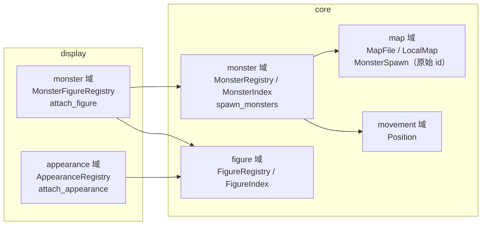
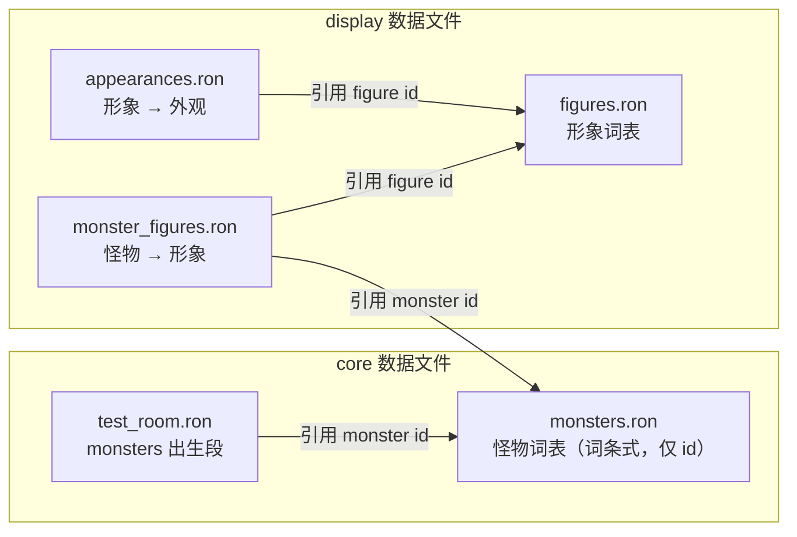
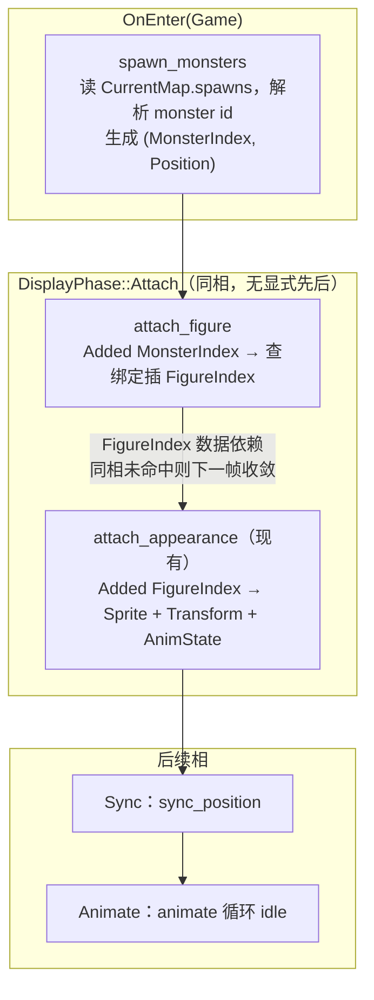

历史归档，不符合先英文后中文规范，请勿参考

# Design: add-first-monster

## Context

动机与范围见 proposal.md。本设计只依赖以下现状事实：

- 生物呈现管线已是通用的：`attach_appearance` 对 `Added<FigureIndex>` 反应，挂载 Sprite、Transform、`AnimState`；主角只是第一个使用者。
- 内核/显示的数据划分先例齐备：core 的 terrain 词表（`terrains.ron` + `TerrainRegistry`）对应 display 的 terrain_tile 绑定（`terrain_tiles.ron` + `TerrainTileRegistry`）；core 的 figure 词表（`figures.ron` + `FigureRegistry`）对应 display 的 appearance 表（`appearances.ron` + `AppearanceRegistry`）。注册表统一为 `FromWorld` 构建、依赖以 `get_resource_or_init` 拉取、加载期闭合校验。
- 出生先例：`spawn_hero` 以 `OnEnter(AppState::Game)` 注册，生成 `(Hero, FigureIndex, Position)` 纯数据实体；`entities/` 侧面的文件主语是产出的实体群体（`chunks.rs` 的 `spawn_chunks`）。
- 地图文件（`MapFile`/`LocalMap`）目前只含地形；`CellCoord { x: i32, y: i32 }` 是格子词汇类型，`Position::from(CellCoord)` 已存在。
- `AnimState.frame_offset` 的文档承诺：群体出生时相位去同步（独生为零）；工程无 `rand` 依赖。

## Goals / Non-Goals

**Goals**：怪物管线的三层数据链（词表 → 出生 → 绑定）各自成文件、加载期闭合校验；既有系统零结构改动；不新增 crate 依赖、不新增调度相位。

**Non-Goals**（设计级边界，proposal 范围之外不再重复）：不引入运行时单体出生构造器（繁殖/召唤落地时再说）；不引入随机数源（相位确定性派生）；hero 的形象绑定方式不动；同 z 层绘制次序不处理。

## Decisions

### 1. 双新域划分：core/monster + display/monster



core 的 monster 域持有怪物种类的内核数据（词表）与出生系统；display 的 monster 域持有怪物到形象的绑定与挂载系统。绑定归 display 镜像 core 域的划分，对齐 terrain_tile 住在 display/map 的先例（绑定住在其 core 域的 display 对应域里）。

依赖方向单向无环：monster → map（`CellCoord`、`CurrentMap`）与 monster → movement（`Position`）；map 不感知 monster——这是决策 3 的约束来源。

**Alternatives**：绑定并入 display/appearance（形象归属域知道怪物概念，域纯度受损）；core 直接命名 figure（违反"到形象的映射放在 display 层"的范围要求）。

### 2. 三级数据链：monster → figure → appearance



monster 与 figure 分层的价值：多个怪物种类可共用同一形象（占位素材期常见），外观表的键保持为形象而非怪物。加载期闭合校验沿链传递：每个形象必有外观（既有机制），每个怪物必有绑定且引用已声明形象（新增），地图引用的怪物 id 在出生时报错（新增）。

**Alternatives**：绑定直达外观（跳过 figure）——绕过既有 `attach_appearance` 管线，违反开闭原则；怪物 id 与形象 id 合并——退化为单层，失去素材替换时的接缝。

### 3. 出生数据入地图文件，原始 id 存储，出生时解析

固定地图的怪物是地图内容的一部分，出生条目随地图文件声明。因决策 1 的依赖方向（map 不能依赖 monster 注册表），`LocalMap.spawns` 持有**原始字符串 id**，由 `spawn_monsters` 在出生时经 `MonsterRegistry` 解析；未知 id 在出生时报错——出生发生在启动期，与加载期报错同一时刻呈现。格子越界不需要 monster 知识，留在地图加载期校验。

参考来源：ToME2 `lib/edit/evil.map`——固定地图以 F: 行定义"地形+怪物"符号、D: 行绘制布局，怪物出生属于地图定义是 roguelike 固定地图的传统形态。本设计采用显式条目列表而非符号内嵌：图例字符当前映射纯地形，内嵌会让 legend 值在字符串与结构之间分叉，解析复杂度不值。

**Alternatives**：独立出生文件（多一层文件对应关系，测试房间规模下偏重）；地图加载期解析 monster id（依赖成环，不可行）。

### 4. 出生条目写法：CellCoord 结构体形式

`CellCoord` derive `Deserialize`，出生条目形如：

```ron
monsters: [
    ( monster: "giant_white_rat", cell: ( x: 28, y: 10 ) ),
    ( monster: "giant_white_rat", cell: ( x: 24, y: 13 ) ),
],
```

坐标概念不拆散为散装 `x`/`y` 字段；`CellCoord` 作为词汇类型同时服务文件布局与内存，未来地图文件里其他坐标内容（如主角起点）复用同一类型。

**Alternatives**：条目平铺 `x: 28, y: 10`——"这是一个格子"的语义在文件里变弱。

### 5. 出生条目类型：entry / 内存类型分离

`MonsterSpawnEntry`（serde 布局，MapFile 字段类型）与 `MonsterSpawn`（`LocalMap.spawns` 的元素类型）分离，即使当前二者字段相同（`monster: String, cell: CellCoord`）、转换是逐字段拷贝。统一标准：serde 布局类型不兼任内存类型——对齐 `TerrainEntry`/`Terrain` 先例，避免"有时兼任有时分离"的随意；文件格式演进（如出生条目将来携带个体参数）只动 entry 一侧。

### 6. 形象挂载：attach_figure 与 attach_appearance 同相无序



`attach_figure` 是 display/monster 域的唯一系统：对 `Added<MonsterIndex>` 反应，查 `MonsterFigureRegistry` 得到 `FigureIndex` 并插入实体；`attach_appearance` 零改动接棒。工程纪律中系统顺序由相位表达，两系统同在 Attach 相且无显式先后：最坏情况怪物晚一帧上屏——出生发生在启动期，首帧不可见，`Added` 语义保证不丢。

**Alternatives**：为这一个依赖新增相位（一个系统一个相位，过重）；`attach_appearance` 自查怪物绑定（通用系统知道怪物概念，违反开闭）。

### 7. 群体相位去同步：出生格坐标派生

`attach_appearance` 挂载 `AnimState` 时，`frame_offset = (cell.x + cell.y) as usize % idle 帧数`——由 `Position` 取站立格（出生即整数坐标）派生。兑现 `AnimState` 文档承诺的群体去同步，确定性、可复现、零新依赖。主角的 idle 相位随之偏移，视觉上无感。

参考来源：pixel-dungeon `MobSprite`/`CharSprite` 不做过同步，怪物因出生时机不同天然错相——本设计对齐的是其**体感**而非机制（本工程同帧出生，需显式派生）。

**Alternatives**：引入 `rand`（为纯表现加依赖，不值）；接受同步（群体感假，且违背已写入文档的承诺）。

### 8. 注册表形状对齐既有先例

`MonsterRegistry` 对齐 `FigureRegistry`（`ids` + `by_id` + `get_index` + `iter`，`FromWorld` 读 `data/core/monsters.ron`）；`MonsterFigureRegistry` 对齐 `TerrainTileRegistry`（`HashMap<MonsterIndex, FigureIndex>`，`FromWorld` 拉取 `MonsterRegistry` 与 `FigureRegistry`，闭合校验：未知怪物 id、未知形象 id、重复绑定、缺少绑定均 panic 并指明文件与位置）。词条式词表使将来加字段（速度、生命等）不改文件格式——字段在首次有内核查询时再加。

### 9. 老鼠外观数据

参考来源：pixel-dungeon `assets/rat.png`、`RatSprite.java` 与 `AlbinoSprite.java`。素材 256×32，帧 16×15，图集 16 列×2 行（共 32 帧）——同一贴图装两种老鼠：第一行褐鼠（`RatSprite`：idle `[0,0,0,1]` @2、run `6..10` @10、attack `2..5,0` @15、die `11..14` @10），第二行灰白鼠（`AlbinoSprite`：idle `[16,16,16,17]` @2、run `22..26` @10、attack `18..21` @15、die `27..30` @10）。按 `giant_white_rat` 之名取第二行灰白变体。本期仅 idle 进数据文件：

```ron
(
    figure: "giant_white_rat",
    texture: "rat.png",
    frame_width: 16,
    frame_height: 15,
    columns: 16,
    rows: 2,
    clips: [ ( anim: idle, frames: [16, 16, 16, 17], fps: 2.0 ) ],
),
```

run/attack/die 的帧号在此备查，对应动画落地时直接搬入。id 取自 ToME2 `r_info.txt` N:86 "Giant white rat"（Angband 传统的入门鼠，与 PD 下水道弱鼠定位一致）；其 speed 110、2d2、ANIMAL、MULTIPLY 等字段本期无内核查询，不采用。

## 文件落位

```
src/core/monster/
  mod.rs                          register：init MonsterRegistry；spawn_monsters 入 OnEnter(Game)
  components/monster_index.rs     MonsterIndex（种类句柄组件）
  resources/monster_registry.rs   MonsterRegistry + 词表解析校验
  types/monster_entry.rs          MonsterEntry（词表 serde 词条）
  entities/monsters.rs            spawn_monsters（对齐 chunks.rs：文件主语是实体群体）

src/frontend/display/monster/
  mod.rs                          register：init MonsterFigureRegistry；attach_figure 入 Attach
  resources/monster_figure_registry.rs
  types/monster_figure_entry.rs   MonsterFigureEntry（绑定 serde 词条）
  systems/attach_figure.rs

src/core/map/（既有域的扩展）
  types/monster_spawn_entry.rs    MonsterSpawnEntry（serde 布局）
  types/monster_spawn.rs          MonsterSpawn（LocalMap 持有）
  types/cell_coord.rs             CellCoord derive Deserialize
  types/map_file.rs               MapFile += monsters: Vec<MonsterSpawnEntry>（serde default）
  types/local_map.rs              LocalMap += spawns: Vec<MonsterSpawn>
  resources/current_map.rs        解析出生条目并校验越界
```

## Risks / Trade-offs

- 同相无序 → 怪物最坏晚一帧上屏。→ 出生发生在启动期，首帧不可见；`Added` 语义保证收敛；在 `attach_figure` 文档注释中说明。
- `(x+y) % len` 相位派生在对角等距格（Δx=−Δy）撞相位。→ 派生只保证确定性，错开是选格的副产品；测试房间选格 (28,10)、(24,13) 已验证偏移为 2 与 1。
- 主角与怪物同处 `LAYER_ACTOR`，同格时绘制次序未定义。→ 穿透瞬间短暂重叠，接受；占位系统落地时同格场景消失。
- 出生条目的 monster id 报错发生在出生时而非地图加载时，错误文案不带地图路径。→ 报错指明怪物 id 与格子坐标；越界类错误仍在加载期拦截。
- 小数屏幕映射（分数显示器缩放、移动途中的小数相机坐标）下，精灵边缘会采到图集相邻行——老鼠头顶可见一条来自上一行的细线。→ 已知限制，不属本 change；已登记于 openspec/OPEN_ISSUES.txt 条目 2，根治归未来的像素完美渲染管线 change（低分辨率画布 + 最近邻上屏，可选相机像素对齐或图集 gutter）。
- rat.png 为 GPLv3 素材。→ 工程约定原型期复制、未来统一替换（见 openspec/config.yaml 参考项目说明）。

## Migration Plan

无。新增域与数据文件均为增量；地图文件的 monsters 段以 serde default 兼容缺省，既有地图文件与测试不受影响。

## Open Questions

- hero 的形象绑定是否数据化：主角不进怪物词表（参考 PD `Hero`/`Mob` 分立、ToME2 `player_type`/`monster_type` 分立），其形象常量待开局选职业落地时再审。
- 形象词表的归属：figure 是显示关切，现居 core 仅因主角在代码中命名形象；待主角形象绑定离开 core 代码（同上一题），词表文件、注册表与句柄整体移入 display——怪物的形象绑定已在 display。已登记于 openspec/OPEN_ISSUES.txt 条目 1。
- 怪物运行时单体出生（繁殖、召唤）的单数构造器 `entities/monster.rs::spawn_monster`：待对应机制落地时引入，`spawn_monsters` 届时改为委托。
