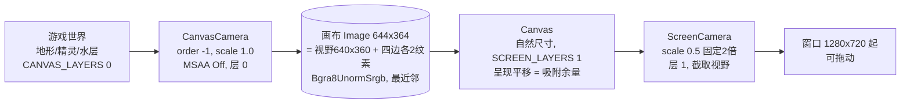
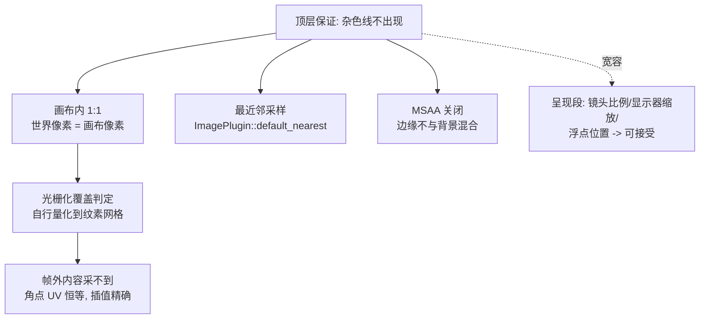
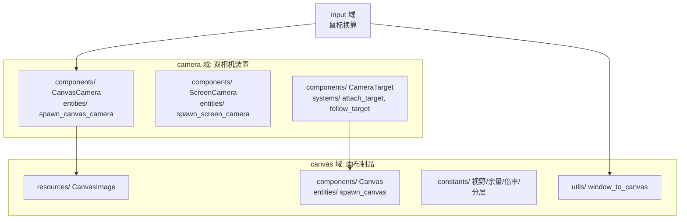

历史归档，不符合先英文后中文规范，请勿参考

# Design: pixel-perfect-canvas

## Context

原管线直通：世界 → Camera2d（scale 0.5，2 倍放大）→ 窗口 → 操作系统合成器。缺陷与动机见 proposal.md - Why。补充两个设计前提：

- `Position`（连续格子坐标，权威位置）与 `Transform`（派生渲染态）本就分离，渲染位置是每帧派生、绝不回写的显示状态。
- 工程锁定 bevy 0.19.1（Cargo.lock）；参考实现已入 `.ref/`：官方示例 `.ref/bevy/examples/2d/pixel_grid_snap.rs`（两道渲染范式）、`.ref/gdx-mellow-demo/`（亚纹素平滑滚屏源头，2016）、`.ref/godot-smooth-pixel-camera-demo/`（吸附+余量最小实现）、`.ref/bevy_pixcam/`（独立放大流派的对照）。

## Goals / Non-Goals

Goals:

- 任何窗口尺寸、任何显示器缩放下、静止与移动中：不出现取自贴图其他帧的杂色线。保证由两道渲染的结构实现：画布内 1 世界像素 = 1 画布像素；画布只保存像素结果，呈现仅对像素整体处理。
- 主角移动时世界滚动非常平滑：以 1 屏幕像素为量子，无按世界像素跳格的抖动（2 倍上屏会放大抖动）。
- 呈现段不做警务：精灵呈现位置连续派生；镜头缩放比例、显示器缩放设置、主角浮点位置引入的抖动与模糊为可接受。
- 视野恒定 640×360 世界像素；固定 2 倍上屏；窗口可拖动，过大留边、过小裁剪，均无需专门处理。
- 结构符合域组织规范：管线机制独立成域；域间依赖单向无环。

Non-Goals:

- 不改动任何游戏逻辑：移动模型、寻路、逻辑位置（`Position`）全部不变。
- 上屏倍率不做配置化（2 倍固定）；UI 尚未出现，其渲染层归属届时再定。
- 不采用图集帧间隔离带、精灵纹理数组、独立放大（每精灵分别缩放）等替代路线。

## Decisions

### D1 两道渲染：世界进画布，画布上屏



- CanvasCamera 渲染整个世界到画布：1 世界像素 = 1 画布像素（scale 1.0 + 画布 644×364）。图外区域由画布清屏色填充（沿用全局 `ClearColor` 深灰）。
- ScreenCamera 只渲染画布精灵到窗口：投影 scale 恒 0.5（固定 2 倍），画布精灵自然尺寸 644×364、由呈现平移定位（见 D2）。窗口政策由此**自动成立**，无需任何 resize 处理：窗口 1280×720 时视野（窗口×0.5 = 640×360）恰为画布中央视野区；拖大时视野大于它，四周露出窗口清屏色（同一深灰）；拖小时裁剪。
- 画布纹理由 `Image::new_target_texture` 创建（官方构造器，自动带齐渲染目标用途标志）；格式照抄官方示例 `Bgra8UnormSrgb`，颜色经 sRGB 往返无失真。
- 世界实体全部留在默认层 0（不显式标记）；仅画布精灵与 ScreenCamera 用层 1——呈现通道因此只含画布精灵一个呈现源，不存在基于场景元素的重绘（spec「呈现仅处理像素」的单测依据）。
- 参考：`.ref/bevy/examples/2d/pixel_grid_snap.rs`（两道渲染、order -1、`Image::new_target_texture` 前的手工构造等价物、`HIGH_RES_LAYERS` 分层先例）。

### D2 像素保证只落在 1:1 结构上；跟随装置一处完成吸附与平移

精灵经实例化四边形渲染，角点 UV 由图集矩形算出并恰好压在帧边界上（`bevy_sprite_render/src/render/mod.rs`：`uv_offset_scale` 由 rect 计算，rect.max 为排他端）。两条性质合起来使"帧外内容采不到"：UV 插值不可能越出本帧矩形；同一边缘两个角点 UV 按位相同，光栅化对恒等值的插值组合精确，被边缘穿过的像素采样恒得本帧边缘纹素。因此像素稳定的全部要件是**世界像素与画布像素比率为 1、采样器最近邻**——比率为 1 时，光栅化的覆盖判定自行把连续位置量化到纹素网格，与窗口尺寸、合成器缩放无关。



平滑滚屏由 `follow_target` 一个系统完成（与参考实现同构）：

```
  snapped   = round(主角位置)          # 画布相机吸附整数像素:画布内容网格对齐
  remainder = snapped − 主角位置       # 亚纹素余量
  画布相机位置  = snapped              # 内容以整纹素为步
  画布精灵位置  = remainder            # 呈现平移精确抵消吸附
  净映射: 世界点 p -> 屏幕 2×(p − 主角) —— 主角精确居中,滚动量子 1 屏幕像素
```

吸附与平移一体算出，无先后依赖；四边各 2 纹素的余量环容纳 ±0.5 纹素的平移（环内是有效世界内容，永不入镜）。同构参考：`.ref/gdx-mellow-demo/core/src/com/codedisaster/mellow/MellowGame.java`（`floor` 吸附 + `displacement offset` 余量，2016 年源头）；`.ref/godot-smooth-pixel-camera-demo/camera_controller.gd`（`snapped − actual` 余量公式逐字同款）。

其余机制件（经实机验证的决策）：

- **精灵呈现位置连续派生**：`sync_position` 把权威 `Position` 原样写入渲染 `Transform`。光栅化的覆盖判定已把画面量化到网格，显式取整只是对同一结果的二次量化，实机令移动明显不平滑。
- **MSAA 只关画布相机一处**：多重采样解析按覆盖率把四边形边缘与背景混合，实机验证会在精灵与地形边界调出细线——"杂色线"在采样分析之外的另一半来源（混合，不是越界）。ScreenCamera 保持引擎默认（全屏四边形无斜边可平滑）。

旧管线症状的归因注记：旧管线默认 4 倍 MSAA 一直在岗，"精灵边缘与地面颜色混合"与多重采样的边缘混合吻合；"头顶细线"按本节采样分析并非越界采样所能产生（帧外内容采不到），其"不足一个放大像素高"的形态更接近缩放滤波（合成器）的痕迹，确切成因不再追究——本管线从结构上消除了小数世界→屏幕映射的全部环节与边缘混合，实机验收为最终裁判。

### D3 域落位与依赖



- 相机同属一域：两台相机是"装置"的两半（一个取景、一个上屏），与跟随政策同处；画布域只持有制品（纹理、呈现精灵、几何常量、映射函数）。
- 依赖方向单向无环：camera→canvas（纹理句柄与呈现精灵）、input→canvas 与 input→camera（协议组件）。
- 编排不变：各域 register 只做成员注册；两相机的渲染先后由 `Camera.order` 表达（引擎机制），不占系统集编排。
- 命名对照官方先例（`.ref/bevy/examples/2d/pixel_grid_snap.rs` 的 `Canvas`/`InGameCamera`/`OuterCamera`）：`Canvas` 随官方；`CanvasCamera`/`ScreenCamera` 按"渲染到哪"角色命名，与官方分层常量（`PIXEL_PERFECT_LAYERS`/`HIGH_RES_LAYERS` → `CANVAS_LAYERS`/`SCREEN_LAYERS`）一一对应。

### D4 鼠标映射单一出处

窗口坐标 → 画布坐标的换算只存在一处（canvas 域 utils 纯函数）：

```
canvas = (cursor − (window_logical − 1280×720) / 2) / 2 + 2
```

即：减去居中偏移（窗口比 1280×720 大出的部分的一半），除以固定倍率 2 得视野坐标，再加 2 纹素余量换算到画布坐标；**落出视野（留边区域）时返回 `None`**——余量环持有有效世界内容，不加守卫会让点黑边变成有效指令。画布坐标送入 CanvasCamera 的 `viewport_to_world_2d`：图像渲染目标的逻辑视口即画布尺寸（`bevy_render/src/camera.rs` `get_render_target_info`：图像目标 physical_size = 图像尺寸、scale_factor = 1.0），转换语义不变。窗口恰为 1280×720 时居中偏移为零。

参考：`.ref/bevy/examples/2d/2d_viewport_to_world.rs`（viewport 坐标→世界范式）。

## Risks / Trade-offs

- [将来接入 bevy_picking 时，内置后端看不见画布后的世界：指针挂在窗口目标上，后端按渲染目标匹配相机，世界相机的目标是图像] → 沿现有手搓换算路线做命中检测（已验证 `bevy_sprite/src/picking_backend.rs` 的目标不匹配即跳过逻辑）；本 change 不消费任何 picking 事件，当前零行为变化。
- [125% 等分数合成器缩放下，上屏后物理像素宽窄不均（2/3 像素交替）] → 不与合成器协作时的机制上限，spec 已列为可接受残留。
- [慢于 1 纹素/帧的物体（将来的慢速怪物、抛物线顶点的投掷物）会呈停停走走的步进感] → 本路线的固有限制（Celeste 同款，其主角速度恒在 1 纹素/帧之上）；真出现时出口是 pixel-art filtering shader（牺牲严格对齐换全程平滑），已登记 OPEN_ISSUES。

## Migration Plan

纯渲染路径变更，无数据格式与存档迁移。落地步骤与验证条件归 tasks.md；回滚 = 还原本 change 涉及的全部文件（git 级别）。

## Open Questions

- UI 出现时的渲染层归属：进画布（像素风 UI）还是上屏层（原生高清）——两道渲染的架构两种都支持，届时决策。
- 上屏倍率配置化（2 倍以外）：不为假想需求实现，需要时改 canvas 域两个常量即可。
