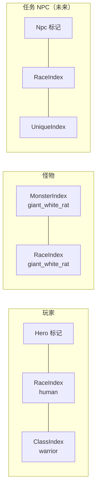
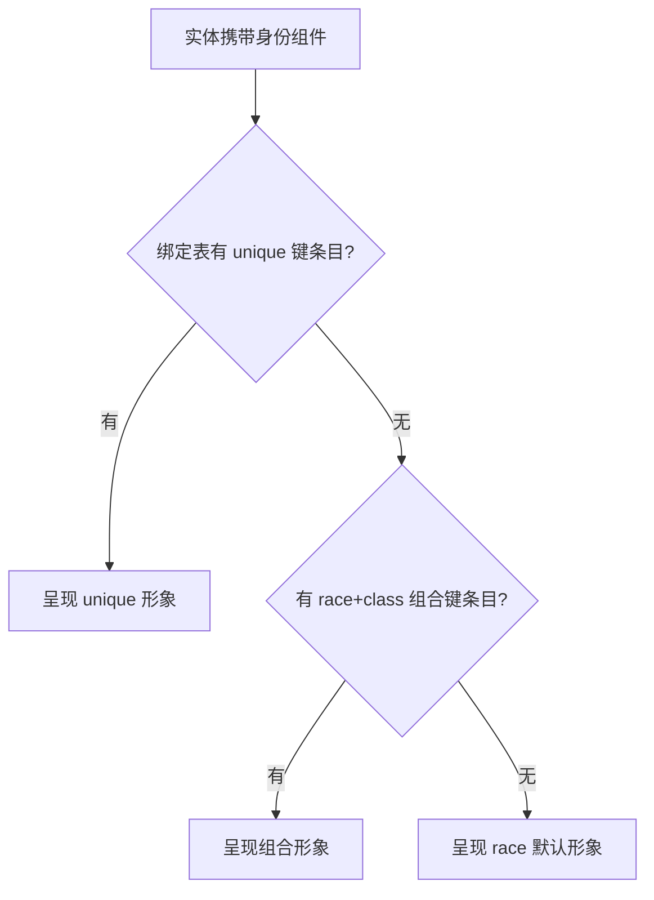
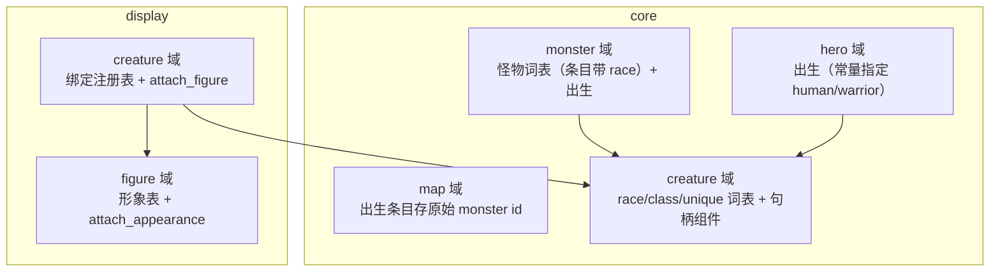
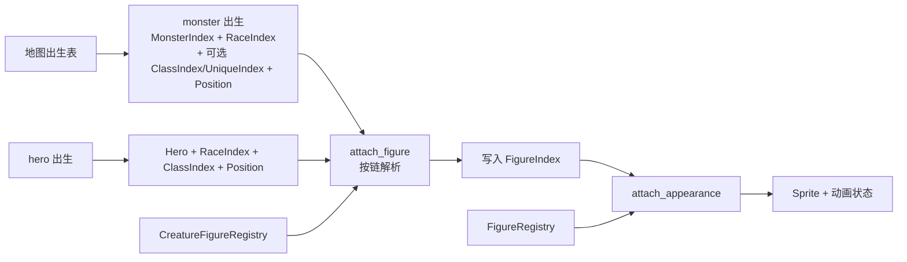

历史归档，不符合先英文后中文规范，请勿参考

# Design: creature-identity

## Context

现状与动机见 proposal.md。设计层面的事实约束：

- 既有模式：词表文件 → 注册表资源（`FromWorld` 拉取构建，注册顺序无关）→ u16 句柄组件；挂载系统以 `Added` 查询驱动；地图以原始 id 存储出生条目，map 域不依赖怪物域。
- ToME2 考证（.ref/tome2）：玩家身份 = `player_race` + `player_class`（types.h:1131、1329），怪物身份 = `monster_race`（types.h:461，r_info.txt 自称 "monster race information"）；形象绑定是 display 数据——xtra-new.prf 以 `$RACE`/`$CLASS` 条件重映射玩家贴图，race 默认兜底、(class, race) 组合精化；unique 混在怪物种族表里（`RF1_UNIQUE` flag）；身体变化有运行期机制（cave.c 玩家渲染分支的 `body_monster`、xtra2.c 的 `set_mimic`）。

## Goals / Non-Goals

**Goals:**

- 统一身份层：race（必需）+ class（可选）+ unique ID（可选）三个词表组件，玩家、怪物、未来的 NPC 皆以此表达身份。
- 形象解析收进 display：绑定表按 unique → race+class → race 取最具体匹配；figure 词表与外观表合并为一个域、一张表、一个注册表，关闭 OPEN_ISSUES #1。
- 为已知演进留缝：绑定表的可选键结构吸收未来的 ego/亚种/子职业维度；unique 聚合注册结构先行（NPC 落地即接入，不设独立词表文件）。

**Non-Goals:**

- 开局选职业 UI（本期主角身份由出生代码以常量指定）。
- ego、亚种、子职业等修饰层；附身、变形等运行期身体机制（Race 不可变，一次解析）。
- NPC 域与 unique 内容（词表为空表）。

## Decisions

### D1：身份层 = 三个词表组件，归于单一 core/creature 域

三个词表结构完全同构（注册表资源 + 句柄组件 + 条目类型），同属"生物身份"一个主题，落一个域内按侧面分目录。备选"一词表一域"被否：三个同构小域只会带来三倍的 mod.rs 仪式。

unique 轴的处理：个体即内容，不设独立词表文件——unique id 由内容文件声明（怪物条目的 `unique_id` 字段；npc.ron 落地时同法）。这里确立一条原则：**一个文件允许多个解析者各读各的部分**——UniqueRegistry 自构建（`FromWorld` 直读来源文件），用只声明 `unique_id` 字段的探针布局解析共享文件（serde 跳过其余字段），不经任何其他注册表转手；内容域与身份域零模块耦合，环在结构上不可能。代价是字段漂移静默化（改名会读空），由双解析一致性测试兜底（探针与全条目各解析真实文件一遍，断言一致）。



角色标记（Hero / MonsterIndex / 未来的 Npc）驱动行为，身份组件驱动呈现，两边互不泄漏。class 对怪物开放（"狗头人酋长" = race + class，无组合图时落回 race），词表层不做"谁可以拥有 class"的限制——ToME2 用显示字母限制 ego 适用范围（re_info.txt 的 `R_CHAR_*`）是反面教材：呈现层信息不能当玩法约束。

### D2：怪物词表保留，条目携带身份字段，注册表行式存储

怪物不止身份，还是数值与行为的生长点（HP、速度、攻击方式沿条目生长，对照 ToME2 r_info 的全数值条目）。因此 monsters.ron 保留，条目加 `race` 字段（必需）与 `class`、`unique_id` 字段（可选，如 `( monster: "grip", race: "dog", class: "warrior", unique_id: "grip" )`），出生时解析并加挂对应句柄；MonsterIndex 保留为行为侧身份。地图出生条目保持 `monster` 键，格式不变。race 词表只做形象身份轴（human、giant_white_rat……），与怪物词表是"身份"与"业务"两个主题。

注册表为行式存储（`Vec<MonsterKind>` + by_id 映射，`MonsterIndex::index()` 为 pub(crate) 槽位访问器）：一次索引拿到整行，条目顺序免费保持；列式（每字段一张 HashMap）在字段生长时不可持续。行类型名 `MonsterKind`——ECS 里"一只怪物"是实体（携带 MonsterIndex），行是种类的数据，名字不与实体争。TerrainRegistry、MonsterRegistry、FigureRegistry（display 侧）同构，行式即注册表样板；存档时代其余词表（handle→id 反查需要 ids）向此形态收敛。

### D3：形象绑定 = 模式匹配表，最具体者胜

绑定条目以可选字段表达三种键形态，解析按 unique → race+class → race 取最具体匹配：

```ron
[ ( unique: "grip", figure: "grip" ),                       // unique 键
  ( race: "human", class: "warrior", figure: "warrior" ),   // race+class 组合键
  ( race: "giant_white_rat", figure: "giant_white_rat" ) ]  // race 键
```



字段组合必须恰好构成三种键之一（unique 不与 race/class 混用，class 不单独出现），加载期校验。实现注记：RON 的 Option 字段默认只认 `Some(...)`/`None` 字面量，现成出口是其 `implicit_some` 扩展——解析侧以 `ron::Options::default().with_default_extension(Extensions::IMPLICIT_SOME)` 解析（怪物条目同用），数据文件保持裸字符串，无需任何自定义 serde 代码。参考来源：xtra-new.prf 的条件重映射表（race 默认 + 组合精化 + '@' 兜底）。两处刻意偏离：以命名 id 替代图集位置（cave.c 的 `BMP_FIRST_PC_CLASS + pclass` 位置式绑定把贴图排版耦合到职业顺序，不学）；unique 身份独立成轴而不混进 race 词表（ToME2 把 unique 塞进 r_info，词表被个体污染，不学）。

可扩展性是这条设计的目标：未来 ego、亚种、子职业到来时只是条目上的新可选键（如 `( race: "orc", racemod: "skeleton", ... )`），键形态与解析器结构不动。race 默认只对有裸个体的种族必需（动物）；成员必带职业的种族（人形）允许只有组合键——没有裸形象素材时不强造。加载期校验保证每个 race 至少被一条条目（race 键或组合键）覆盖；三层全未命中的身份（如无职业的人形）在挂载时报错——今天出生全在启动期，等同加载期暴露。

### D4：figure 与 appearance 合并为一个域、一张表、一个注册表

分裂的唯一理由是词表曾滞留 core；迁入 display 后两表 1:1 闭合，分裂即成仪式。合并后：figures.ron 的每个条目 = id + 贴图 + 图集 + 帧表；FigureRegistry 一体提供 id→句柄与句柄→外观；跨文件闭合校验在结构上消失（单表校验保留：id 重复/为空、帧号越界、帧率非正、缺 Idle）。appearance 一词保留在外观数据值类型与挂载系统上（Appearance、attach_appearance）；帧表词干统一为 anim（AnimClip→Anim，字段 clips→anims，含参数与变量名）。

### D5：身份一次解析，Race 不可变

attach_figure 以 `Added` 身份组件驱动，一次解析写入 FigureIndex；不做运行期重解析。ToME2 的身体变化机制（附身的 `body_monster`、变形的 `set_mimic`、吸血鬼化的 race-mod）是运行期可变的，其实现方式（组件置换还是修饰层）不在本期裁定；绑定解析集中于 attach_figure 一处，未来机制的接入成本可控。

### D6：域落位与数据流



map 域保持不知道身份词表（原始 id，出生时由 monster 域解析——沿用现有纪律）。display/creature 是 core 身份与 display 形象之间的桥：读身份组件、查绑定表、写 FigureIndex；display/figure 自足。UniqueRegistry 自构建：直读声明个体的内容文件（monsters.ron，将来 npc.ron），多解析者共享文件，无跨注册表依赖。



## Risks / Trade-offs

- [绑定链静默落回掩盖内容错误（组合键拼错时默默落回 race 默认）] → 加载期校验覆盖引用与重复键；落回本身是设计行为，内容正确性由 spec 对齐测试锁定真实数据文件。
- [unique 词表为空、组合层仅一条，机制缺少真实数据检验] → 结构先行是面向终局设计的有意留缝；合成文档单测覆盖三层解析与全部校验分支。
- [appearance→figure 与 clip→anim 的更名横跨代码与 spec，遗漏即编译或测试失败] → 提交前全绿门槛（`cargo +nightly fmt --check`、`cargo clippy --all-targets`、`cargo check --all-targets`、`cargo test`）。
- [未来身体机制的接入方式未定] → 本期裁定 Race 不可变、一次解析，机制单独立项；解析点集中于 attach_figure，改造成本可控。

## Migration Plan

原型阶段无存档与对外 API，一次性切换：数据文件合并/更名、代码迁移、OPEN_ISSUES #1 条目删除，全绿后提交。
