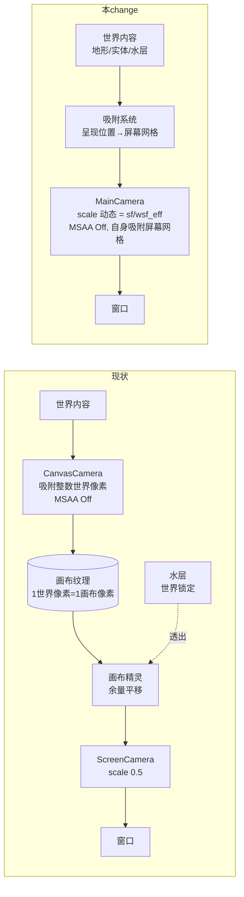
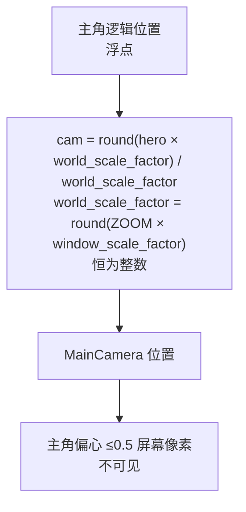
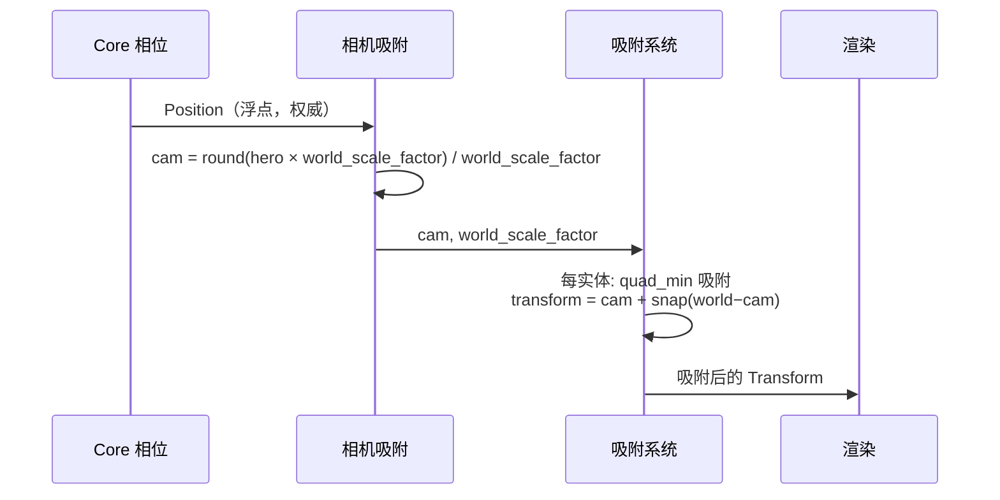
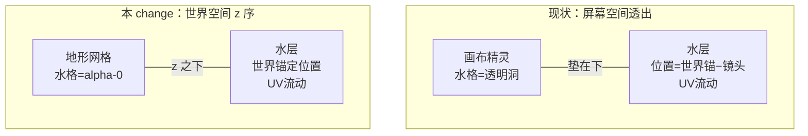
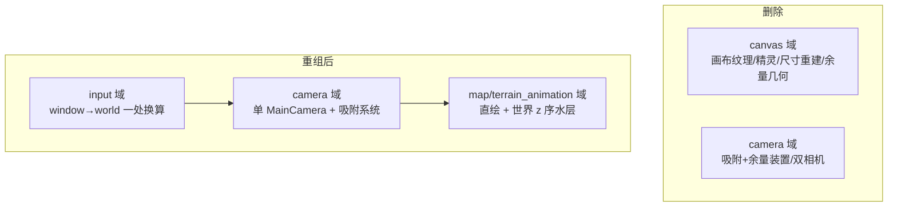

# Design: direct-render-pipeline

## Context

动机与实验结论见 proposal.md - Why。本 change 的设计前提（全部经实机实验验证）：

- 杂线根因定案：四边形边缘逼近屏幕像素中心时，帧边界采样被光栅化插值误差推入相邻帧纹素。MSAA 只调浓淡；显示器缩放档位只改变屏幕像素网格间距（scale_factor）。
- 不变量：**呈现位置吸附到屏幕像素网格**（网格间距 = 1/有效倍率 世界单位，有效倍率 = round(2×scale_factor) 恒为整数）时，帧边缘与像素中心的距离恒定，远大于插值误差，错采不可能发生。
- 整倍放大下最近邻采样的块均匀性：素材 1 像素 = N 屏幕像素块，任意屏幕像素网格上的平移不破坏块的均匀（长度为整数的半开区间恒含整数个格点）。
- 工程锁定 bevy 0.19.1。参考：`.ref/gdx-mellow-demo/core/src/com/codedisaster/mellow/MellowGame.java`（吸附到像素网格 + 整数屏幕上屏位移的源头，其 `upscaleOffset` 明确取整数）；`.ref/bevy/examples/2d/pixel_grid_snap.rs`（两道渲染与分层的官方先例——本 change 逆向其结构，只留直绘）；本仓 archive 的 `2026-09-29-pixel-perfect-canvas` 与 `2026-09-30-smooth-water-scroll` design（被否路径与余量机制的记录）。

## Goals / Non-Goals

Goals:

- 单一相机直绘窗口：地形、实体、水、将来的一切呈现源同走一条路径；一切呈现位置吸附屏幕像素网格。
- 运动量子 1 屏幕像素：慢速实体平滑；滚动平滑度不劣于现状（现状上屏量子同为 1 屏幕像素）。
- 像素保证四条纪律（最近邻、MSAA 关、有效倍率恒为整数、屏幕网格吸附）集中落实，新呈现源自动继承。

Non-Goals:

- 放大倍率可配置化（固定 2 倍，用户裁决）。
- 亚屏幕像素平滑（需要混合，软化像素——已否决，见 archive smooth-water-scroll 的定理与否决表）。
- OPEN_ISSUES 登记维护（归档时统一处理）。
- 游戏逻辑侧任何改动；UI 渲染层归属（UI 尚未出现，届时决策）。

## Decisions

### D1 管线重构：两道渲染 → 单相机直绘

唯一 `Camera2d`：投影 scale 恒 0.5（ScalingMode::WindowSize，视野 = 窗口逻辑尺寸 ÷ 2，拖窗即变），`Msaa::Off` 直接挂在相机上——画布时代"MSAA 只关画布相机"的纪律变为"唯一相机 MSAA 关"，结构性回归点消失。渲染目标即窗口，无中间纹理：填充率反而低于现状（现状画布 23 万像素 + 上屏 92 万，直绘只付 92 万）。

参考：`.ref/bevy/examples/2d/pixel_grid_snap.rs`（`OuterCamera`/画布精灵的呈现关系——本 change 相当于把世界直接放进它的 `HIGH_RES_LAYERS`）。

### D2 相机：吸附屏幕像素网格，无余量装置

- 余量机制的存在理由是"画布相机必须整数吸附而滚动要更细"；直绘下相机的上屏量子就是 1 屏幕像素，吸附即全部，余量环与画布精灵平移一并删除。
- **有效倍率恒为整数**（`world_scale_factor = round(ZOOM × window_scale_factor)`，至少为 1）：分数缩放档位（175%、215%）下，非整数倍率使帧的屏幕尺寸出现小数（15 × 3.5 = 52.5），远边必然压上像素中心抽签——这是实机发现的"头顶固定线"根因。取整后任意帧尺寸两边恒在格上，类目整个关闭；投影 scale 每帧换算为 `window_scale_factor / world_scale_factor`，视野尺寸吸收取整偏差（175% → 纵视野 315、215% → 387 世界像素）。150% 与 100% 下取整为零偏差，画面与已验证版本逐像素一致。
- scale_factor 每帧实时读取（窗口跨屏拖动即变），网格随之换算；吸附是每帧计算，天然跟随。
- 震屏等将来的全屏偏移同样过吸附（纪律 4 适用于相机本身）——震屏以 1 屏幕像素为量子，观感无损。
- 参考：`.ref/gdx-mellow-demo` 的 `sceneIX = floor(sceneX * SCALE) / SCALE`——同一定律，只是吸附对象从画布相机换成唯一相机、网格从窗口像素换成屏幕像素。

### D3 单一吸附系统（用户裁决：集中）

- Display 相位一个系统，排在相机吸附之后：对每个呈现实体，**吸附其四边形的 min 角**（而非平移分量）：`rel_min = (world − cam) − min_corner_offset`，吸附后回写 `transform = cam + snapped_min + min_corner_offset`。吸 min 角使"四边形边缘落在屏幕像素边界"对任意 offset（含小数）恒成立——锚点只保留语义职责（脚底压格底），网格对齐职责由本规则承担。
- 纪律集中的理由即本 change 的核心风险缓解：新呈现源只要经过该系统即自动守规矩（用户裁决）。
- 地形 chunk 与水层不过吸附系统：它们的顶点在整数世界像素上，相机吸附后其屏幕位置恒为整数屏幕像素（证明：p 整数、cam = k/world_scale_factor，屏幕位置 = (p−cam)×world_scale_factor = p×world_scale_factor − k；scale_factor 为 1 或 1.5 时 world_scale_factor ∈ {2,3} 皆整数），天然在格。
- 参考：archive pixel-perfect-canvas design D2（"吸附与平移一体算出"的同构关系；本 change 把平移从画布精灵移到各实体自身）。

### D4 水层与地形直绘重接

水层从屏幕空间装置变回普通世界内容：地图尺寸四边形置于世界锚定位置（z 低于地形网格），不再需要 follow_target 逐帧世界锁定；UV 流动系统原样保留。水岸自动拼合的 alpha-0 开放水格机制不变（它本就在地形网格上）。"多类型动画地形需格子并集网格"（OPEN_ISSUES #2）的性质不变、仍登记。

### D5 删除清单与域重组

- 鼠标映射：世界坐标 = cam + (光标逻辑位置 − 窗口逻辑中心)/2——单一出处不变，公式简化。
- 视野随窗口、图外背景色等行为不变（spec 已述）。

## Risks / Trade-offs

- [新呈现源绕过吸附系统 → 杂线回归] → spec 把四条纪律写成需求；单测锁定吸附函数与奇偶相位边界；验收方式用户裁决为仅单测（不强制实机肉眼环节）。
- [scale_factor 运行中变化（跨屏拖动）] → 网格每帧实时换算，吸附系统每帧执行，天然跟随。
- [分数 scale_factor（175%、215% 等）] → 有效倍率取整到整数（round(ZOOM × scale_factor)），像素块恒均匀、任意帧尺寸两边恒在格；视野尺寸吸收取整偏差（spec"视野 ≈ 窗口 ÷ 2"本带"约"），无宽容残留。
- [实体块与地形块运动中错位] → 已肉眼确认的固有外观，记录在 proposal，不追踪。
- [主角偏心 ≤0.5 屏幕像素] → 不可见；camera spec 已改写居中语义。

## Migration Plan

纯渲染路径变更，无数据格式与存档迁移。落地步骤与验证归 tasks.md；回滚 = git 级还原（画布管线在 git 历史中完整存在）。

## Open Questions

- UI 出现时的渲染归属：直绘管线下原生渲染即可，届时决策（继承自 pixel-perfect-canvas 的 open question，语义已转化）。
