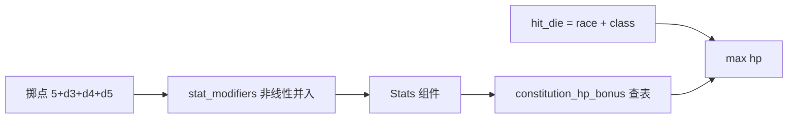
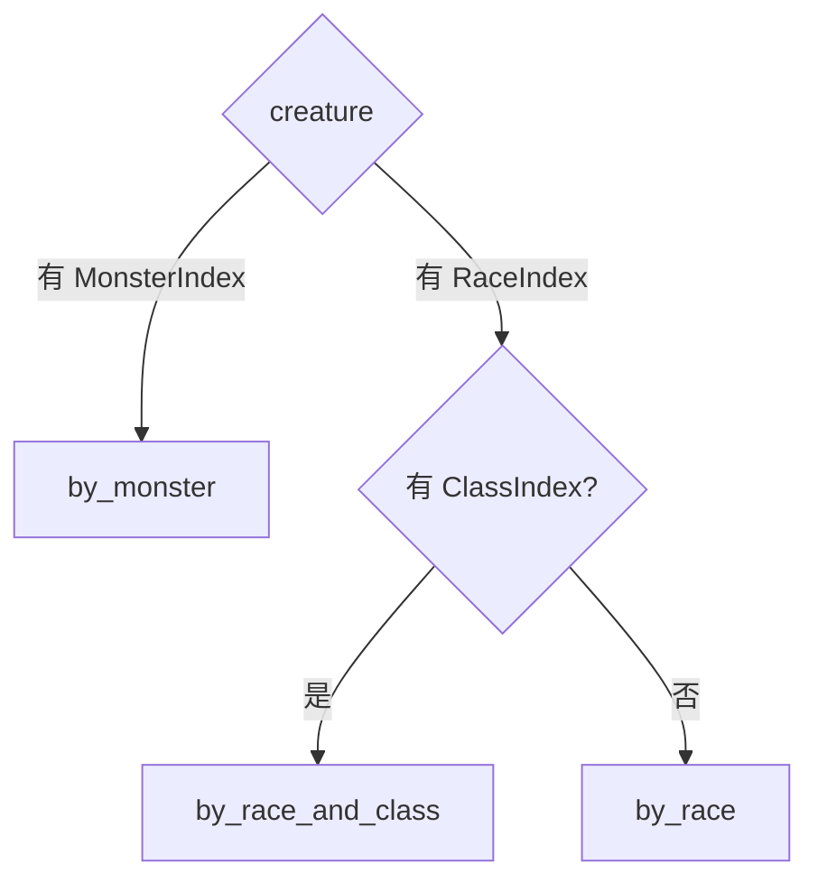

历史归档，不符合先英文后中文规范，请勿参考

# Design: character-attributes

## Context

现状骨架见 proposal.md - Why 与 Impact。关键结构事实：

- `core/creature/` 现有 race/class/unique 三张注册表，只存 id、丢条目字段；`core/monster/` 的 `MonsterKind` 携带 race/class/unique；`frontend/display/creature/` 以 race 为怪物绑定与 attach 的枢纽（`Added<RaceIndex>`）。
- 出生现状：`core/player/entities/player.rs` 的 `spawn_player` 以代码常量（human/warrior）挂身份组件，无属性。
- `core/speed/` 是"只有组件 + 常量 + 纯函数、无系统"的域样板。

关键参考事实：

| 事实 | 出处 |
|---|---|
| 六维掷点 `5 + d3 + d4 + d5`、总和 42–57 | tome2 `birth.c:375 get_stats` |
| 修正 18 以上分段非线性并入 | tome2 `birth.c:308 adjust_stat` |
| 生命 `max = hit_die + con_bonus(con)`（等级 1） | tome2 `xtra1.c:1904 calc_hitpoints`、`birth.c:486` |
| 体质→生命加成 38 项表（128 为基线） | tome2 `tables.c:978 adj_con_mhp` |
| 怪物无六维，kind 束 = hdice/ac/blow/speed | tome2 `types.h:461 monster_race` |
| Human `r_mhp=10`、Warrior `c_mhp=9`、`c_adj=[5,-2,-2,2,2,-1]` | tome2 `lib/edit/p_info.txt` |
| ECS：组件/系统/资源分工、插件装配、Startup vs Update | bevy 官方入门（`.ref/bevy-website/.../getting-started/`） |

## Goals / Non-Goals

**Goals:**

- 玩家向六维与全生物生命值落地，机制逐项对齐 tome2、可用区间/不变量单测锁定。
- race/class 独立成域并保留条目；怪物以 kind 为身份；unique 整套移除。
- 出生掷点写成纯函数，玩家出生时一次把值解析进组件。

**Non-Goals:**

- 命中/防御/伤害与碰触战斗；等级与逐级生命表；属性吸取与运行时重算；角色创建界面；可种子化随机源。

## Decisions

### D1 域拆分与依赖方向

```mermaid
flowchart LR
    race --> stats
    class --> stats
    stats --> health
    monster -.kind 为身份.-> display_creature[display/creature]
    race & class --> player
    player --> stats & health
```

- `core/race/`、`core/class/`：词表、注册表、句柄组件，各加 `stat_modifiers`、`hit_die`。
- `core/stats/`（玩家向六维）与 `core/health/`（全生物生命值）：仿 `speed` 域，只放组件 + 常量 + 纯函数，无系统、无注册。
- `core/creature/` 解散；怪物身份归 `core/monster/` 的 kind。
- 依赖方向：stats 读 race/class（取修正与生命骰）、health 由 stats 派生，单向无环；怪物不经 stats。

### D2 六维组件与掷点

- `Stats { max: [i32; 6], current: [i32; 6] }`（对应 tome2 `stat_max`/`stat_cur`）；`Stat` 枚举全名（Strength/Intelligence/Wisdom/Dexterity/Constitution/Charisma）做数组索引。单组件：六维同掷、同展示、同派生，是内聚小值集合；按 `Stat` 索引读单维。
- 掷点：六组 `5 + d3 + d4 + d5`，总和落在 42–57 才接受，否则整组重掷（对应 tome2 `get_stats`）。

### D3 修正并入与生命派生

- `stat_modifiers: [i32; 6]`（对应 tome2 `r_adj`/`c_adj`），按 18 以上分段非线性并入基准（对应 tome2 `adjust_stat`）。
- 生命：`constitution_hp_bonus(con)` 查 38 项表（128 为基线，对应 tome2 `adj_con_mhp`）；等级 1 时 `max = hit_die + constitution_hp_bonus(con) / 2`（整数除法），`current = max`。逐级数组与运行时重算押后。



### D4 race/class 注册表保留条目

- 注册表从"只存 id"升级为"保留条目"（仿 `MonsterRegistry` 的 `Vec<Kind>` + `by_id`）：`RaceKind { stat_modifiers, hit_die }`、`ClassKind` 同构；提供 `race_kind(RaceIndex)` 访问器。
- 加载校验：`stat_modifiers` 长度恰为 6、`hit_die > 0`、id 非空不重复。

### D5 身份拆分与 figure 绑定键

- 怪物以 kind（MonsterIndex）为身份：条目减为 `monster + speed`，去掉 race/class/unique_id；`unique` 整套移除。
- 绑定键扩为 `{monster} | {race} | {race+class}`，优先级 monsterId > race+class > race；attach 拆两系统（怪物 `Added<MonsterIndex>`、人形 `Added<RaceIndex>`）。



### D6 出生落位

- `spawn_player` 串起出生：解析 race/class 句柄 → 掷点 → 并入修正 → 派生生命 → 一次挂齐 `Stats`/`HitPoints` 与既有组件。纯函数归 stats/health 的 `utils/`，`spawn_player` 只做调用与挂组件；race/class 仍是代码常量，不做创建界面。

## Risks / Trade-offs

- 掷点随机 → 单测写区间/不变量（每维 8–17、总和 42–57；生命为 hit_die 与体质的确定函数），不做种子化（沿用 world-clock 的押后）。
- `core/creature` 解散波及 player/monster/display 的引用路径 → 一次性迁移，编译器兜底。

## Migration Plan

1. 新建 race/class/stats/health 域；词表加字段、注册表升级。
2. 怪物条目减字段、figure 绑定换键、attach 拆分；删除 unique 与 `core/creature`。
3. 出生接 stats/health；更新四个数据文件。

## Open Questions

- 命中/防御/伤害的 kind 束字段与判定在战斗变更里定（本变更只到生命）。
