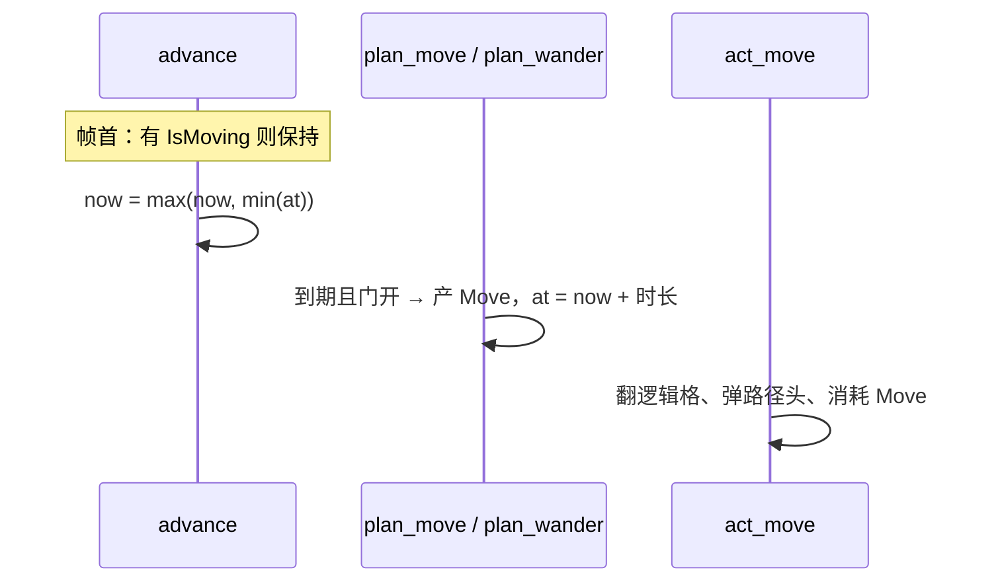
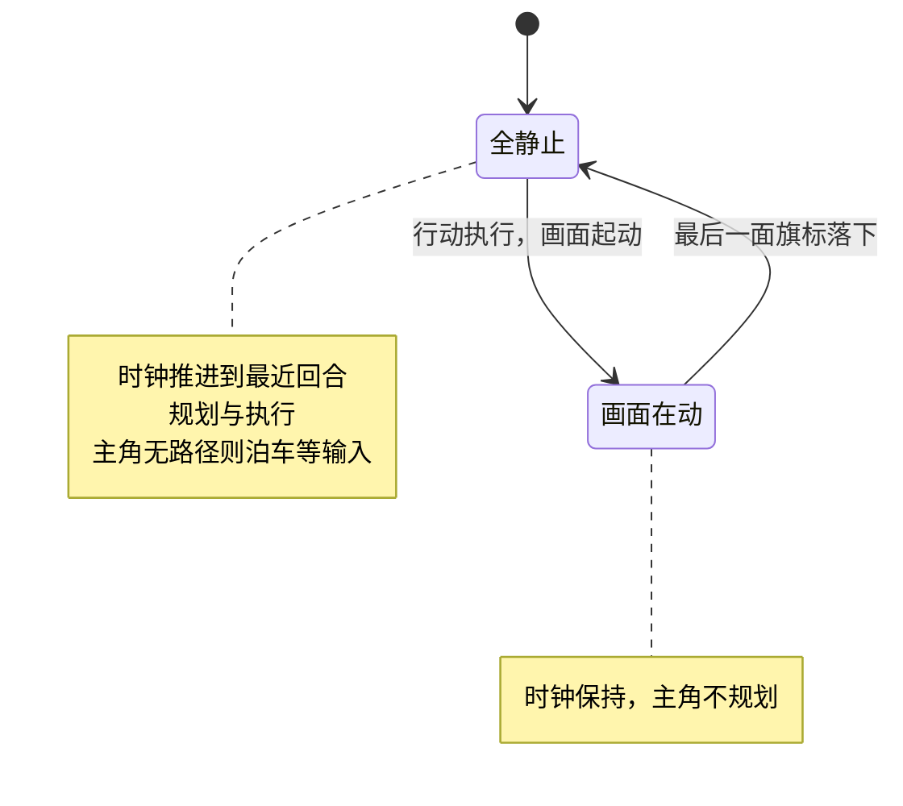
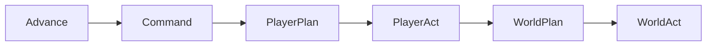
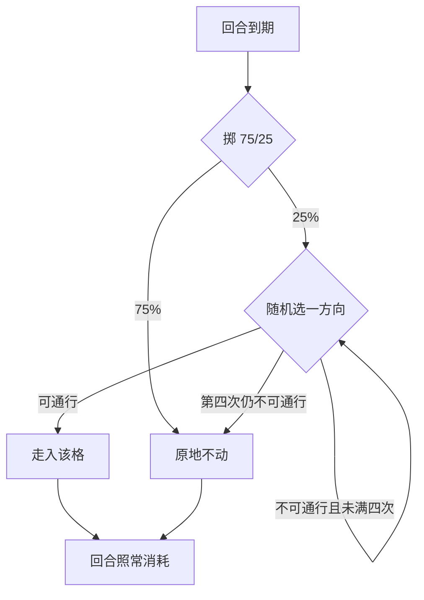

历史归档，不符合先英文后中文规范，请勿参考

# Design: world-clock

## Context

现状骨架（本变更的结构事实）：

- 世界时钟域 `src/core/world_clock/`：`WorldClock` 资源（`now`，整数 tick）、`NextTurn`（回合槽组件）、`WorldDriver`（世界驱动者标记）、`advance` 系统。
- 速度域 `src/core/speed/`：`Speed` 组件、速率表与时长常量、`action_duration` 纯函数；无系统、无注册。
- 移动域 `src/core/movement/`：`Path`（排队路径）、`Move`（一步行动）、`act_move`（执行器）。
- 协议域 `src/core/display/`：`IsMoving` 组件——display 写、core 读。
- 前端 motion 域 `src/frontend/display/motion/`：`CurrPosition`（呈现位置）、`move_sprite`、位置工具函数。

关键参考事实：

| 事实 | 出处 |
|---|---|
| 速率表 `extract_energy[300]`：110 = 标准速率 10，高速饱和 49 | tome2 `src/tables.c:1124` |
| 移动八方向消耗相等 | tome2 `src/cmd1.c:4672` |
| 回合槽持久、行动后按消耗推进（`Actor.time`） | PD `src/com/watabou/pixeldungeon/actors/Actor.java:38-46` |
| 移动画面每格固定 0.1s、方向无关 | PD `src/com/watabou/pixeldungeon/sprites/CharSprite.java:53,136-141` |
| 老鼠携带 `RAND_25` 旗标 | tome2 `lib/edit/r_info.txt` N:86 |

## Goals / Non-Goals

**Goals:**

- 门控世界时钟：世界等画面、主角泊车；整数回合槽，无累积误差。
- 相对速度关系与参考逐项一致，可测：行动时长 = 标准时长 × 标准速率 ÷ 查表速率。
- 主角平滑度由结构保证：主角步进不读任何怪物状态。
- 逻辑位恒为整格；世界泊车时一切生物停在整格上。

**Non-Goals:**

- 显式"等待"动作、战斗、追击 AI、主角速度词表字段、NPC。
- 可种子化随机源：当前无存档/回放消费者，测试写成与概率无关；未来出现消费者时立项。

## Decisions

### D1 整数回合槽

每只生物持有持久的 `NextTurn { at }`：规划 = 产出行动 + `at = now + 时长`。`advance` 帧首两条规则：任何 `IsMoving` 存在则时钟保持；否则 `now = max(now, min(at))`——min 选最近的回合槽，max 保证时钟永不倒退。



整数 tick 的取舍：时长定价一次成型（整数四舍五入），不存在逐帧累积的浮点误差；回合槽持久不删除，未花费的未来回合天然就是泊车点（见 D3）。

### D2 时长定价与速率表

`action_duration(base, speed) = base × STANDARD_SPEED_RATE ÷ SPEED_RATE_TABLE[speed]`，整数四舍五入。表为 300 项原表直抄（脚本比对逐项一致）；词表 speed 直写索引原值，加载期校验、越界拒绝启动。表上限 49 → 最短时长 20 tick，任何行动都有代价。

速度只影响行动频率；画面步速恒定（每格 0.1s，方向无关）——速度感完全由行动频率表达，画面不承担定价。

### D3 世界等画面：冻结、泊车与预测式放行

`IsMoving` 是协议组件：display 侧 `move_sprite` 按"剩余路程是否超过一帧步长"挂载或摘除旗标，core 侧 `advance` 与 `plan_move` 读。



- 主角规划看全局门（任何画面在动都不规划）：世界节奏与画面严格一致。
- 怪物规划看自身门（自己的画面在动才等待）：怪物连跳之间必有时钟推进所需的全静止帧，主角不会被饿死。
- 预测式放行：旗标在落地前一帧摘下，核心在画面收尾的同一帧规划下一步，新目标吸收剩余路程，衔接无停顿。
- 泊车：主角无路径 → 回合不消耗 → 其未来回合是最近回合 → 时钟停在其上等输入。冻结只冻世界逻辑，idle 动画照播。

### D4 六阶段链与命令落盘



- `Command` 阶段独占命令执行：验证与寻路在此落盘。阶段链的链边即同步点——规划读到的一定是已落盘状态；改目标与规划同帧发生时，该步沿新路径走出（回归测试锁定）。
- 编排只在 core 根模块；域 register 只做成员注册。
- `act_move` 同入 `PlayerAct` 与 `WorldAct`：主角与怪物共用同一执行器。

### D5 RAND_25 随机移动



与参考一致：撞墙也耗一次行动。启动门：世界自 `WorldDriver` 的首个行动开始运转——其回合槽仍为零时怪物不规划。

### D6 域落位与依赖方向

```
src/core/world_clock/
  resources/world_clock.rs    时钟资源（now: i64）
  components/next_turn.rs     回合槽
            /world_driver.rs  世界驱动者标记
  systems/advance.rs          帧首推进时钟
src/core/speed/
  components/speed.rs         速度（词表出生期解析入组件）
  constants/speed.rs          速率表与标准速率
           /action_duration.rs 标准行动时长
  utils/action_duration.rs    时长定价纯函数
src/core/display/
  components/is_moving.rs     画面在动协议组件
src/core/movement/
  components/path.rs move.rs  排队路径 / 一步行动
  systems/act_move.rs         行动执行器
src/core/player/
  commands/move_to_cell.rs    命令消息
  systems/commands/move_to_cell.rs  命令执行（Command 阶段）
  systems/plan_move.rs        步进规划
src/core/monster/
  systems/plan_wander.rs      RAND_25 随机移动
src/frontend/display/motion/
  components/curr_position.rs 呈现位置
  systems/move_sprite.rs      画面移动与旗标写摘
  utils/position.rs           位置纯函数
```

依赖方向：`speed` ⊥ `world_clock` ⊥ `creature`；`world_clock` 只依赖 bevy 与 `core/display`；前端 → 内核单向，无环。

### D7 终局数据模型方向（记录）

race/class/monster 三表字段对齐 tome2：

| 我们的表 | 对齐 | 字段（终局） |
|---|---|---|
| race.ron | player_race（types.h:1133） | id + 物种修正：六维/技能/生命骰/抗性（全可选；怪物家族长期零修正） |
| class.ron | player_class（types.h:1329） | id + 六维/技能/成长修正、生命骰、法术参数 |
| monster.ron | r_info | id + kind 数值束：speed/hp骰/AC/攻击/旗标/经验/深度/掉落 + race + 可选 class/unique |

取值规则：终值 = kind 束 + race 修正 + class 修正，出生期合成后解析入组件。词表层不对称（玩家六维 vs 怪物 kind 束），运行期组件对称。race 词表是否按玩家/怪物拆分已登记 OPEN_ISSUES #2，角色属性体系立项时裁决。

## Risks / Trade-offs

- 全局静止门：画面密集时主角规划频率受画面节奏约束——刻意取舍（世界节奏与画面一致）；连跳之间必有全静止帧，主角不会被饿死。
- 随机源不可种子化：每帧取全局随机源，测试写成与概率无关的断言；存档/回放出现时再立项。

## Open Questions

- 长动作（祈祷类）的时长发布方式：`action_duration` 的 `base` 参数已预留入口，立项时定。
