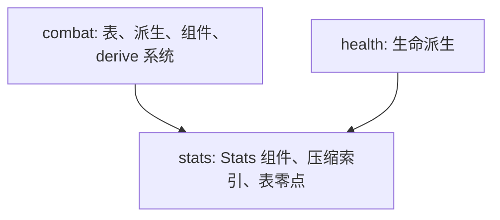
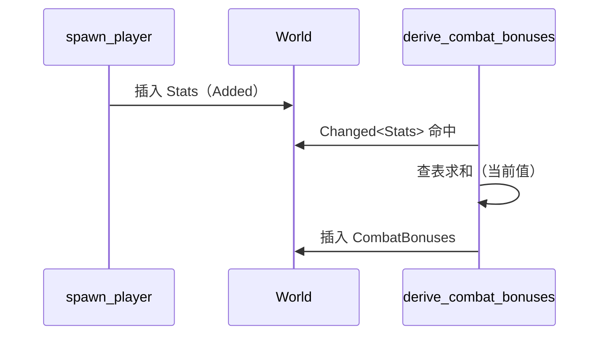

# Design: combat-bonuses | 设计：combat-bonuses

## Context

The six-statistic component (`Stats { max, current }`) and the hit-point
derivation precedent are in place: the 38-bracket compressed scale
(`stat_bonus_index`) and the constitution table are private to the
health domain. No combat domain exists, and the player side has no hit,
damage, or armor numbers. For motivation see proposal.md (Why); for the
behavior contract see this change's specs/ (combat added, stats
modified).

六维组件（`Stats { max, current }`）与生命派生先例已就位：38 段压缩刻度
（`stat_bonus_index`）与体质生命表私有于 health 域。战斗域不存在，玩家
侧没有任何命中、伤害、护甲数值。动机见 proposal.md（Why）；行为契约见
本变更 specs/（combat 新增、stats 修改）。

## Goals / Non-Goals

**Goals:**

- Found the combat domain: four stat bonus tables, three derived combat
  bonuses, and the three composite formulas (attack chance, unarmed
  damage, player armor class).

  combat 域开山：四张属性修正表、三个战斗修正的派生、攻击值/徒手伤害/
  玩家护甲三个合成公式。

- Land the derivation entry in its endgame form: the bonuses reside on
  a component; a derive system recomputes them wholesale whenever the
  statistics change and writes the component back; consumers read the
  component only. The computation core stays pure functions.

  派生入口按成品形态落地：战斗修正驻组件，derive 系统在六维变化时整体
  重算写回；消费方只读组件。计算核心为纯函数。

- Publish the compressed statistic index and the bonus-table bias as
  stats-domain capabilities, unifying the five tables (the four new
  ones plus the existing constitution table) on the source-table form
  (128 bias included).

  压缩属性索引与加成表零点成为 stats 域的公开能力，五张表（新增四张 +
  既有体质表）统一为源表原值形态（含 128 零点）。

**Non-Goals:**

- The skill system itself (skill components, growth, melee style
  selection) — this entry lands only the melee skill formula fed by
  stand-in factors (recovered under OPEN_ISSUES entry 8).

  技能系统本体（技能组件、成长、近战风格选择）——本条只落地命中技能
  公式并以顶替因子喂入（OPEN_ISSUES 条目 8 回收）。

- Hit resolution, damage resolution, and action wiring (entries 4, 5);
  combat feedback (entry 6).

  命中判定、伤害判定与行动接入（条目 4、5）；战斗反馈（条目 6）。

- Criticals, multiple blows, weapon dice, the stance and movement
  posture tables (entries 8, 9).

  暴击、多击、武器骰、站姿与移动姿态表（条目 8、9）。

- Stat drain/buff mechanics (entry 10) — the derive system's
  recomputation path is reserved for them.

  属性吸取/增益机制（条目 10）——derive 系统的重算路径为此预留。

## Decisions

Grilling conclusions. Proposal round: land entry 2 only (Q1); the new
capability is named combat (Q2); the compressed index sinks into the
stats domain with a new requirement (Q3). Design round: the derivation
entry is a component plus change-driven recomputation (Q1); the melee
skill term is the real formula fed by stand-in factors (Q2); the five
tables unify on source-table form with the bias subtracted on read
(Q3); table reads take the current statistic values (Q4).

grilling 结论汇总。proposal 轮：只落条目 2（Q1）；新 capability 名
combat（Q2）；压缩索引下沉 stats 域并增补 requirement（Q3）。design 轮：
派生入口为组件 + 响应变化的重算（Q1）；命中技能取真公式 + 顶替因子
（Q2）；五张表统一源表原值形态、读取减零点（Q3）；查表取六维当前值
（Q4）。

### D1 Table Form: Source Values Stored, Bias Subtracted on Read | 表族形态：源表原值存储，读取减零点

The four bonus tables are copied value by value from the source tables,
128 bias included (tome2 src/tables.c:610 strength-to-hit, :518
strength-to-damage, :564 dexterity-to-hit, :472 dexterity-to-armor); a
reader subtracts the bias to obtain the bonus. The existing
constitution table is brought to the same form (its values already
match adj_con_mhp one to one, tome2 src/tables.c:976-1017), with the
same subtraction at its read site; behavior is unchanged.

四张修正表逐值搬运源表，含 128 零点（tome2 src/tables.c:610 力量命中、
:518 力量伤害、:564 敏捷命中、:472 敏捷护甲），读取处减零点得修正。既有
体质生命表一并改存原值（数值已与 adj_con_mhp 逐项核对一致，tome2
src/tables.c:976-1017），读取处同减零点；行为不变。

Rationale: the tables match the source character for character, so
transcription is verification. The rejected alternative — storing net
values with the bias pre-subtracted — diverges from the source form,
adds a mental subtraction to every audit, and contradicts the alignment
policy settled this round.

理由：表与源表逐字可对拍，录入即可核对。备选"存净值、录入时预减"被否：
与源表形态不一，逐字核对要多一步心算，且与本轮定下的对齐口径相左。

### D2 Reads Take the Current Statistic Values | 派生取六维当前值

Table reads take the current values (tome2 reads the drained, in-use
values; this project's health spec already established the same
wording — the constitution bonus is looked up by the current value). No
drain mechanic exists today, so the two values are equal at birth and
the choice is behaviorally indistinguishable; the wording pins the
endgame semantics now, so the drain mechanic lands with zero rework.

查表取当前值（tome2 以吸取后的现行值查表；本项目 health spec 已立同款
措辞——体质加成按当前值查表）。当前无吸取机制，出生时两值相等、行为
不可区分；措辞按终局语义钉死，吸取机制接入时零返工。

### D3 Entry Form: Component Residence Plus Change-Driven Recomputation | 入口形态：组件驻留 + 响应变化的重算


- `CombatBonuses { hit, damage, armor }` resides on the entity; the
  field names do not copy the source project's abbreviations.

  `CombatBonuses { hit, damage, armor }` 组件驻实体；字段不沿用源工程
  的缩写命名。

- The derive system queries `(Entity, &Stats)` with `Changed<Stats>`:
  Added is covered by Changed, so birth triggers it, and `spawn_player`
  stays untouched (open-closed). Recomputation is always wholesale (all
  three bonuses together), isomorphic to the source's calc_bonuses
  (tome2 src/xtra1.c 的 calc_bonuses); the trigger comes from Bevy
  change detection (.ref/bevy/crates/bevy_ecs/src/query/filter.rs:956).

  derive 系统 `Query<(Entity, &Stats), Changed<Stats>>`：Added 被
  Changed 覆盖，出生即触发；`spawn_player` 零改动（开闭）。重算永远
  整体进行（三个修正同算），与源工程 calc_bonuses 同构（tome2
  src/xtra1.c 的 calc_bonuses；本项目借 Bevy change detection 获得
  触发，.ref/bevy/crates/bevy_ecs/src/query/filter.rs:956）。

- The computation core stays pure functions (table reads plus sums),
  shared by the derive system and the tests; pure functions touch no
  ECS — the same discipline as the dice/rng change.

  计算核心为纯函数（查表 + 求和），derive 系统与测试共用；纯函数不碰
  ECS，取数纪律与 dice/rng 案一致。

- The rejected alternative — pure functions computed on demand — pushes
  "when to recompute" onto every consumer once the endgame input
  sources multiply (statistics, skills, equipment, effects); the source
  project built a five-level update schedule for exactly this problem,
  which proves it real.

  备选"纯函数按需算"被否：终局输入源多（六维、技能、装备、状态），
  每个消费点各算一遍等于把"何时重算"推给所有消费方；源工程为此建起
  五级更新调度，说明该问题真实存在。

### D4 Melee Skill: Real Formula, Stand-in Factors | 命中技能：真公式 + 顶替因子

The formula lands in this entry:

公式本条落地：

```
melee_skill_thn(style, combat) = 50 × ((7×style + 3×combat) / 10) / 10
```

The two integer divisions run stepwise in source order (tome2
src/xtra1.c:3903) — folding them into a single /100 would yield 6
instead of 5 at factors (1, 2), a mistake the corpus once recorded; the
code shape pins the order down.

两步整数除法按源码次序逐步执行（tome2 src/xtra1.c:3903）——合并为
/100 在因子 (1, 2) 处会得 6 而非 5，语料库曾误记，代码形态钉死次序。

The factors are stand-in constants: `MELEE_STYLE_SKILL_STANDIN = 1`
(weaponmastery) and `COMBAT_SKILL_STANDIN = 2` (combat). Derivation
chain: the warrior class grants Combat +2000 and Weaponmastery +1000
raw points (tome2 lib/edit/p_info.txt:80-81, the C:k lines); get_skill
divides raw points by 1000 into skill levels (tome2 src/skills.c:114),
giving combat 2 and weaponmastery 1; the default melee style is
weaponmastery (tome2 src/skills.c:728-745); the formula under stepwise
integer division yields 5. Attack chance = melee_skill_thn(stand-ins) +
hit × 3 (tome2 src/cmd1.c:2640-2644; BTH_PLUS_ADJ = 3,
src/defines.h:367).

因子为顶替常量：`MELEE_STYLE_SKILL_STANDIN = 1`（武器掌握）、
`COMBAT_SKILL_STANDIN = 2`（战斗）。推导链：战士职业表授予 Combat
+2000、Weaponmastery +1000 原始分（tome2 lib/edit/p_info.txt:80-81 的
C:k 行）；get_skill 以原始分整除 1000 得技能等级（tome2
src/skills.c:114）→ 战斗 2、武器掌握 1；默认近战风格取武器掌握
（tome2 src/skills.c:728-745）；代入公式逐步整除得 5。攻击值
chance = melee_skill_thn(顶替因子) + hit × 3（tome2
src/cmd1.c:2640-2644；BTH_PLUS_ADJ = 3，src/defines.h:367）。

Recovery under entry 8: the stand-ins delete when the skill system
lands, the formula stays, and the replacement's form and home follow
the skill system's design — this file hosts no replacement
implementation.

条目 8 回收方式：顶替常量随技能系统落地删除，公式不变，替换的形式与
位置由技能系统的设计决定——本文件不承载替代实现。

The stand-ins' doc comment must spell out four things in self-contained
terms: the factor semantics (the level-one warrior's skill bases — raw
scores integer-divided by 1000), the formula they serve (the melee
skill term), the recovery path (replaced once the skill system lands),
and the stand-in boundary (the replacement's form and home follow the
future system's design — the file hosts the stand-ins, not the
replacement). The comment names no reference project; the derivation
chain and anchors live in this section.

顶替常量的 doc comment 须自解释写全四点：因子语义（一级战士技能基值
——原始分整除 1000 的换算结果）、服务公式（命中技能项）、回收去向
（技能系统落地后替换）、顶替边界（替换的形式与位置由未来系统的设计
决定——本文件只承载顶替值，不承载替代实现）；注释不提参考工程，推导
链与锚点以本节为准。

### D5 Index and Bias Sink into the Stats Domain | 压缩属性索引与表零点下沉 stats 域

`stat_bonus_index` moves into the stats domain and goes public; the
table bias constant (128) belongs to the same stat-bonus-table family
of shared conventions and is published alongside. The health domain
reads both through the stats domain, behavior unchanged. The stats spec
gains the "Compressed Statistic Index" requirement; the index gets its
own unit tests — it was previously covered only indirectly through the
constitution derivation.

`stat_bonus_index` 迁入 stats 域并公开；表零点常量（128）同属属性加成
表一族的共享约定，一并由 stats 域公开。health 域改经 stats 域取索引与
零点，行为不变。stats spec 增补"压缩属性索引"requirement；索引获独立
单测——此前它只经体质派生被间接覆盖。

### D6 Composite Formulas | 合成公式

- Attack chance: chance = melee skill term + hit × 3 (tome2
  src/cmd1.c:2640-2644; BTH_PLUS_ADJ = 3, src/defines.h:367).

  攻击值：chance = 命中技能项 + hit × 3（tome2 src/cmd1.c:2640-2644；
  BTH_PLUS_ADJ = 3，src/defines.h:367）。

- Unarmed damage: max(0, 1 + damage) — the base is 1 (tome2
  src/cmd1.c:2665); negative results floor at zero (:2846-2853). Weapon
  dice and criticals live only in the weapon branch (:2743); the
  equipment system does not exist, so they stay out.

  徒手伤害：max(0, 1 + damage)——基础值 1（tome2 src/cmd1.c:2665）；
  负值截 0（:2846-2853）。武器骰与暴击只在武器分支（:2743），装备系统
  不存在，不落。

- Player armor class: 0 + armor — the zero base stands in for the
  equipment armor source while no equipment system exists, recovered
  under OPEN_ISSUES entry 9 (the replacement's form and home follow
  the equipment system's design; this file hosts the stand-in only);
  monster hit resolution reads ac + to_a (tome2 src/melee1.c:1394).

  玩家护甲：0 + armor——装备基数 0 为顶替值，终局来源为装备系统
  （OPEN_ISSUES 条目 9 回收；替换的形式与位置由装备系统的设计决定，
  本文件只承载顶替值）；怪物命中读 ac + to_a
  （tome2 src/melee1.c:1394）。

### File Layout | 文件布局

```
src/core/combat/
  mod.rs                             — mod 声明 + register（注册 derive 系统）
  constants/stat_bonus_tables.rs     — 四张 38 项原值表
  components/combat_bonuses.rs       — CombatBonuses
  systems/derive_combat_bonuses.rs   — 响应 Stats 变化整体重算
  utils/combat_bonus.rs              — 三修正查表派生（取当前值）
  utils/attack.rs                    — 命中技能公式、顶替因子、攻击值、徒手伤害
  utils/armor_class.rs               — 玩家护甲
src/core/stats/
  utils/stat_bonus_index.rs          — 压缩属性索引（公开）
  constants/stat_bonus_table.rs      — 表零点常量（公开）
src/core/health/
  constants/constitution_hp_bonus.rs — 改存原值
  utils/hp.rs                        — 经 stats 域取索引与零点
```

### Domain Dependencies | 域依赖



### Birth Sequence | 出生时序



## References | 参考来源

- The four bonus tables: tome2 src/tables.c:472 (dexterity-to-armor),
  :518 (strength-to-damage), :564 (dexterity-to-hit), :610
  (strength-to-hit); the constitution table :976-1017.

  四张修正表：tome2 src/tables.c:472（敏捷护甲）、:518（力量伤害）、
  :564（敏捷命中）、:610（力量命中）；体质表 :976-1017。

- Bonus composition: tome2 src/xtra1.c:3482-3491.

  修正合成：tome2 src/xtra1.c:3482-3491。

- Attack chance: tome2 src/cmd1.c:2640-2644; BTH_PLUS_ADJ at tome2
  src/defines.h:367.

  攻击值：tome2 src/cmd1.c:2640-2644；BTH_PLUS_ADJ tome2
  src/defines.h:367。

- The melee skill formula and the stand-in factor derivation: tome2
  src/xtra1.c:3903; lib/edit/p_info.txt:80-81; src/skills.c:114,
  728-745.

  命中技能公式与顶替因子推导：tome2 src/xtra1.c:3903；
  lib/edit/p_info.txt:80-81；src/skills.c:114、728-745。

- Unarmed damage: tome2 src/cmd1.c:2665, :2846-2853.

  徒手伤害：tome2 src/cmd1.c:2665、2846-2853。

- Player armor class: tome2 src/melee1.c:1394.

  玩家护甲：tome2 src/melee1.c:1394。

- Wholesale-recompute form: calc_bonuses in tome2 src/xtra1.c.

  整体重算形态：tome2 src/xtra1.c 的 calc_bonuses。

- Corpus: .ref/tome2-specs/specs/player-derive/spec.md,
  tables/spec.md, player-melee/spec.md.

  语料库：.ref/tome2-specs/specs/player-derive/spec.md、tables/spec.md、
  player-melee/spec.md。

- Bevy change detection: .ref/bevy/crates/bevy_ecs/src/query/
  filter.rs:956 (Changed).

  Bevy change detection：.ref/bevy/crates/bevy_ecs/src/query/
  filter.rs:956（Changed）。

## Risks / Trade-offs

- [The four tables' 38×4 entries are transcribed by hand and may
  drift] → value-by-value tests against the source tables; the
  constitution table's form change is guarded by its existing behavior
  tests.

  [四张表 38×4 项手工录入可能出错] → 逐值测试对拍源表；体质表的形态
  改造由既有测试守住行为。

- [The attack/armor composites have no production consumers in this
  entry and would trip dead_code in a binary crate] → transition with
  #[allow(dead_code)], comments naming the consumers; removed when
  entries 4 and 5 land (the Stats component already set this
  precedent).

  [attack/armor 合成公式本轮无生产消费方，二进制 crate 下触发
  dead_code] → 以 #[allow(dead_code)] 过渡并在注释注明消费方；条目
  4、5 接入后移除（Stats 组件已有同款先例）。

- [derive and its consumers share the frame pipeline] → the derive
  system registers in its own CorePhase::Derive, chained between
  Advance and Command — every turn-logic phase reads freshly derived
  bonuses, and later consumers join their phases with no extra
  orchestration.

  [derive 与未来消费方同帧流水] → derive 系统注册于专属的
  CorePhase::Derive，链位于 Advance 与 Command 之间——各回合逻辑阶段
  读到的都是新鲜派生值，消费方接入后续阶段无需额外编排。

- [A statistics write that bypasses &mut would escape change
  detection] → in Bevy every component mutation goes through Mut's
  deref and flags itself; drain mechanics will pass through naturally,
  no code is reserved for this.

  [六维变更不经 &mut 则 change detection 不触发] → Bevy 中组件变更必经
  Mut 解引用、自动标记；吸取机制落地时自然走通，无需预留代码。

## Migration Plan

No data or deployment migration. The constitution table's form change
is a pure refactor within this change, behavior unchanged. On archive,
the new combat spec and the stats delta merge into the main specs.

无数据与部署迁移。体质表形态调整为同变更内的纯重构，行为不变。归档时
combat 新 spec 与 stats 增量并入主 specs。

## Open Questions

None — both grilling rounds are closed.

无——两轮 grilling 已收口。
