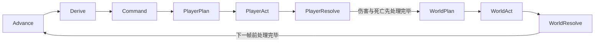
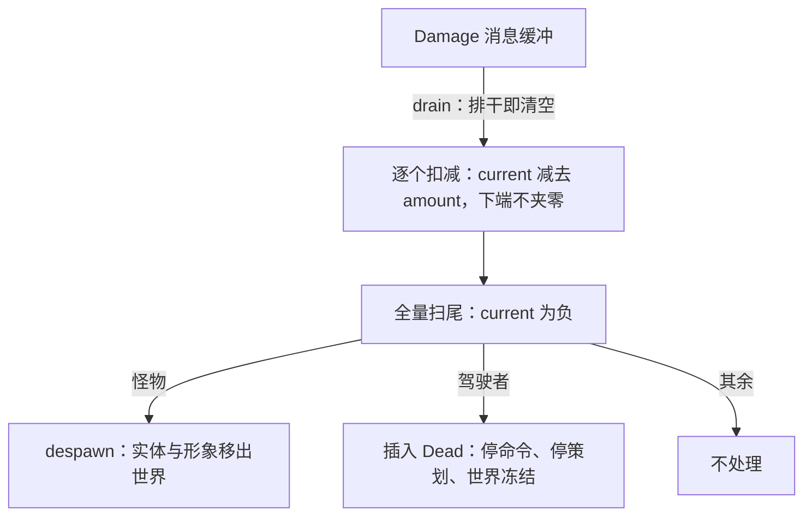
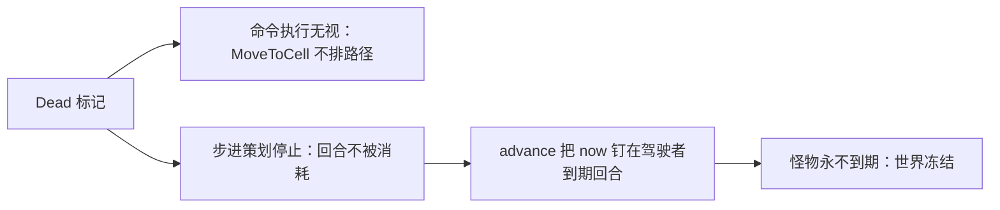

# Design: damage-and-death | 设计：damage-and-death

## Context

Current state and constraints (motivation: proposal.md - Why):

当前状态与约束（动机见 proposal.md - Why）：

- `HitPoints { current, max }` is shared by the player and every
  monster; both fields still carry `#[allow(dead_code)]` — nothing
  reads them. The only invariant is `current <= max`.

  `HitPoints { current, max }` 由玩家与一切怪物共享；两个字段仍挂
  `#[allow(dead_code)]`——没有读者。唯一不变量是 `current <= max`。

- The turn pipeline is seven chained phases: Advance → Derive →
  Command → PlayerPlan → PlayerAct → WorldPlan → WorldAct. The core
  root discipline: the two sides' root modules orchestrate sets only;
  every system sinks to its domain register; phases carry ordering and
  order facts never leave the phase enums (no cross-domain `.after()`).

  回合管线为七个链式阶段：Advance → Derive → Command → PlayerPlan →
  PlayerAct → WorldPlan → WorldAct。核心根纪律：两侧的根模块只编排
  集合；系统一律沉入所属域的 register；阶段承载排序，排序事实不
  离开阶段枚举（禁止跨域 `.after()`）。

- The clock sweeps with `now = max(now, min(every creature's
  next_turn.at))`: the clock can never pass a creature's unspent due
  turn, so the world stops while the driver stands without an action.

  时钟按 `now = max(now, min(所有生物的 next_turn.at))` 推进：时钟
  无法越过任何生物到期而未消耗的回合，因此驾驶者站着没动作时世界
  停住。

- A monster's figure is a component on the monster entity itself, so
  `despawn` removes the whole presentation with the entity.

  怪物形象是挂在怪物实体自身上的组件，`despawn` 会将表现随实体一
  并移除。

- Reference anchors: monster damage and death check at
  `.ref/tome2/src/xtra2.c:4549-4553` (`hp -= dam; if (hp < 0)`),
  monster removal at `xtra2.c:4819` (`delete_monster_idx`); player
  damage and death check at `.ref/tome2/src/spells1.c:1368-1413`
  (`chp -= damage; if (chp < 0)` → `death`/`leaving` flags). Both
  species die only at strictly negative hit points; zero is alive; the
  subtraction is never clamped at zero.

  参考锚点：怪物扣血与死亡判定在 `.ref/tome2/src/xtra2.c:4549-4553`
  （`hp -= dam; if (hp < 0)`），怪物移除在 `xtra2.c:4819`
  （`delete_monster_idx`）；玩家扣血与死亡判定在
  `.ref/tome2/src/spells1.c:1368-1413`（`chp -= damage;
  if (chp < 0)` → `death`/`leaving` 旗标）。两个物种都只在严格负
  值死亡；零为存活；减法下端不夹零。

## Goals / Non-Goals

**Goals:**

- One damage channel any future producer can use without knowing
  species, ordering, or death policy.

  一条伤害通道，未来的生产者使用时无需知道物种、时序或死亡政策。

- Ordering expressed entirely inside the phase enums, per the root
  discipline.

  排序完全落在阶段枚举内，合乎根纪律。

- Every behavior verifiable in tests that emit the channel message
  directly; no producer ships in this change.

  一切行为可由直接发出通道消息的测试验证；本变更不带任何生产者。

**Non-Goals:**

- Attack actions and their hit/damage rolls (OPEN_ISSUES entries 4, 5).

  攻击行动及其命中/伤害掷点（OPEN_ISSUES 条目 4、5）。

- Death presentation, tombstone, and any `AppState` switch
  (entry 6); experience, drops, corpses, fear rolls (entries 11-13).

  死亡表现、墓碑与任何 `AppState` 切换（条目 6）；经验、掉落、尸
  体、恐惧掷点（条目 11-13）。

- Healing of any kind; the channel only subtracts.

  任何形式的回血；通道只做减法。

## Decisions

### D1 The Channel Is a Message, Not Direct Producer Writes | 通道是消息，不由生产者直接改写

Producers emit `Damage { target: Entity, amount: i32 }`; one settle
system in the health domain applies it. Direct writes from the future
attack systems (mutating the target's `HitPoints` through their own
queries) were rejected: the strictly-negative rule, the despawn, and
the `Dead` marking would be duplicated into every attack system, and
this change could deliver nothing testable on its own. A transient
component on the target (the `Move` pattern) was rejected too:
components are unique per entity, so two hits on one creature between
resolves would overwrite — and entry 5 has multiple monsters striking
the player in the same `WorldAct`.

生产者发出 `Damage { target: Entity, amount: i32 }`；由 health 域
的一个 settle 系统施加。否决了攻击系统直接改写目标生命值的方案
（攻击系统经自己的查询改写 `HitPoints`）：严格负值规则、despawn
与 `Dead` 标记会重复进每个攻击系统，且本变更将无可独立交付测试
之物。也否决了挂在目标上的瞬态组件（`Move` 模式）：组件每实体
唯一，两个 Resolve 之间同一生物挨两击会互相覆盖——而条目 5 里
多只怪物会在同一个 `WorldAct` 攻击玩家。

### D2 Two Resolve Phases; One System Function Registered Twice, Draining Destructively | 双 Resolve 阶段；同一系统函数注册两次，破坏式排干

Damage dealt in `PlayerAct` must be fully processed before `WorldPlan`
(a slain monster never plans again), and damage dealt in `WorldAct`
before the next frame's planning (a slain player never steps again).
The root discipline bans cross-domain ordering, so the ordering becomes
two new phases: `PlayerResolve` after `PlayerAct`, `WorldResolve`
after `WorldAct` — the same Plan/Act/Resolve symmetry on both sides.

`PlayerAct` 造成的伤害必须在 `WorldPlan` 之前处理完毕（被杀的怪
物不再策划），`WorldAct` 造成的伤害必须在下一帧的策划之前处理
完毕（被杀的玩家不再迈步）。根纪律禁止跨域排序，因此排序落成两
个新阶段：`PlayerAct` 之后的 `PlayerResolve` 与 `WorldAct` 之后
的 `WorldResolve`——两侧同为 Plan/Act/Resolve 对称。

One system function cannot sit in both phases as one instance: sets
are ordering positions, and one instance in two chained positions
would need to run both before `WorldPlan` and after `WorldAct` — a
cycle. It registers as two instances, one per phase. Two instances
with ordinary `MessageReader`s would each apply every message once
(reader state is per instance), doubling all damage. The settle system
therefore takes `ResMut<Messages<Damage>>` and reads with
`Messages::drain()` (bevy_ecs 0.19,
`.ref/bevy/crates/bevy_ecs/src/message/messages.rs`), which removes
every buffered message: whichever instance runs after the write drains
it, the other finds an empty buffer. This destructive read is the
deliberate exception to the `MessageReader` convention, documented at
the system.

同一个系统函数不能以单实例身处分两个阶段：集合即排序位置，单实例
占两个链上位置就得既在 `WorldPlan` 前又在 `WorldAct` 后——成环。
因此按阶段各注册一个实例。两个实例若各用普通 `MessageReader`，每
条消息会被各施一次（读取状态按实例独立），全部伤害翻倍。故
settle 系统取 `ResMut<Messages<Damage>>`，以 `Messages::drain()`
（bevy_ecs 0.19：`.ref/bevy/crates/bevy_ecs/src/message/messages.rs`）
读取——排干即清空：先跑的实例排干消息，另一个面对的已是空缓冲。
这一破坏式读取是对 `MessageReader` 惯例的有意例外，在系统注释中
说明。

### D3 One Settle System: Drain, Subtract, Sweep All | 单 settle 系统：排干、扣减、全量扫尾

The settle system does three steps in one pass: drain the channel,
subtract each amount from its target, then sweep **every** creature
for `current < 0` and handle death. Sweeping all creatures — not only
the ones just damaged — catches hit points spent by any future path
that bypasses the channel, at the cost of one full query per resolve
phase; creature counts make that negligible. Splitting apply and sweep
into two systems would need intra-phase ordering for no gain.

settle 系统一遍做三步：排干通道、对目标逐个扣减、然后对**所有**
生物扫 `current < 0` 并处理死亡。扫全体而非只扫刚受伤者——任何
未来绕过通道的扣血路径都会被兜住，代价是每个 Resolve 阶段一次全
查询，生物数量级下可忽略。拆成“施加”与“扫尾”两个系统只会平
白引入阶段内排序。

### D4 Strictly Negative Death Line; Monsters Despawn, the Driver Is Marked | 严格负值死亡线；怪物 despawn，驾驶者加标记

Death is `current < 0` for both species, zero inclusive alive — the
reference rule copied exactly (anchors in Context). A dead monster is
despawned on the spot; the reference's end-of-death extras (kill
tracking, drops, experience) belong to entries 11-13 and are absent by
scope. A dead driver is not despawned — its corpse is the world's
center of attention — it gains the `Dead` marker component instead.
An entity below zero that is neither a monster nor the driver is left
untouched: no third species exists, and the sweep's species branches
are exhaustive over what exists.

两个物种的死亡线同为 `current < 0`，零含于存活——照搬参考规则
（锚点见 Context）。死怪就地 despawn；参考实现收尾时的杂项（击
杀记录、掉落、经验）属条目 11-13，按范围排除。死去的驾驶者不
despawn——它的遗体是世界的中心——而是获得 `Dead` 标记组件。
小于零、却既非怪物亦非驾驶者的实体不做处理：第三物种不存在，扫
尾的物种分支对现有一切已穷尽。

### D5 Player Death Is a Marker Plus Two Gates, Never a State Switch | 玩家死亡是标记加两处门控，不是状态切换

On `Dead`, exactly two behaviors change: `MoveToCell` execution
ignores the driver (its player query gains `Without<Dead>`), and the
driver's step planning stops (the same filter). Everything else
follows from the clock: with the driver's due turn never spent again,
`advance` pins `now` at that turn, monsters never come due, and the
world freezes — no gate in monster planning. Switching `AppState`
instead was rejected: no core system gates on a state today (only one
is reachable), so a death state would force a protocol-wide
`in_state(Game)` rollout for zero behavioral gain, and the reference
itself models death as flags (`death`, `leaving`), not a mode. The
presentation side (tombstone, entry 6) may still promote death to a
state when a screen exists to justify it.

`Dead` 之下恰好两处行为变化：`MoveToCell` 执行无视驾驶者（其玩
家查询加 `Without<Dead>`），驾驶者的步进策划停止（同一过滤）。
其余皆由时钟推导：驾驶者到期的回合不再消耗，`advance` 把 `now`
钉在该回合，怪物永不到期，世界冻结——怪物策划无需门控。否决了
切换 `AppState`：今天没有任何核心系统按状态门控（只有一个可达
状态），死亡状态会迫使全协议铺开 `in_state(Game)` 却换不来任何
行为，且参考实现本就以旗标（`death`、`leaving`）而非模式表达死
亡。表现侧（墓碑，条目 6）届时若有了画面，仍可把死亡升格为状态。

### D6 The Amount Contract: Non-negative In, Unclamped Below | amount 契约：入口非负，下端不夹零

The channel contract is `amount >= 0` (a `debug_assert` at
application); the subtraction itself is never clamped, so a target
can sit at any negative value, as in the reference. Since the current
value only decreases, the `current <= max` invariant holds without a
ceiling clamp. Healing is out of scope (Non-Goals); when it lands it
arrives as its own path with its own ceiling handling, not as negative
damage through this channel.

通道契约为 `amount >= 0`（施加处 `debug_assert`）；减法本身不做
任何夹取，目标可停在任意负值，与参考实现一致。当前值只减不增，
`current <= max` 不变量无需上限夹取即成立。回血不在范围内
（Non-Goals）；回血落地时走自己的路径、自己处理上限，不以负伤
害穿过本通道。

## Risks / Trade-offs

- [Phase enum grows from seven to nine] → The Plan/Act/Resolve
  symmetry absorbs it; future effect types that must be processed
  between the two sides join the existing resolve phases instead of
  adding phases.

  [阶段枚举由七涨到九] → Plan/Act/Resolve 对称消化了这一增长；未
  来需要在两侧之间处理的效果类型加入既有 Resolve 阶段，不再新增
  阶段。

- [The destructive `drain()` breaks the `MessageReader` convention;
  a future reader of `Damage` (e.g. a hit log) would find the buffer
  already empty] → Documented at the system; an observer that must
  coexist with draining reads the applied result (changed `HitPoints`)
  instead, or the channel moves to a shared queue when a real second
  consumer appears.

  [破坏式 `drain()` 打破 `MessageReader` 惯例；未来想读 `Damage`
  的观察者（如命中日志）面对的将是已空的缓冲] → 在系统注释中说
  明；必须与排干共存的观察者改读施加的结果（变化的
  `HitPoints`），或待真正的第二消费者出现时，通道迁移到共享队
  列。

- [No lower bound on negative hit points] → Copied from the reference
  deliberately; healing lands with its own ceiling handling and must
  not assume a zero floor (D6).

  [负值无下限] → 有意照搬参考实现；回血落地时自带上限处理，不得
  假设零下限（D6）。

- [Zero producers this change: the channel shows no observable
  gameplay behavior] → Same landing shape as the combat-bonus pure
  functions; the spec behaviors are all exercised by tests emitting
  `Damage` directly, and entries 4/5 wire real producers without
  touching this channel.

  [本变更零生产者：通道无可观察的游戏行为] → 与战斗修正纯函数的
  落地形态同例；spec 行为全部由直接发 `Damage` 的测试演练，条目
  4/5 接入真生产者时不动本通道。
