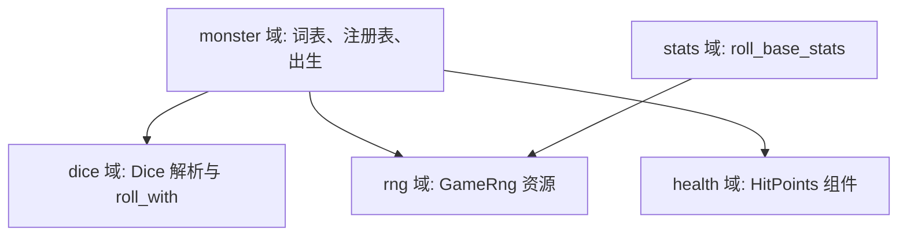
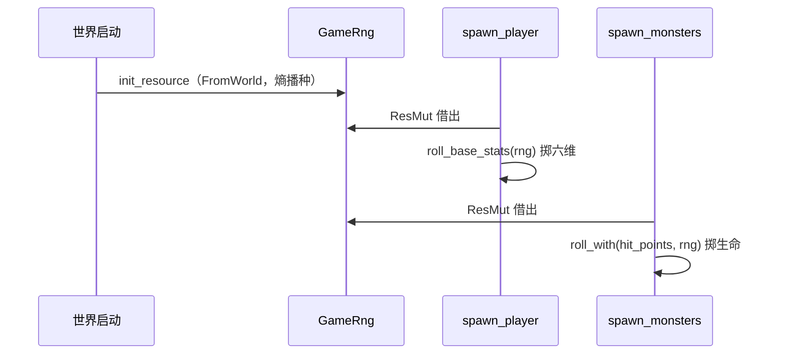

# Design: monster-combat-profile

## Context

怪物词表现只有 speed 一词（`MonsterEntry { monster, speed }` →
`MonsterKind { speed }`），出生实体不带生命组件；`HitPoints` 组件已通用但
只有主角挂。随机消耗散落三处（六维出生掷骰、怪物随机移动、即将新增的
生命骰掷出），全部 `rand::rng()` 各自熵播种——无集中状态、不可定种。
health spec 已预留"怪物生命值上限将来由其生命骰派生，不经六维"。
动机见 proposal.md（Why），行为契约见本变更 specs/（dice、rng 新增，
monster、health 修改）。

## Goals / Non-Goals

**Goals:**

- 骰式（NdM）解析与掷骰落位独立小域，作为生命骰与将来伤害骰的公共基础。
- 集中可播种随机源：正式游戏每局随机；测试与调试可指定种子得到可复现
  序列；现有消费者一并改走集中源。
- 怪物词表扩展战斗档案四字段，出生期掷出生命并挂 `HitPoints`。

**Non-Goals:**

- 骰式上限函数（FORCE_MAXHP 属旗标系统，OPEN_ISSUES 条目 7）。
- blows 的 method/effect 列（effect 家族，条目 10）。
- 词表感知/睡眠/稀有度/掉落/经验字段（条目 7、11、12、13）。
- 随机状态落存档（存档能力立项时补——tome2 将生成器状态存入存档，
  src/z-rand.c:32-33 注释、语料库 rng/spec.md）。

## Decisions

grilling 结论（Q1-Q10）汇总：blows 用命名结构体预留槽位（Q1）；骰式严格
解析（Q2）；dice 配独立 spec（Q3）；随机源为集中可播种单例且全部消费者
一并改走（Q6）；`Dice` 用 `i32`（Q7）；解析错误载体 `String`（Q8）；
资源经 `FromWorld` 接入（Q9）；纯函数带参、系统 `ResMut`（Q10）。

### D1 骰式为词表字符串：加载期解析，出生期掷骰

`hit_points` 与 `blows[].damage` 在词表中是骰式字符串，注册表加载期解析为
`Dice { n, m }` 并逐条校验，出生期才掷骰。解析放加载期使坏数据死在启动
（对齐既有 speed 校验风格）；掷骰放出生期对齐"词表注册表职责封顶于解析、
校验与出生期解析"。备选"存字符串、出生期再解析"被否：坏骰式会活到出生，
违背验证条件（启动失败带文件与条目 id）。

### D2 blows 元素为命名结构体 `MonsterBlow { damage: Dice }`

终局形态是 `method:effect:damage` 三元组（src/init1.c:7941-8000）；命名
结构体就是该形状的槽位，将来加 method/effect 字段不改任何消费点。备选
裸 `Vec<Dice>` 被否：effect 家族落地时须改类型形状，等于拆墙。

### D3 骰式严格边界

仅"正整数 d 正整数"（小写 d，N ≥ 1，M ≥ 1，无多余字符）。tome2 数据
全部为正且小写；宽容分支（z-rand.c:337-343 对非正骰返回 1）服务于不存在的
数据。解析错误向上穿透，注册表 panic 时加文件与条目 id 前缀。

### D4 集中可播种随机源 `GameRng`，机制对齐 tome2 单流

- 形状：`src/core/rng/` 域，`GameRng` Resource 包可播种生成器（StdRng）。
  `FromWorld` 构造即熵播种（正式游戏每局随机，对齐 tome2 以 time(NULL)
  播种，src/dungeon.c:5712-5731）；`seeded(u64)` 构造器供测试定种（对齐
  tome2 `Rand_value = seed` 固定种子路径，src/z-rand.c:29-36）。
- 消费者：`roll_base_stats`、`plan_wander`、怪物生命骰掷出全部取数自它，
  另建随机源不得出现——对齐 tome2"一个游戏单例喂全部随机"的机制。
- 掷骰语义对齐：N 个 1..=M 求和（damroll，src/z-rand.c:337-343；randint
  出 1..=M，src/z-rand.h:30-62）。
- 算法不复刻 tome2 生成器（LCRNG、63 度表、28 位映射）：种子决定序列的
  语义已对齐，算法差异游戏内不可观察。备选"连算法复刻"仅在未来需要与
  tome2 逐点对拍序列时才有意义，届时独立立项。
- 存档保存随机状态：押后至存档能力（见 Non-Goals）。

### D5 数值与错误载体

`Dice { n: i32, m: i32 }`——值恒正，类型从宽以与 `HitPoints` 及将来伤害域
的整数世界一致。解析返回 `Result<Dice, String>`——纯函数小域没有需要按
变体分支的调用方，错误只穿透到启动 panic。

### D6 取数形态：系统管资源，纯函数只算

`roll_base_stats(rng: &mut StdRng)` 等纯函数带参；`spawn_player`、
`spawn_monsters`、`plan_wander` 以 `ResMut<GameRng>` 取集中源再借出。
utils 侧面保持不碰 ECS。dice 域不依赖 rng 域（只收注入的生成器引用）。

### 域关系与数据流

dice 与 rng 之间无依赖边：随机源由系统层注入，dice 只收生成器引用。

## 参考来源

- 词表字段与解析：tome2 lib/edit/r_info.txt:122-186；src/init1.c:7862-7874
  （I 字段拆 hdice/hside）、7919-7936（W 字段）、7941-8000（B 字段，
  method:effect:damage）。
- 出生掷生命：tome2 src/monster2.c:2594-2605（maxhp = damroll(hdice,hside)）；
  2614-2615（个体抄 ac 与 level）。
- 掷骰语义：tome2 src/z-rand.c:337-343（damroll）、src/z-rand.h:30-62
  （randint 出 1..=M）。
- 随机源机制：tome2 src/z-rand.c:29-36（固定种子路径）、52（LCRNG）、74
  （Rand_state_init）；src/dungeon.c:5712-5731（熵播种）；语料库
  .ref/tome2-specs/specs/rng/spec.md（双生成器与存档状态）。
- Bevy Resource/FromWorld：.ref/bevy-website/content/learn/quick-start/
  getting-started/（config context 摘要）。

### D7 必填字段为纯类型，缺失交由格式层报错

词表必填字段一律以纯类型声明：缺失由 RON 反序列化报错（文件、字段名、
位置），加载校验只判值——骰式合法性、越界——错误带条目 id。曾以
"全字段 Option + require_field"换取缺失错误带条目 id，否决：serde 对
缺失字段没有携带条目上下文的钩子，带 id 的唯一路径就是全字段 Option，
必填字段在类型上说谎；词表小而人手编辑，serde 的位置信息足以定位。
格式层语义可选的字段（形象绑定的键、地图的 monsters、autotile 等）
仍用 Option/default——那是可选语义，不是管道。词表格式内嵌套节点
（如 blow 条目）与布局文件同文件是**特例而非先例**：拆才是默认
（一个值类型一个文件），同文件须同时满足两个条件——它是该格式线
格式的节点、格式之外无任何消费者；缺一即拆。

## Risks / Trade-offs

- [StdRng 与 tome2 生成器算法不同，序列不可逐点对拍] → 游戏行为不可观察；
  未来若需对拍再立项复刻生成器（见 D4）。
- [熵播种"两次启动相互独立"是统计性质] → 单测只断言同种子可复现与功能
  正确性；熵唯一性不作断言（与六维掷骰测试的统计风格一致）。
- [词表新增必填字段使旧格式失效] → 数据文件随本变更一并更新；RON 缺字段
  的解析错误本身指明字段名，注册表错误再加文件与 id。
- [GameRng 为 ResMut 独占，持源系统之间不可并行] → 消费者均为低频路径
  （出生期一次、怪物到期回合），无可观察影响；Bevy 按参数自动排序。

## Migration Plan

无部署迁移：代码与数据文件同变更落地，启动即校验。归档本变更时同步
health spec 的 Purpose 措辞（"将来由其生命骰派生"随本条成为现状）。

## Open Questions

无——grilling Q1-Q10 已收口。
