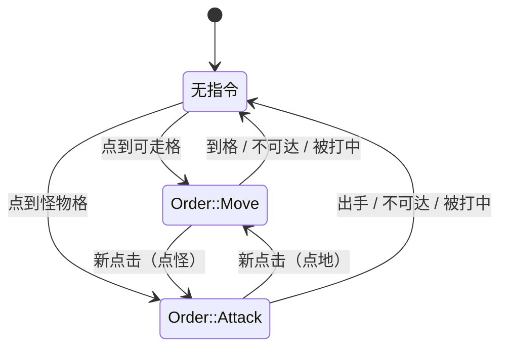
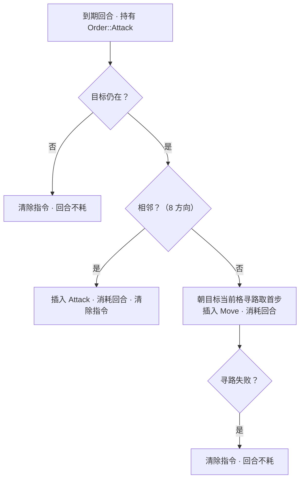

# Design: player-attacks | 设计：player-attacks

## Context

Current state and constraints (motivation: proposal.md - Why):

当前状态与约束（动机见 proposal.md - Why）：

- The movement model is a precomputed queue: the `MoveToCell`
  executor validates terrain and paths once at `Command` time, then
  `plan_move` consumes the path's front cell on each due turn
  (`src/core/player/systems/plan_move.rs`). The queue is blind to the
  world between clicks.

  现行移动模型是预计算队列：`MoveToCell` 执行器在 `Command` 阶段一
  次性校验并寻路，`plan_move` 每个到期回合消费队列的首格
  （`src/core/player/systems/plan_move.rs`）。两次点击之间，队列看
  不到世界的变化。

- The combat material is all landed: `attack_chance` /
  `unarmed_damage` (`src/core/combat/utils/attack.rs`, all carrying
  `#[allow(dead_code)] // consumed by attack resolution`), the
  monster's `armor_class` behind `MonsterRegistry::monster_kind`, the
  `Damage` channel with death handling, and the nine-phase pipeline
  with `PlayerPlan → PlayerAct → PlayerResolve`.

  战斗素材已全部落地：`attack_chance` / `unarmed_damage`
  （`src/core/combat/utils/attack.rs`，均挂
  `#[allow(dead_code)] // consumed by attack resolution`）、经
  `MonsterRegistry::monster_kind` 可取的怪物 `armor_class`、`Damage`
  通道与死亡处理、含 `PlayerPlan → PlayerAct → PlayerResolve` 的九
  阶段管线。

- Reference behavior, verified against source. Pixel Dungeon:
  tap dispatch at `.ref/pixel-dungeon/src/com/watabou/pixeldungeon/actors/hero/Hero.java:961-1011`
  (a tapped monster becomes an `Attack` action holding the target
  entity; a tapped cell becomes `Move`); the attack action at
  `Hero.java:771-793` (adjacent → strike; otherwise `getCloser`
  re-paths every turn); `onAttackComplete` at `Hero.java:1251-1257`
  clears the action after each strike — one action, one strike;
  movement at `Hero.java:486-501` (every turn `getCloser` re-paths;
  failure → `ready()` clears the action); `getCloser` at
  `Hero.java:908-955` and `Dungeon.findPath` at
  `Dungeon.java:618-640` (every visible character's cell is an
  obstacle); `PathFinder` at
  `.ref/PD-classes/com/watabou/utils/PathFinder.java:81-102,133-172`
  (BFS expands from the target regardless of its passability, so an
  occupied target is still approachable; `from == to` fails, so
  arrival clears the action); interruption at `Hero.java:473-478` plus
  `Char.java:158` (being hit interrupts) and `Hero.java:878-897`
  (a newly sighted enemy interrupts). tome2: bump-to-attack at
  `.ref/tome2/src/cmd1.c:3501`, the hit skeleton `test_hit_norm` at
  `cmd1.c:52-75`, attack and movement both at energy 100
  (`cmd2.c:1213-1226`, `cmd1.c:4672`).

  参照行为，已对源码核实。Pixel Dungeon：点选分派在
  `.ref/pixel-dungeon/src/com/watabou/pixeldungeon/actors/hero/Hero.java:961-1011`
  （点到怪物生成持有目标实体的 `Attack` 动作，点到格子生成
  `Move`）；攻击动作在 `Hero.java:771-793`（相邻即出手，否则
  `getCloser` 每回合重寻路）；`onAttackComplete` 在
  `Hero.java:1251-1257`——每次出手后清除动作：一道动作一次出
  手；移动在 `Hero.java:486-501`（每回合 `getCloser` 重寻路，失败
  则 `ready()` 清除动作）；`getCloser` 在 `Hero.java:908-955`、
  `Dungeon.findPath` 在 `Dungeon.java:618-640`（一切可见角色所在
  格都是障碍）；`PathFinder` 在
  `.ref/PD-classes/com/watabou/utils/PathFinder.java:81-102,133-172`
  （BFS 无视目标格可走性、以它为源点扩散，被占的目标格仍可逼近；
  `from == to` 判失败，故到格即清除动作）；打断在
  `Hero.java:473-478` 加 `Char.java:158`（被打中即打断）与
  `Hero.java:878-897`（新敌入视野打断）。tome2：撞击转攻击在
  `.ref/tome2/src/cmd1.c:3501`，命中骨架 `test_hit_norm` 在
  `cmd1.c:52-75`，出手与移动同为 100 能量（`cmd2.c:1213-1226`、
  `cmd1.c:4672`）。

## Goals / Non-Goals

**Goals:**

- A click on a monster attacks it: approach when distant, strike when
  adjacent, and the strike flows hit → damage → death through the
  landed channel.

  点击怪物即攻击：远则逼近，相邻则出手，出手经既有通道走命中→伤
  害→死亡。

- Movement that stays correct while monsters wander: orders re-path
  against the current world every turn instead of trusting a frozen
  queue.

  怪物游荡中移动依然正确：指令每回合对当前世界重寻路，不再信任冻
  结的队列。

- Every ordering fact stays in the phase enums; every behavior is
  world-testable headlessly.

  一切排序事实留在阶段枚举内；一切行为可无头世界测试验证。

**Non-Goals:**

- Monsters fighting back (OPEN_ISSUES entry 5); the monster's own
  attack order is its own change.

  怪物还手（OPEN_ISSUES 条目 5）；怪物的攻击指令是它自己的变更。

- All presentation: attack animations, damage numbers, health bars
  (entry 6). The minimal feedback is the slain monster leaving the
  world.

  一切表现：攻击动画、伤害数字、生命显示（条目 6）。最小反馈是被
  杀的怪物离开世界。

- Weapon dice, criticals, multiple blows (entries 8, 9); the
  reference's `lastAction`/`resume` convenience and its
  new-enemy-sighting interruption (no field-of-view system exists).

  武器骰、暴击、多击（条目 8、9）；参照的 `lastAction`/`resume` 便
  利机制与新敌入视野打断（视野系统不存在）。

## Decisions

### D1 Standing Orders Replace the Precomputed Path | 站立指令取代预计算路径



The executor stops pathfinding and only dispatches: a monster on the
clicked cell inserts `Order::Attack { target }`, a walkable cell
inserts `Order::Move { target }`, and inserting a variant replaces the
standing order
(reference: `handle` overwrites `curAction`, `Hero.java:961-1011`).
The `Path` component deletes: the frozen queue is exactly what goes
stale under wandering monsters, and per-turn pathing (D3) makes it
redundant. The reference's own model is a persistent action plus
per-turn re-pathing; the precomputed path was our transliteration of
it, and this change lands the real thing. Keeping `Path` for plain
moves beside a re-pathing pursuit order was rejected: two movement
models would coexist, and every staleness edge of the queue would
need its own rule.

执行器不再寻路，只做分派：点到的格上有怪物发出
`Order::Attack { target }`，可走格插入 `Order::Move { target }`，
插入变体即替换旧指令（参照：`handle` 覆盖 `curAction`，`Hero.java:961-1011`）。
`Path` 组件删除：冻结队列正是在怪物游荡下过时的东西，每回合寻路
（D3）令它失去存在意义。参照实现的模型本就是“持续动作 + 每回合
重寻路”，预计算路径只是我们的转写，本条把真身落下来。否决了
“普通移动留 `Path`、追击指令单独重寻路”的混合方案：两套移动模
型并存，队列的每个过时边角都得单独立规。

### D2 Attack Order: Pursue While Distant, Strike Once When Adjacent | 攻击指令：远则追击，相邻出手一次即清



Adjacency is the eight directions, matching both the movement model
and the reference (`Level.adjacent`, `Level.java:882-885`). The strike
clears the order — the reference clears the action in
`onAttackComplete` (`Hero.java:1251-1257`), so repeated strikes come
from repeated clicks; "pursue to the death with one click" was
considered and rejected as a deviation from the reference. While
distant, the order re-paths to the target's *current* cell each turn
(`actAttack` → `getCloser`, `Hero.java:784`) — the pursuit follows a
wandering target. An unreachable target clears the order (the
reference's `ready()`); the turn is not spent, the clock pins, and
the world freezes awaiting input — the same endpoint as the
reference's input wait. The target cannot die while its order stands
(the player's strike is the only damage source, and striking clears
the order), so "target gone → clear" is a defensive branch, not a
reachable behavior.

相邻取八方向，与移动模型和参照一致（`Level.adjacent`，
`Level.java:882-885`）。出手即清指令——参照在 `onAttackComplete`
清除动作（`Hero.java:1251-1257`），连打靠连点；“点一次追杀到
死”作为对参照的偏离被否决。不相邻时每回合朝目标*当前*格重寻路
（`actAttack` → `getCloser`，`Hero.java:784`）——追击跟得上游荡
的目标。目标不可达时清除指令（参照的 `ready()`）；回合不消耗，
时钟钉住，世界冻结等待输入——与参照的等待输入殊途同归。指令存
续期间目标不可能死（玩家出手是唯一伤害源，而出手即清指令），故
“目标消失→清除”是防御分支，不是可达行为。

### D3 Per-Turn Pathing with an Obstacle Overlay, the Target Cell Exempt | 每回合寻路加障碍覆盖，目标格豁免

`find_path` gains an obstacle overlay: monster cells block pathing,
except the destination cell itself — the move order's target and the
pursuit target's cell stay reachable so the order can walk up beside
an occupied target and clear there (the reference's BFS expands from
the target regardless of its passability, `PathFinder.java:141-172`,
then the adjacency intercept fails the step and clears the action,
`Dungeon.java:618-640`). Routing around monsters is what makes "tap
floor never starts a fight" true; the alternative — precomputing
around monsters once at click time — goes stale the moment a monster
wanders. `from == to` failing upstream (`PathFinder.java:135-137`)
mirrors the executor's existing `target == start` ignore.

`find_path` 增加障碍覆盖：怪物格挡路，但目的格本身豁免——移动指
令的目标格与追击目标的所在格保持可达，使指令能走到被占目标旁边
并在那里清除（参照的 BFS 无视目标格可走性、以它为源点扩散，
`PathFinder.java:141-172`，随后相邻特判拦下这一步并清除动作，
`Dungeon.java:618-640`）。绕行怪物是“点地板永不卷入战斗”成立
的前提；被否决的替代方案——点击时一次性绕开怪物——在怪物游荡
的下一秒就会过时。上游 `from == to` 判失败
（`PathFinder.java:135-137`）与执行器现有的 `target == start` 忽略
互为镜像。

### D4 The Attack Action Mirrors Move: Planned in PlayerPlan, Executed in PlayerAct | Attack 行动镜像 Move：PlayerPlan 策划，PlayerAct 执行


`Attack { target }` is a transient action component inserted by
planning and consumed by `act_attack` on `Added<Attack>` — the exact
`Move` pattern. The combat domain owns the action and its executor
(the registry's recommended home: producers will span player and
monster), while the player domain owns the planning that issues it —
the same split as the planner issuing movement's `Move`. The target
is resolved to an entity at plan time and cannot die before
`PlayerAct` (nothing runs between them that can hurt it), yet
`act_attack` still reads the target through a fallible `get`: the
phase guarantee is a comment, not a type.

`Attack { target }` 是由策划插入、由 `act_attack` 经
`Added<Attack>` 消费的瞬态行动组件——与 `Move` 完全同例。combat
域持有该行动及其执行器（登记表建议的归属：生产者将横跨玩家与怪
物），player 域持有发出它的策划——与策划发出 movement
的 `Move` 同一分工。目标在策划期解析为实体，且在 `PlayerAct` 之
前不可能死（两者之间没有任何能伤害它的系统），但 `act_attack`
仍以可失败的 `get` 读取目标：阶段保证写在注释里，不靠类型撑腰。

### D5 The Hit Skeleton Follows tome2, Not Pixel Dungeon | 命中骨架取 tome2，不取 Pixel Dungeon

```
percentile = rng(0..100)           ← 先抽
percentile < 10 → 命中 iff percentile < 5   （必中/必失带）
chance <= 0 → 必失                  （不再抽取）
power = rng(0..chance)             ← 后抽
命中 iff power >= armor_class * 3 / 4
```

Copied term for term from `test_hit_norm` (`.ref/tome2/src/cmd1.c:52-75`)
with the two absent systems dropped: no visibility halving, no luck
term. `chance` is the landed `attack_chance` (the melee skill term
plus three times the attack quality, the hit bonus and the
weapon-side stand-in summed); `armor_class` is the target kind's
vocabulary value.
Pixel Dungeon's opposed `Float(skill)` rolls (`Char.java:213-217`)
were rejected: the issue anchors tome2, and the two references only
happen to agree on pricing (D6). The skeleton lands as a pure
function with the random source injected — the `roll_with` precedent
— drawing the percentile first and the power roll only when chance is
positive, so seeded tests reproduce every branch boundary.

逐项照搬 `test_hit_norm`（`.ref/tome2/src/cmd1.c:52-75`），去掉两
个不存在的系统：无隐身减半、无幸运项。`chance` 即已落地的
`attack_chance`；`armor_class` 是目标种类的词表值。否决了 Pixel
Dungeon 的对抗 `Float(skill)` 掷点（`Char.java:213-217`）：条目锚
定 tome2，两个参照恰好在定价上一致（D6）纯属巧合。骨架落成注入
随机源的纯函数——`roll_with` 先例——先抽 percentile、chance 为正
才抽威力骰，种子测试可复现每条分支边界。

**The chance's terms, and the weapon-side stand-in.** The
reference's attack quality sums three terms: the stat to-hit, the
weaponmastery skill's to-hit (`to_h_melee`), and the weapon's own
to-hit (`xtra1.c:3742-3745`, `cmd1.c:2640`); this entry's chance is
the melee skill term plus three times that quality. The stat term is
live — and lands in the bonus tables' zero band for every birth roll
in 8..=17, so a level-one warrior's stat to-hit is always zero. The
other two terms belong to the skill and equipment systems (deferred,
entries 8 and 9). The attack quality therefore carries a fixed
stand-in of 1 — the weaponmastery to-hit at level one (1) plus the
basic weapon's own +0 — putting a level-one warrior's chance at 8,
just above three quarters of a giant white rat's armor (5). Without
it the chance is 5 and the loop's goal — slay a rat — is
mathematically unreachable outside the certain band; the stand-in
deletes as entries 8 and 9 land (registered).

**攻击值的组成与武器侧顶替值。** 参照的攻击品质是三项之和：属性
命中、武器掌握的技能命中（`to_h_melee`）与武器自身命中
（`xtra1.c:3742-3745`、`cmd1.c:2640`）；本条的 `chance` 取"命中
技能项 + 3 × 攻击品质"。属性项是活的——但对 8..=17 的任何出生
掷点都落在修正表的零带，即一级战士的属性命中恒为 0；另两项属技
能与装备系统（条目 8、9 延后）。故攻击品质携带固定顶替值 1——
武器掌握一级的技能命中（1）加基础武器自带的 +0——使一级战士的攻
击值为 8，恰好压过巨白鼠护甲的四分之三（5）。没有它，攻击值将
是 5，"打死老鼠"这一闭环目标在必中带之外数学上不可达；顶替值随
条目 8、9 落地删除（登记表已记）。

### D6 Damage through the Existing Channel; Attack Priced Like a Step | 伤害走既有通道；出手与移动同价

A hit emits `Damage { target, amount: unarmed_damage(bonuses) }` —
the landed 1 + damage bonus, floored at zero — and the resolve phase
does the rest. A miss emits nothing (damage numbers and wording are
entry 6 and 14 concerns). Both references price an unarmed strike at
one standard action: tome2 sets `energy_use = 100` for attack and
movement alike (`cmd2.c:1213-1226`, `cmd1.c:4672`), and Pixel
Dungeon's unarmed `attackDelay()` is `1f` (`Hero.java:344-352`).
Planning therefore spends the turn identically for `Move` and
`Attack`. The references diverge for fast creatures — tome2 scales
both by speed, Pixel Dungeon's strike ignores `speed()`
(`Hero.java:360-362`) — and we take tome2's rule: every action is
priced through `action_duration`.

命中即发出 `Damage { target, amount: unarmed_damage(bonuses) }`——
已落地的 1 + 伤害加成、下端夹零——剩下交给 Resolve 阶段。未命中
什么都不发（伤害数字与措辞是条目 6、14 的事）。两个参照都把徒手
出手定为一个标准行动：tome2 的出手与移动同为 `energy_use = 100`
（`cmd2.c:1213-1226`、`cmd1.c:4672`），Pixel Dungeon 的徒手
`attackDelay()` 为 `1f`（`Hero.java:344-352`）。故策划对 `Move`
与 `Attack` 同价消耗回合。两个参照在快速生物上分道——tome2 两者
都按速度缩放，Pixel Dungeon 的出手无视 `speed()`
（`Hero.java:360-362`）——本条取 tome2 规则：一切行动都经
`action_duration` 定价。

### D7 Being Hit Clears Standing Orders, Landed at the Application Point | 被打中清指令，落在施加点

The reference interrupts the current action when a hit lands
(`Char.java:158`); its other interrupt sources (status effects,
search discoveries, chasms, hunger, wells) all name systems that do
not exist here. The rule lands in `apply_damage`: applying damage to
a target strips its `Order`. The damage channel is
the only way hit points are spent, so the rule cannot be bypassed,
and entry 5's monster attacks inherit the interruption with zero
extra wiring. A miss emits no damage and therefore does not
interrupt — matching the reference, where the interrupt lives inside
the hit branch. Clearing orders on a monster target is a harmless
no-op: monsters hold no orders. The strip crosses one domain boundary:
`Order` stays the player domain's type — only the player ever holds
one — and health clears it by type, the way monster planning already
reads the player marker.

参照在命中落地时打断当前动作（`Char.java:158`）；它的其余打断源
（状态、搜索发现、深渊、饥饿、水井）全都指向此处不存在的系统。
本规则落在 `apply_damage`：对目标施加伤害时剥掉它的 `Order`。伤害通道是生命值的唯一消耗口，规则无
从绕过，条目 5 的怪物攻击零接线继承这一打断。未命中不产生伤害，
也就不打断——与参照一致：打断在命中分支之内。对怪物目标清指令
是无害空操作：怪物没有指令。这里跨了一次域边界：`Order` 仍是
player 域的类型——只有玩家持有指令——health 按类型清除它，正如
怪物的策划也读玩家标记。

### D8 Wandering Avoids Occupied Cells | 随机移动避开占位格

`plan_wander`'s walkable check gains a creature-free clause: a
monster never steps onto a cell holding another monster or a living
player. The
reference gets the same coherence for free — its pathfinding marks
every visible character as an obstacle (`Dungeon.java:636-639`), so
stacking never occurs; our single random step uses no pathfinding, so
the check is explicit. Besides ending stacked monsters, this is the
precondition entry 5 needs: its attack condition is adjacency, and a
monster standing *on* the player's cell would defeat the check.

`plan_wander` 的可走判定增加无生物条款：怪物永不走上持有其他怪
物或存活主角的格子。参照免费获得同款自洽——它的寻路把一切可见角色标为障
碍（`Dungeon.java:636-639`），叠格无从发生；我们的单步随机不走
寻路，故检查写成显式。除消灭叠格外，这也是条目 5 需要的前置：它
的出手条件是相邻，而怪物站上主角所在格会让该判定落空。

### D9 The Frontend Signal Swaps, the Input Path Collapses | 前端信号换绑，输入链路塌缩

The only frontend reader of `Path` is the run-animation signal in
`sync_animation`: `path.is_some()` becomes "a standing order is
present". The input path collapses too: the frontend's cell-gesture
and resolver layers and the monster paradigm marker go, and the mouse
writes the core command `TargetCell` directly — with the core
deriving what the action means, the frontend kept no policy to hold a
layer for. The slain monster's despawn already removes its figure.
The world-clock test that wired a `Path` rewires with an `Order`.

`Path` 的前端读者只有 `sync_animation` 的跑步动画信号：
`path.is_some()` 变为“站立指令在场”。输入链路一并塌缩：前端的
cell 手势层、解析器层与怪物范式标记移除，鼠标把按下直接翻译为核
心命令 `TargetCell`——动作含义已由核心推导，前端不再持有需要
分层安放的策略。被杀怪物的 despawn 本就连形象一并移除。世界时钟
里那个接线 `Path` 的测试改用 `Order` 重接。

## Risks / Trade-offs

- [Deleting `Path` rewrites the driver's planner and its tests, including the
  retarget-on-the-planning-frame wiring test] → The replacement tests
  cover the same phase-topology guarantees against the order model;
  the observable retarget behavior (the next step follows the new
  click) is unchanged by construction.

  [删除 `Path` 要重写驾驶者的策划及其测试，含换目标恰好落在策划
  帧的接线测试] → 替代测试在指令模型上覆盖同样的阶段拓扑保证；
  可观察的换目标行为（下一步跟随新点击）按构造保持不变。

- [Per-turn pathing costs an A* per due player turn] → One search per
  turn for one creature on a small map; monster wandering does no
  pathing. The clock stops entirely while no order stands, so idle
  frames cost nothing.

  [每回合寻路意味着玩家每个到期回合一次 A*] → 小地图上一个生物每
  回合一次搜索；怪物随机移动不寻路。无指令时时钟全停，闲置帧零
  成本。

- [One strike per click can feel laborious against a survivor] →
  Faithful to the reference (D2); the attack indicator convenience
  the reference uses for re-tapping is presentation territory, and
  entry 6 decides whether an equivalent is wanted.

  [一次点击一次出手，对存活者要连点] → 忠于参照（D2）；参照用来
  快速再点的攻击指示器属表现层，是否需要等价物由条目 6 定夺。

- [A monster wandering onto the move target makes the order clear
  beside it rather than wait] → The reference behaves exactly so (an
  occupied destination clears the action); a re-target after the
  monster wanders off is one input, and no silent fighting can start
  from targeting the floor.

  [游荡怪走上移动目标格会让指令停在它旁边而非等待] → 参照行为正
  是如此（目的被占即清除动作）；怪走开后补一次点击即可，且点地
  板绝不可能悄悄卷入战斗。
