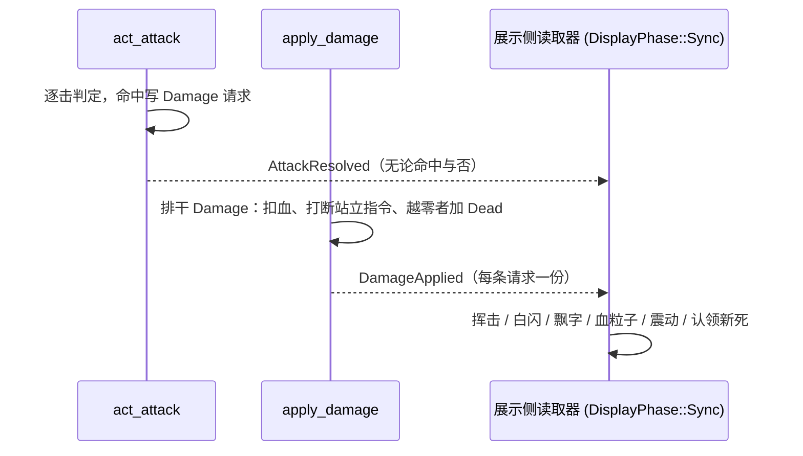
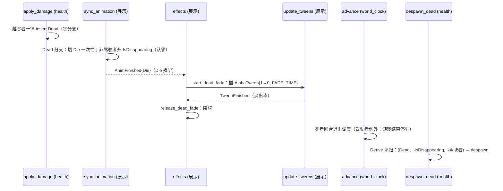
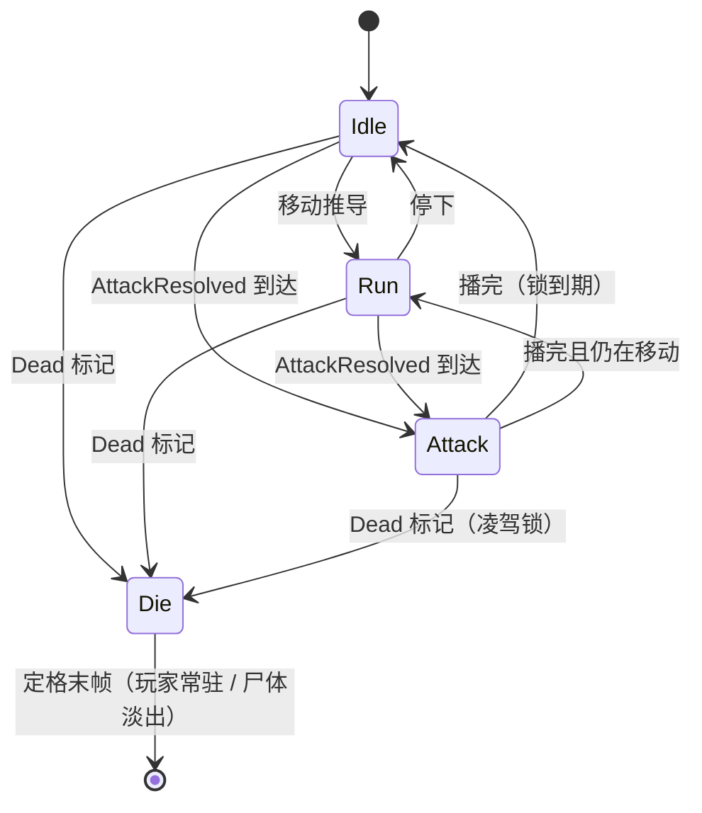
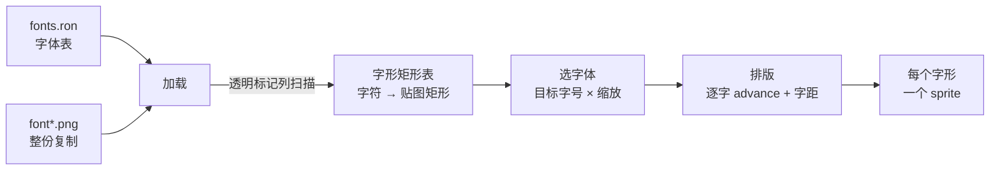

# Design: combat-feedback | 设计：combat-feedback

## Context

Landed pieces this design composes (motivation in proposal.md — Why):

- The attack pipeline `act_attack` (combat domain) consumes the
  `Attack` component and writes `Damage` requests on landed blows; a miss
  writes nothing. `apply_damage` (health domain) drains the request
  queue destructively, dual-registered in the two Resolve phases; a
  dead monster despawns in the same frame, a dead player gains the
  `Dead` marker.
- `AnimKind` already declares the animation vocabulary, but only
  Idle and Run have construction sites; `figures.ron` declares
  idle/run anims only, while the attack and die frames already exist
  in the copied textures (warrior 13-15 and 8-12, rat 2-5 and 11-14).
- The `IsMoving` freeze convention holds the world clock for movement
  only; combat presentation never holds it — this design keeps that
  convention untouched.
- The display side has no text rendering and no particles; the camera
  follows and snaps to the pixel grid at a fixed `ZOOM = 2.0`.

本设计组合的既有件（动机见 proposal.md — Why）：

- 攻击管线 `act_attack`（combat 域）消耗 `Attack` 组件，命中才写
  `Damage` 请求，未命中什么都不写；`apply_damage`（health 域）破
  坏式排干请求队列，在两个 Resolve 阶段双注册；怪物死亡同帧
  despawn，玩家死亡获得 `Dead` 标记。
- `AnimKind` 词表已齐，但只有
  Idle 与 Run 有构造点；`figures.ron` 只声明了 idle/run 动画，而
  攻击与死亡帧在已复制的贴图里本就存在（战士 13-15 与 8-12；
  老鼠白色变体行持有攻击 18-21 与死亡 27-30）。
- `IsMoving` 冻结约定只让移动挡住世界时钟；战斗表现从不挡时钟
  ——本设计不动这条约定。
- 展示侧没有文字渲染与粒子；相机在固定 `ZOOM = 2.0` 下跟随主角
  并吸附像素网格。

## Goals / Non-Goals

**Goals:**

- Combat becomes observable through past-tense fact messages; the
  display side renders every fact without the core knowing who
  listens.
- Presentation aligned with the reference implementation, parameter
  by parameter: frame tables, flash, blood burst, floating damage
  numbers, camera shake, death fade.
- The new mechanisms (bitmap text, particles, tween) land as
  independent domains; the effects domain composes them for combat,
  and later entries (the message system) reuse them.

**目标：**

- 战斗经过去时事实消息变得可观察；展示侧呈现每一条事实，核心不
  关心谁在听。
- 呈现逐项对齐参考实现：帧表、白闪、血粒子、伤害数字飘字、相机
  震动、死亡淡出。
- 新机制（位图字体、粒子、tween）落为独立域；effects 域为战斗
  编排它们，后续条目（消息系统）复用。

**Non-Goals:**

- Any UI (hero health bar, monster overhead bars) and miss wording
  text (message system, OPEN_ISSUES entry 14).
- Holding the world clock for combat animation; the reference's
  actor loop never waits for sprites, and neither does ours.
- Particle pooling and a custom flash material (see D3/D7 for the
  recorded deviations).

**不做：**

- 任何 UI（主角血条、怪物头顶血条）与未命中措辞文字（消息系统，
  OPEN_ISSUES 条目 14）。
- 战斗动画阻挡世界时钟；参考实现的行动循环从不等画面，我们也
  不等。
- 粒子对象池与白闪的自定义材质（差异记录见 D3/D7）。

## Decisions

### D1: Two past-tense fact messages — request = noun, fact = past tense | 两条过去时事实消息——请求用名词，事实用过去时

The core emits facts; consumers read them through ordinary message
readers, each reader registered once, so facts — unlike the
destructively drained `Damage` request — broadcast freely. The
naming convention: a request is a noun (`Damage`), a fact is past
tense, and every fact name traces back to landed domain vocabulary
(attack, apply).

核心发出事实；消费方经普通消息读取器各读各的，每个读取器只注册
一次，因此事实——与被破坏式排干的 `Damage` 请求不同——可以自
由广播。命名约定：请求用名词（`Damage`），事实用过去时，且每个
事实名都能回溯到已落地的域词汇（attack、apply、die）。

```rust
/// act_attack, one per attack consumed — an empty list means every
/// blow missed.
AttackResolved { attacker: Entity, attacker_cell: CellCoord,
                 target_cell: CellCoord, damage_amounts: Vec<i32> }

/// apply_damage, one per damage request applied.
DamageApplied { target: Entity, cell: CellCoord,
                source_cell: Option<CellCoord>,
                amount: i32, max: i32 }
```

Facts carry cell coordinates because consumers read them after the
Resolve phases' command flushes: a wounded target may already be gone
when the display phase runs, so anything position-like travels inside
the fact. `max` travels with `DamageApplied` because the blood count
and the shake threshold both need it and the target may be gone.
Death carries no fact at all: it is a component (`Dead`), not an
event — the presentation reacts to the marker, and the death-adjacent
domains (clock, planners, departure sweep) query it.

事实携带格坐标：消费方在 Resolve 阶段的命令冲刷之后读事实，受
伤的目标届时可能已经离开，一切位置信息只能随事实走。`max` 随
`DamageApplied` 走，因为血粒子数量与震动阈值都要它，而目标可
能已经消失。死亡不携带事实：它是组件（`Dead`），不是事件——
呈现对标记做反应，死亡相关的各域（时钟、策划、离场清扫）按它
查询。



The dual registration of `apply_damage` stays honest: facts are
written by whichever instance drained the request, and the drain
guarantees exactly one writer per request — the same argument that
makes the subtraction apply once.

`apply_damage` 的双注册保持诚实：事实由排干到请求的那个实例写
出，排干保证每条请求只有一个写入者——与扣减只执行一次是同一
个论证。

**Alternatives rejected | 否决的备选**: a single `CombatFact` enum —
three consumer cadences (attack anim, per-damage presentation,
death) would each filter the whole union; `Changed<HitPoints>`
detection — loses the attacker, the miss, and the killing blow.

否决的备选：单一 `CombatFact` 枚举——三种消费节奏（攻击动画、逐
伤害呈现、死亡）都得过滤整个联合类型；`Changed<HitPoints>` 检
测——丢失攻击者、未命中与致命一击。

### D2: Death is the marker; the body presents its own exit | 死亡即标记，躯体自演离场

The reference separates actor from sprite: the mob leaves the level
immediately (`Mob.destroy`, Mob.java:324-328) while its sprite plays
the die animation, fades, and erases itself (MobSprite.java:46-56).
Our fused entity gets the same split through one component and three
query rules, with no identity branch anywhere in the apply pass:



- `apply_damage` is identity-free: any unmarked creature whose hit
  points crossed below zero gains `Dead` — one line, no species
  branch, no `WorldDriver`/`Player`/`MonsterIndex` anywhere in the
  file. Death means nothing else there.
- The schedule holds the rule "a dead turn pins nothing":
  `advance` counts turns under
  `Or<(Without<Dead>, With<WorldDriver>)>` — the driver's dead turn
  is the exception, because an unspent driver turn is the game-over
  hold. The exception lives in the domain that owns the driver.
- Every living-creature query filters the marker: planners (already),
  `act_attack` targets (already), `act_move` (belt), the apply pass
  itself (the dead are not woundable). A corpse is a full entity with
  a state, not a subtracted one.
- The exit presentation is the IsMoving pattern turned around: the
  protocol component `IsDisappearing` lives in the core (written only
  by the display, read only by the departure sweep), raised when the
  body's death presentation takes it and dropped when its fade ends.
  The fade itself is carried by a tween, and animation ends travel as
  messages — the display reads no animation state to sequence it.
- `despawn_dead` runs in the Derive phase, ahead of the resolve
  phases where new deaths land — a same-frame death is never swept
  unfaded. An unflagged corpse is always one whose presentation is
  over (or one that never had one: headless, death alone empties the
  world on the next sweep). The driver is never taken: its death
  presentation is the frozen world, and the death wrap-up (entry 13)
  owns its exit.
- The same schedule arithmetic opens the world: every creature's
  first slot sits at the world's zero, so a due creature plans as the
  world opens; from then on the driver's unspent turn is the nearest,
  and the clock rests on it until input produces the next action,
  with no planner checking for it.

参考实现把行动者与画面分离：怪物立即离开关卡（`Mob.destroy`，
Mob.java:324-328），其画面播死亡动画、淡出、自我抹除
（MobSprite.java:46-56）。我们的融合实体用一个组件和三条查询规
则拿到同样的分离，施加侧没有任何身份分支：

- `apply_damage` 无身份：任何未标记而越零的生物获得 `Dead`——
  一行，零分支，文件里不出现 `WorldDriver`/`Player`/
  `MonsterIndex`。死亡在那里不意味着别的。
- 调度持有"死亡回合不钉住任何东西"的规则：`advance` 以
  `Or<(Without<Dead>, With<WorldDriver>)>` 计数回合——驾驶者的死
  亡回合是唯一例外，因为未消耗的驾驶者回合就是游戏结束的停驻。
  例外住在拥有驾驶者标记的域里。
- 一切"活物"查询过滤标记：策划（已有）、`act_attack` 目标（已
  有）、`act_move`（腰带）、施加本身（死者不可再受伤）。尸体是
  带状态的完整实体，不是被减除的实体。
- 离场呈现是 IsMoving 模式的反向运用：协议组件
  `IsDisappearing` 住在核心（展示侧唯一写入、离场清扫唯一读
  取），死亡呈现接管躯体的当刻升起、淡出播毕降下。淡出本体由
  tween 承载，动画的结束以消息传递——展示侧排序不读动画状态。
- `despawn_dead` 跑在 Derive 阶段，先于新死亡落地的各 Resolve
  阶段——同帧新死永不被无旗清扫。无旗的旧尸体必然是呈现已毕
  （或从未被认领：无头跑法下，死亡自身在下一扫清空世界）。驾驶
  者永不被带走：其死亡呈现是冻结的世界，离场归死亡收尾（条目
  13）。
- 同一份调度算术开启世界：一切生物的首个回合槽落在世界零点，开
  张时到期者随即照常策划；其后驾驶者未消耗的回合即最近槽，时钟停
  驻其上直至输入产生下一行动，任何策划系统都不为此做检查。

**Alternatives rejected | 否决的备选**: despawn at the death sweep
with a re-created remains entity from a display-side snapshot
registry — the snapshot bookkeeping was the most convoluted part of
this change, and the body already carries everything the presentation
needs; scheduling-component stripping at death — moves the species
knowledge back into the apply pass; a core-timed corpse lifetime —
the presentation's duration would live twice and drift.

否决的备选：死亡扫尾处 despawn 并由展示侧快照登记簿重建亡魂——
快照簿记是本次变更最绕的部分，而躯体本就持有呈现所需的一切；
死亡时剥除调度组件——把物种知识又搬回施加侧；核心计时的尸体
寿命——呈现时长会写两份并漂移。

### D3: The hit flash approximates additive white with a multiply tint | 受击白闪以乘色过曝近似加色全白

The reference flashes by setting the additive channel to one —
`ra = ga = ba = 1`, texture × 1 + 1 renders as a solid white
silhouette — and holds it for `FLASH_INTERVAL = 0.05s`
(CharSprite.java:54, 247-249), then restores (`resetColor`,
CharSprite.java:325-327). Our sprite tint is multiply-only, and a
true silhouette wants a custom material — out of proportion for one
feedback blink. The stand-in: multiply the sprite color by a large
factor for the same 0.05 seconds; bright texels clamp to white, dark
outlines survive. At 0.05s the difference is subliminal. The
stand-in is recorded here per the house convention, with the
recovery path (a custom material) noted in OPEN_ISSUES.

参考实现的白闪是把加色通道拉满——`ra = ga = ba = 1`，贴图 × 1 +
1 呈纯白剪影——保持 `FLASH_INTERVAL = 0.05` 秒
（CharSprite.java:54、247-249），随后复原（`resetColor`，
CharSprite.java:325-327）。我们的 sprite 着色只有乘法通道，真
剪影需要自定义材质——为一次受击闪烁配材质不成比例。顶替方案：
同等的 0.05 秒内把 sprite 颜色乘上一个大系数；亮部截断为白，
暗色描边残留。0.05 秒内差别难辨。按既有体例在此记录顶替，回
收路径（自定义材质）登记进 OPEN_ISSUES。

The flash lives in the effects domain as a small component plus
its apply/expire systems (`flash` / `update_flash`); it is the
flash's only user today.

白闪住在 effects 域，一个小组件加施加/到期两个系统（`flash` /
`update_flash`）；今天它只有这一个用户。

### D4: One-shot animations with a playback lock | 一次性动画与播放锁

Anim table entries gain a `looped` flag, mirroring the reference's
`Animation` constructor parameter — idle/run loop, attack/die do not
(HeroSprite.java:66-72: attack 15fps frames 13,14,15,0, die 20fps
frames 8,9,10,11,12,11; RatSprite.java:35-48: attack 15fps frames
2,3,4,5,0, die 10fps frames 11-14). A non-looping anim clamps its
frame index at the last frame instead of wrapping. `AnimState` gains
the one-shot's finish timestamp and finished flag (the reference's
`finished`): while a one-shot plays, `sync_animation` derives
nothing; when it finishes, derivation resumes. Every switch lives in
`sync_animation`, and `animate` only plays frames. The intent
priority in `sync_animation`: the `Dead` marker forces Die above
everything — even an active one-shot (a player dealt a killing blow
mid-swing dies immediately); an active one-shot holds; otherwise the
landed idle/run derivation runs.

动画条目新增 `looped` 标志，对应参考实现的 `Animation` 构造参数
——idle/run 循环，attack/die 不循环（HeroSprite.java:66-72：攻
击 15fps 帧 13,14,15,0，死亡 20fps 帧 8,9,10,11,12,11；
RatSprite.java:35-48：攻击 15fps 帧 2,3,4,5,0，死亡 10fps 帧
11-14）。不循环的动画帧索引钳在末帧，不回卷。`AnimState` 新增一次性动画
的播毕时刻与播毕标志（对齐参考实现的 `finished`）：一次性存续期
间 `sync_animation` 不做推导；播毕后推导恢复。一切切换都住在
`sync_animation`，`animate` 只负责播帧。`sync_animation` 的意图
优先级：`Dead` 标记凌驾一切强制 Die——包括存续中的一次性动画
（挥击中被打死的玩家立即转入死亡）；一次性存续则保持；否则走
既有的 idle/run 推导。



`AnimKind::Hit` gains no construction site: the reference has no hit
frames — its hit feedback is the flash (D3), and so is ours. The
vocabulary entry stays for the day a figure ships hit frames.

`AnimKind::Hit` 仍无构造点：参考实现没有受击帧——受击反馈就是
白闪（D3），我们也是。词表条目保留，等某天有形象配受击帧。

### D5: Attacks do not lunge — face the target, play the frames | 攻击不前冲——转向目标，播放帧动画

The reference's melee attack performs no positional motion:
`attack()` is `turnTo` plus `play(attack)` (CharSprite.java:160-163).
On `AttackResolved`, the attack branch of `sync_animation` flips
the attacker's sprite toward the target cell and switches it to the
attack anim with the one-shot state (D4) — whether or not any blow
landed, since the swing happens either way. The attacker is queried
fallibly: an attacker gone by the display phase is skipped.

参考实现的近战攻击没有任何位置移动：`attack()` 就是 `turnTo` 加
`play(attack)`（CharSprite.java:160-163）。`AttackResolved` 到达
时，`sync_animation` 的攻击分支把攻击者的 sprite 朝目标格翻转
并切到攻击动画（一次性状态，D4）——无论有无命中，挥击都发生
了。攻击者按可失败查询：展示阶段已离开的跳过。

### D6: Floating damage numbers — rise, fade, stack | 伤害数字飘字——上浮、淡出、堆叠

A landed `DamageApplied` spawns the amount as world-space text at
the wounded sprite's top-center (FloatingText.java:90-96: x centered
on the sprite, y above it). The text rises one tile over one second
(`LIFESPAN = 1`, `DISTANCE = one tile`, FloatingText.java:33-44) and
fades in the latter half of its life (`alpha = 1` while more than
half remains, else twice the fraction). The color reports the
target's remaining condition: orange `0xFF8800` while above half,
red `0xFF0000` at or below (Char.java:276-280 with
CharSprite.java:48-51); a target already despawned reads as red.
Texts on the same cell stack: a newcomer pushes the cell's living
texts up by one line, tracked by a small cell-to-texts resource
(FloatingText.java's per-cell `stacks`, FloatingText.java:37 and its
`push`). Misses spawn nothing — the reference's miss wording belongs
to the message system (entry 14).

落地的 `DamageApplied` 在受击 sprite 的顶部中央生成伤害数值的世
界空间文字（FloatingText.java:90-96：x 对准 sprite 中心，y 在其
上方）。文字一秒内上浮一格（`LIFESPAN = 1`、`DISTANCE = 一格`，
FloatingText.java:33-44），在生命后半程淡出（剩余过半时不透明，
否则按两倍剩余比例）。颜色报告目标伤后状态：高于半血橙
`0xFF8800`，半血及以下红 `0xFF0000`（Char.java:276-280 配
CharSprite.java:48-51）；已 despawn 的目标按红处理。同格飘字堆
叠：新飘字把该格存活飘字上挤一行，由一个格子到飘字列表的小资
源跟踪（FloatingText.java 的按格 `stacks`，FloatingText.java:37
及其 `push`）。未命中不产生飘字——参考实现的未命中措辞归消息
系统（条目 14）。

### D7: Blood particles — parameters ported, pooling skipped | 血粒子——参数照抄，不建对象池

Each `DamageApplied` bursts blood at the wounded sprite's center:
count `min(9 * sqrt(amount / maximum), 9)`, color `0xFFBB0000`
(CharSprite.java:235-245), each particle a 4-world-pixel shrinking
square living 0.5-1.0s, speed drawn polar-random between 40 and 80
within the spray cone, gravity +100 px/s² (Splash.java:62-76).
The spray follows the blow: the cone is 90° around the direction
from source cell to target cell; a source-less wound falls back to
the reference's generic upward 180° fan (Splash.java:36-47).

每条 `DamageApplied` 在受击 sprite 中心迸溅血粒子：数量
`min(9*sqrt(伤害/上限), 9)`，颜色 `0xFFBB0000`
（CharSprite.java:235-245）；每个粒子是 4 世界像素的收缩方块，
存活 0.5-1.0 秒，速度在喷射锥内按极坐标 40-80 随机，重力
+100 px/s²（Splash.java:62-76）。喷射沿打击方向：锥角 90°，轴
线为来源格指向目标格；无来源的伤害退回参考实现的通用朝上
180° 扇形（Splash.java:36-47）。

The particles land as an independent mechanism domain: one
pixel-particle component carrying speed, acceleration, remaining
life, and the lifetime it was born with; a system that integrates
and expires; a factory value plus a burst spawner. The reference
recycles particles through the emitter's pool (Android GC pressure);
at nine particles per burst we spawn and despawn plainly — a
deliberate difference, recorded here, not a stand-in.

粒子落为独立机制域：一个像素粒子组件承载速度、加速度、剩余生
命与出生时的寿命；一个系统负责积分与到期；一个 Factory 值与一
个迸溅生成函数。参考实现经发射器对象池回收粒子（Android 的 GC
压力）；我们单次至多九粒，直接生成与销毁——有意为之的差异，在
此记录，不是顶替。

### D8: The bitmap font — all five fonts, zoom-picked, glyph sprites | 位图字体——五份字体全备，按缩放选字体，字形 sprite

All five font textures are copied whole from the reference assets —
no slicing, no subsetting. A font table data file records per font:
texture, row height for splitting (full texture height for 1x; 12,
14, 17, 22 for the rest), baseline (6, 9, 11, 13, 17), tracking
(-1, -1, -1, -1, -2), and the character table (the reference's
hardcoded `LATIN_FULL`, BitmapText.java:214-215) — the values
hardcoded in PixelScene.java:103-127 become data.

五份字体贴图整份复制自参考素材——不切不裁。字体表数据文件逐份
字体记录：贴图、切分行高（1x 取贴图全高；其余 12、14、17、
22）、基线（6、9、11、13、17）、字距（-1、-1、-1、-1、-2）与
字符表（参考实现硬编码的 `LATIN_FULL`，BitmapText.java:214-215）
——PixelScene.java:103-127 里的硬编码值在此变为数据。



At load, each font's texture is scanned column by column: a column
whose every pixel is fully transparent is a separator, and the
stretches between separators pair in order with the character table
(the reference's `splitBy`/`colorMarked`, BitmapText.java:280-336).
The font for a text is chosen by the reference's `chooseFont`
(PixelScene.java:146-200): the target glyph height (9px for floating
text) times the current zoom picks the font whose native size serves
it best, preferring integer scales; the chosen integer scale divided
by the zoom becomes the glyph sprites' transform scale. Rendering lays one sprite per
glyph side by side — advance equals glyph width plus tracking —
under a root entity that owns the text's cell, lifetime, and
remaining life; fading writes every glyph sprite's alpha (there is
no inherited alpha).

加载时逐列扫描每份字体贴图：整列像素全透明即分隔列，分隔列之间的
区段按序与字符表配对（参考实现的 `splitBy`/`colorMarked`，
BitmapText.java:280-336）。一段文字用哪份字体由参考实现的
`chooseFont` 决定（PixelScene.java:146-200）：目标字形高度（飘
字为 9px）乘当前缩放选出原生尺寸最贴合的一份，整数缩放优先；
选出的整数倍除以缩放即字形 sprite 的变换缩放。渲染时每个字形一个
sprite 并排排版——步进等于字宽加字距——共属一个持有文字所在
格、寿命与余命的根实体；淡出逐个写各字形 sprite 的透明度（没
有继承透明度）。

The mechanism lands as an independent bitmap-text domain; combat
feedback is its first user, and the message system (entry 14) its
known second.

这套机制落为独立的位图字体域；战斗反馈是它的第一个用户，消息
系统（条目 14）是已知的第二个。

### D9: The damage request carries its source; blood sprays along the blow | 伤害请求携带来源；血粒子沿打击方向迸溅

`Damage { target, amount }` gains `source: Option<Entity>` — the
reference's `damage(dmg, src)` has always carried it, and kill
attribution (entry 12) is its known second user. `act_attack` fills
it with the attacker; `apply_damage` resolves the source's cell
fallibly (a source gone mid-drain reads as `None`) into
`DamageApplied.source_cell`, which D7's spray direction consumes.

`Damage { target, amount }` 新增 `source: Option<Entity>`——参考
实现的 `damage(dmg, src)` 从来带它，击杀归属（条目 12）是它的
已知第二用户。`act_attack` 填入攻击者；`apply_damage` 把来源的
格坐标按可失败查询解析（排干途中消失的来源读作 `None`）进
`DamageApplied.source_cell`，供 D7 的喷射方向消费。

### D10: Camera shake — a request the camera domain owns | 相机震动——相机域持有的请求

The reference shakes on heavy hits to the hero: damage beyond a
quarter of the maximum triggers `Camera.shake` with magnitude gated
to 1-5 by damage proportion and a 0.3s duration (Char.java's attack
resolution, `GameMath.gate(1, effectiveDamage / (HT/4), 5)`); each
frame draws a uniform random offset in ±magnitude, linearly damped
to zero (Camera.java:159-166, 228-231). The mechanism lives in the
camera domain: a `ShakeCamera { magnitude, duration }` message it
owns, a shake state it advances, and the offset applied to the
follow position before the pixel-grid snap — the snap keeps the
shake pixel-perfect instead of smearing it. The trigger lives in
the effects domain: a `DamageApplied` whose target carries the
`WorldDriver` marker and whose amount exceeds a quarter of the
maximum writes the request.

参考实现在主角受重击时震屏：伤害超过上限四分之一触发
`Camera.shake`，幅度按伤害比例钳在 1-5，时长 0.3 秒（Char.java
的攻击解析处，`GameMath.gate(1, effectiveDamage / (HT/4), 5)`）；
每帧在 ±幅度内均匀随机取偏移，随剩余时间线性衰减
（Camera.java:159-166、228-231）。机制住在相机域：相机域持有
`ShakeCamera { magnitude, duration }` 消息与震动状态的推进，偏
移在像素网格吸附之前加进跟随位置——吸附保证震动逐像素整齐，
不拖影。触发住在 effects 域：`DamageApplied` 的目标带
`WorldDriver` 标记且伤害超过上限四分之一时写出请求。

### D11: The display side rebuilt around tweens and messages | 展示侧以 tween 与消息重建

A post-review alignment pass reshaped the display internals; its full
decision record lives in `display-refactor-plan.md`. The settled
shape:

- A tween domain: one `AlphaTween`/`PosTween` pair with
  `elapsed + interval` accumulators replaces per-feature timing
  books. `update_tweens` writes the sprite alpha or the presentation
  position each frame, removes the component at the interval's end,
  and announces `TweenFinished`. Movement is now a tween application
  (a cell change inserts a `PosTween`), and the death fade is one
  too.
- Frame animation is one domain: `sync_animation` owns every switch —
  idle/run derivation and facing, the attack branch on
  `AttackResolved`, die on the death marker, and the death claim —
  and `animate` only plays frames. A one-shot's end is announced as
  `AnimFinished{entity, anim}`; a one-shot cut short announces
  nothing.
- Effects are game-content effects: the effects domain (renamed from
  combat feedback) holds the flash, the floating damage numbers, the
  blood splash, the death fade, and the shake trigger. It composes
  the tween, particle, and camera mechanisms and reads no animation
  state — the death fade is sequenced by the `AnimFinished` and
  `TweenFinished` messages.
- Naming alignment: `bitmap_text` (fonts, no tier vocabulary),
  `PixelParticle` / `Factory` / `burst`, `update_shake`,
  `Appearance.texture`; the unused `AnimKind::Walk` is deleted.

展示侧在 CR 后做了一轮对齐重建，完整决策记录见
`display-refactor-plan.md`。落定形状：

- tween 域：一对 `AlphaTween`/`PosTween` 以 `elapsed + interval`
  累积器取代各处的计时簿。`update_tweens` 每帧写入精灵透明度或
  呈现位置，到点删除组件并发 `TweenFinished` 公告。移动即一次
  tween 应用（格坐标变化插入 `PosTween`），死亡淡出亦然。
- 帧动画归一域：一切切换都住在 `sync_animation`——idle/run 推导
  与朝向、`AttackResolved` 的攻击分支、死亡标记的 Die、死亡的认
  领——`animate` 只负责播帧。一次性动画播毕以
  `AnimFinished{entity, anim}` 公告；被打断的一次性不公告。
- effects 即游戏内容效果：effects 域（由 combat feedback 更名）
  承载白闪、伤害数字、血粒子迸溅、死亡淡出与震动触发；它编排
  tween、粒子、相机三类机制，不读动画状态——死亡淡出由
  `AnimFinished` 与 `TweenFinished` 消息排序。
- 命名对齐：`bitmap_text`（字体，无 tier 词汇）、
  `PixelParticle`/`Factory`/`burst`、`update_shake`、
  `Appearance.texture`；无构造点的 `AnimKind::Walk` 已删除。

## Risks / Trade-offs

- The killing blow's flash does show — the body lingers through its
  death presentation — blinking 0.05s before the death animation
  takes over, as the reference layers flash and death too.

  致命一击的白闪会出现——躯体在其死亡呈现中滞留——白闪一瞬后死
  亡动画接管，与参考实现的闪+死亡叠放一致。

- Facts crossing the Resolve→Display boundary rely on message
  buffering, not on entity state: everything a consumer needs
  travels inside the fact. The cost is wider message payloads; the
  win is zero ordering constraints between emission and consumption
  within the frame.

  事实跨越 Resolve→Display 边界只靠消息缓冲、不靠实体状态：消费
  方需要的一切都装在事实里。代价是消息体更宽；换来的是发出与
  消费之间在帧内零时序约束。

- The flash stand-in keeps dark texels dark under a multiply tint,
  where the reference renders a true silhouette. At 0.05s this is
  subliminal; if a future material pipeline lands, recover the
  silhouette (OPEN_ISSUES note).

  白闪顶替在乘色下保不住暗部（参考实现是真剪影）。0.05 秒内难
  以察觉；将来材质管线落地时回收剪影形态（OPEN_ISSUES 已登
  记）。

- Font textures are copied from the reference's GPLv3 assets —
  sanctioned for the prototype stage by the project config; the
  wholesale replacement pass comes later.

  字体贴图复制自参考实现的 GPLv3 素材——项目配置已许可原型阶
  段复制；日后的统一替换一并处理。

- An attack locked mid-play whose attacker dies (player dealt a killing blow
  mid-swing) is cut short by the Die intent overriding the lock —
  the reference interrupts animations on death the same way.

  挥击动画锁存续期间攻击者死亡（玩家挥击中被打死）时，Die 意图
  凌驾锁立即打断——参考实现在死亡时同样中断动画。
