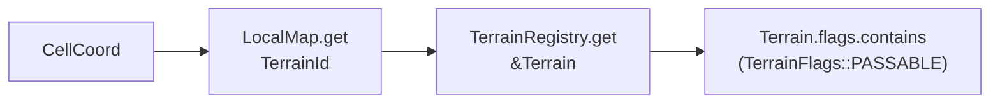
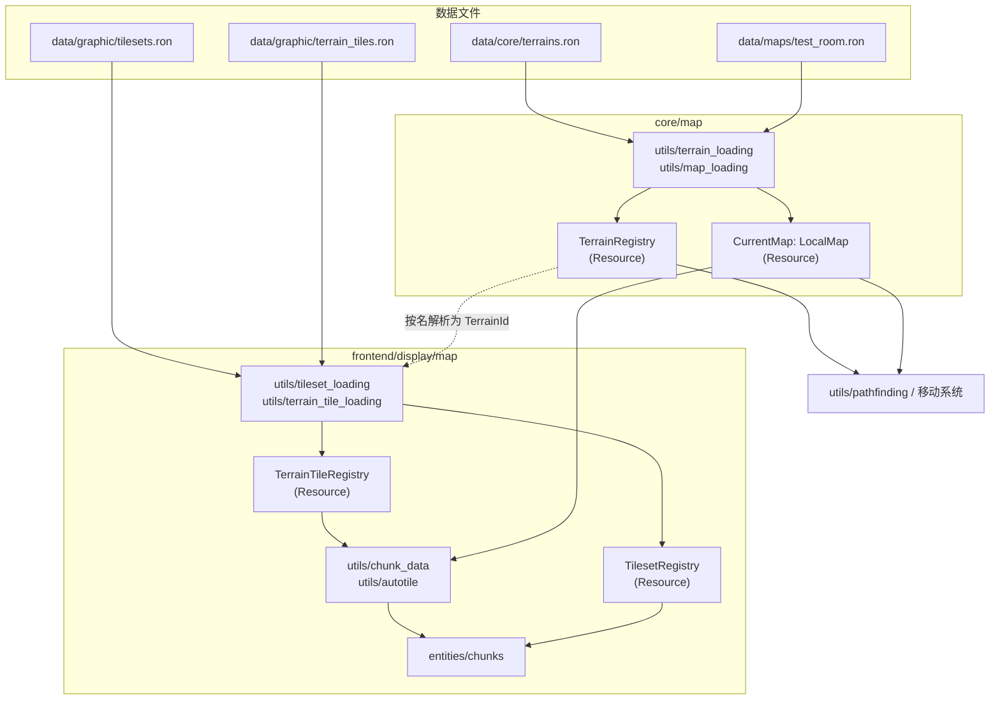
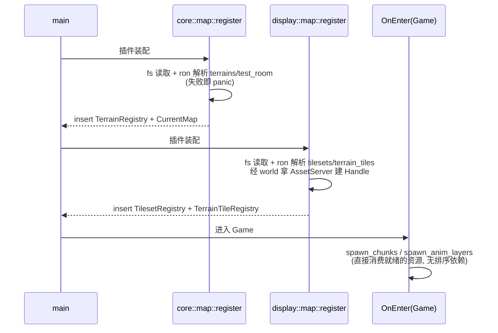

# Design: data-driven-local-map

## Context

现状：房间地图由 `GridMap::demo_room()` 在代码里铺出（围墙边 + 中央水池），地形是 `TileKind` 三值枚举，宽高是 `MAP_W/MAP_H` 常量；显示侧按枚举 match 把格子分流进 floor/wall 两个 chunk，岸线按"邻居非地板"推导，tileset 帧号写死在常量里（`TILE_FLOOR/TILE_WALL/TILE_SHORE_BASE`）。动机见 proposal.md。

已确认的规格基线：`specs/grid-map/spec.md`（本 change 的 delta）——地形注册表、地图数据文件、数据校验、测试房间的空间性质。

## Goals / Non-Goals

**Goals:**

- 地形种类与属性全部由数据文件定义，代码只持有位标志常量与运行时句柄，新增地形零代码改动。
- 地图内容全部由数据文件定义，字符铺图直观可读。
- 显示素材（图集、地形画法）全部由数据文件定义，core 不感知任何像素概念。
- 运行表现与现状完全一致；加载失败在窗口打开前 panic 且报错定位到文件与位置。

**Non-Goals:**

- WorldMap、随机地图、前景物品、地图切换与持久化、Bevy Asset 管线与热重载。
- 出生点数据化（`HERO_START` 维持代码常量）、`terrain_animation` 与 `appearance` 域的配置化。

## Decisions

### D1 地形即数据：注册表 + 标志位

地形种类定义在 `data/core/terrains.ron`，每个条目是字符串 id 加一组标志位（`PASSABLE`、`LIQUID`）。代码里只有 `TerrainFlags` 位标志常量（bitflags）与 `TerrainId(u16)` 运行时句柄；句柄按加载顺序分配，代码不出现任何数字常量与地形名字符串的逻辑分支。

参考来源：pixel-dungeon `levels/Terrain.java`（地形常量 + `flags[]` 标志表，PASSABLE/LIQUID 用词沿用）；tome2 `lib/edit/f_info.txt`（地形完全数据文件化的先例）。

备选方案：保留枚举、仅房间内容数据化——否决，新增地形仍需改动枚举、`match` 分支等多个既有文件，违反开闭原则。

### D2 属性查询三段式：LocalMap 不暴露 walkable

`LocalMap` 是纯容器，只提供 `get(cell) -> Option<TerrainId>`。属性判断由调用方组合完成：



寻路与移动系统同时持有 `Res<CurrentMap>` 与 `Res<TerrainRegistry>`。

备选方案：加载时把标志物化成逐格位图（pixel-dungeon `levels/Level.java` `buildFlagMaps()` 的路线）——否决，本次地图加载后不变，物化只带来数据冗余；将来动态地形（门、陷阱换格子）落地时再评估。

### D3 地图文件格式：legend + rows

固定地图文件用 legend 表把字符映射到地形 id，rows 逐行铺图；宽为行长、高为行数，不单独声明。字符铺图让房间形状在文件里肉眼可见，是 roguelike 数据文件的传统（参考 tome2 `lib/edit/*.map` 的 ASCII 地图惯例）。越界查询视为不可通行，沿用现状。

### D4 名字的边界：文件用字符串，代码用句柄

`TerrainId` 的值是注册表内部数组的下标，按 terrains.ron 条目出现的顺序从 0 分配（查表即数组索引，O(1)）。由此得到一条核心不变量：**编号不具备稳定性**——同一地形的编号随文件条目顺序变化而变化，两次加载之间没有任何一致性保证。编号不是身份，名字才是；编号只是进程内临时的、廉价的数组指针。

因此：代码 MUST NOT 出现地形编号的常量，MUST NOT 以编号或名字判断地形身份（逻辑只查标志位）；地形的字符串 id（如 `"town_floor"`）只出现在三个地方：数据文件之间的互相引用、加载时的解析表、错误信息与将来的存档映射表。

存档由此不能存裸编号——编号在写入和读取的两次加载之间可能已指代不同地形。序列化时输出"编号 → id 字符串"映射表，地图格存编号流；反序列化按映射表把编号翻译回名字、再向当次注册表换取新句柄。映射表是编号不稳定性的唯一合法出口。

参考来源：pixel-dungeon `DungeonTilemap.java` 的"地形编号即贴图帧号"约定——本设计不沿用，编号与帧号解耦，画法由显示侧显式绑定（D5）。

### D5 显示侧双配置 + 显式分层



- `tilesets.ron`：文件名即 id，含帧像素尺寸与行列数；帧尺寸必须等于 `TILE_SIZE`（网格间距与图集帧尺寸是两回事，数值必须一致，加载时校验）。
- `terrain_tiles.ron`：每个地形一条绑定——`terrain`（join key，与 core 表同名）、`tileset`、`tile_index`、`layer`、`autotile`。`layer` 显式声明格子画进 floor 还是 wall chunk；`autotile: true` 时 `tile_index` 是 16 帧岸线组首帧。
- 分层依据显式声明而非标志推导：分层是显示概念，归显示配置；"不可走但画在地板层"的地形（栏杆、陷阱）不受标志组合限制。类别概念的先例是 tome2 f_info 的 `FLOOR/WALL/DOOR` 标志，本设计把它放在显示侧而非 core。

约束：同一 layer 内所有地形必须引用同一个 tileset（Bevy `TilemapChunk` 一个 chunk 只能挂一张图集，参考 `bevy::sprite_render::TilemapChunk`），加载时校验。

### D6 岸线规则由标志位推导

`autotile` 地形的四邻居掩码规则：邻居不可通行或带 `LIQUID` 标志则置位（不画岸线），地图边缘置位。与现状逐行为对照：墙（不可通行）置位、水（LIQUID）置位、地板（可通行非液体）不置位、图外置位——与现有画面完全等价，无需引入专门的拼接标志。

参考来源：pixel-dungeon `levels/Level.java` `getWaterTile()`（同构的 4 位掩码，用 `UNSTITCHABLE` 标志；本设计用现有两个标志推导出等价结果，不增设该标志）。

### D7 加载时机：register 阶段同步完成



与现状 `insert_resource(CurrentMap::new(...))` 一脉相承；数据校验失败在窗口打开前 panic，满足规格的报错要求。显示侧加载把地形名解析为 `TerrainId`（display 单向依赖 core，符合分层）。

备选方案：Bevy AssetServer 自定义 AssetLoader（热重载、异步就绪）——否决，本次写死启动加载用不上其生命周期管理，留作地图切换时的演进方向。

### D8 代码落位

```
src/core/map/
  types/local_map.rs         LocalMap（原 GridMap，纯容器）
  types/terrain.rs           Terrain（名字 + 标志）、TerrainId(u16)
  types/terrain_file.rs      terrains.ron 的 serde 结构
  types/map_file.rs          地图文件的 serde 结构
  constants/terrain_flags.rs TerrainFlags 位标志（bitflags）
  constants/layout.rs        删除（宽高来自地图文件）
  constants/tile_kind.rs     删除
  resources/terrain_registry.rs  TerrainRegistry（Vec<Terrain> + 名字索引）
  resources/current_map.rs   不变（持有 LocalMap）
  utils/terrain_loading.rs   terrains.ron → TerrainRegistry 的加载与校验
  utils/map_loading.rs       地图文件 → LocalMap 的加载与校验
  utils/pathfinding.rs       签名改带 &LocalMap + &TerrainRegistry

src/frontend/display/map/
  types/tileset_file.rs      tilesets.ron 的 serde 结构
  types/terrain_tile_file.rs terrain_tiles.ron 的 serde 结构
  constants/chunk_layer.rs   ChunkLayer 枚举（Floor / Wall）
  constants/layout.rs        删除 TILE_* 帧号常量，保留 TILE_SIZE 与 z 层
  resources/tileset_registry.rs       TilesetRegistry（id → Handle + 网格信息）
  resources/terrain_tile_registry.rs  TerrainTileRegistry（TerrainId → 画法绑定）
  utils/tileset_loading.rs        tilesets.ron → TilesetRegistry 的加载与校验
  utils/terrain_tile_loading.rs   terrain_tiles.ron → TerrainTileRegistry 的加载与校验
  utils/chunk_data.rs        按绑定逐格路由到对应 layer 的 chunk
  utils/autotile.rs          按 D6 规则算掩码
  entities/chunks.rs         tileset 句柄来自 TilesetRegistry
```

serde 结构放 `types/`（纯值类型，无 ECS 角色，符合域组织规范的归类）；`hero` 的移动测试用内存小注册表构造测试地图，随迁。

### D10 集合类型命名：统一 Registry 后缀

按名查全量定义的集合型 Resource 一律以 `Registry` 结尾：`TerrainRegistry`、`TilesetRegistry`、`TerrainTileRegistry`。既有的 `Appearances`（display/appearance）更名为 `AppearanceRegistry`，资源文件随类型更名——该域对外只暴露按 `AppearanceKind` 查询的注册表语义，更名不改变任何行为。

备选方案：复数名词（Terrains、Tilesets）——否决，角色语义不如 Registry 自解释，且三种后缀并存正是本次要消除的不一致。

### D9 测试策略

- 规格对齐测试直接读取仓库里的真实数据文件：加载 `data/maps/test_room.ron`，断言 48×32、四周封闭、水池存在且位置与现状一致、出生点为可通行地形——单测即"测试房间复刻原行为"的证据。
- 机制单测（三段式查询、岸线掩码、校验报错）用内联 RON 字符串构造小注册表与小地图，不依赖磁盘文件。

## Risks / Trade-offs

- [register 阶段 panic 没有恢复路径] → 这是刻意选择（fail-fast）；错误信息必须指明文件与出错位置，已由规格锁定。
- [`data/` 与 `assets/` 平级，发布打包时容易漏带] → 记录为发布清单事项；当前开发阶段无影响。
- [`TerrainId(u16)` 上限 65535] → 地形条目量级在数百以内，远期足够；超出时扩为 u32 只动句柄类型。
- [显示绑定要求每个地形都有条目，地形多时维护感强] → 加载校验保证缺失即报错，不会静默渲染异常。

## Migration Plan

一次性替换，无运行时迁移（无存档、无外部消费方）：先落地 core 侧注册表与加载，再替换显示侧取数来源，最后删除枚举与常量并随迁测试。每步保持可编译、测试绿。

## Open Questions

- 热重载与 Asset 管线何时引入——随地图切换 change 再定，不影响本次结构。
- 出生点由地图文件声明（入口格）的时机——随地图切换 change。
- 多 tileset 共存于同一 layer（需要拆 chunk）——出现需求时再设计。
