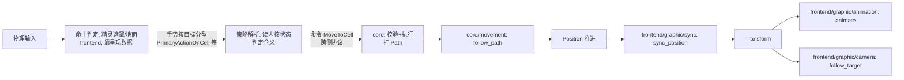

## Context

现状五个域（`map`/`hero`/`movement`/`animation`/`camera`）中，`hero` 与 `map` 把游戏数据、显示数据、输入处理混在同一模块；主角的权威位置只有 `Transform`（世界像素），移动系统直接补间像素；点击系统在自己内部做可通行校验与寻路。动机见 proposal.md - Why。

约束：Bevy 0.19（钉住）；插件三层分类原则（内核是普通模块，可整体替换的实现抽成插件）；域组织规范（侧面子目录、register 约定、归属判定）。

## Goals / Non-Goals

**Goals:**

- core / frontend 两方代码边界；内核不引用界面层具体类型（编译期可验证）。
- 内核以连续格坐标 `Position` 为权威位置；像素换算、Y 翻转、z 层全部归入 frontend。
- 行为与现状逐帧一致：渲染分层、动画帧、移动手感、点击寻路不变。

**Non-Goals:**

- 不交付第二套界面层实现；MUD 文字界面仅作为边界设计的检验参照。
- 不改任何游戏行为、数值与素材。
- 地图数据文件化（后续 change 处理）。

## Decisions

### Decision 1: 两方结构与依赖方向

最初按"内核 + 显示插件 + 输入插件"三方拆分；实现中发现输入对显示的依赖（相机投影、视口、坐标换算、hover）是永久且稠密的——模态与呈现天然成对（触控界面=触控布局+触控输入，键盘光标=光标的渲染与移动），可替换的真实单位是整套玩家界面。故合并为界面层 frontend，内部仍按主题分区。

```mermaid
graph TD
    frontend[frontend/ 界面层插件<br>graphic · input · hud(未来)]
    frontend --> core[core/ 内核]
    core --> nothing[不依赖 frontend]
```

```
src/
├── core/
│   ├── map/        GridMap、TileKind、pathfinding（纯格子语义，无像素概念）
│   ├── hero/       Hero 标记、生成、命令执行
│   ├── movement/   Position、Path、follow_path、step_duration
│   └── system_sets.rs  帧相位标签（协议）
└── frontend/
    ├── graphic/    世界渲染：map（chunks、贴图、地形动画、像素换算）、hero（精灵、帧表）、animation、camera、sync
    ├── input/      输入模态与解析：mouse（未来 touch、keyboard）、gestures、resolve/
    └── hud/        未来 HUD 落位；界面层内部以目录为替换单元
```

回放、AI、无障碍等"只发手势不看画面"的驱动方不是 frontend 的变体——它们直接朝内核协议发手势，合并不影响它们。

### Decision 2: 权威位置为连续格坐标

`core/movement/components/position.rs` 定义 `Position(Vec2)`：1 单位 = 1 格，x = 列、y = 行（向下为正，与地图数组一致）。整数坐标即格中心，`position.round()` 即所在格；非整数坐标只在移动过程中出现，是平滑移动的唯一来源。整数格坐标的词汇类型为 `CellPos`（包 `IVec2` 的 newtype，`core/map/cell_pos.rs`），协议与 API 签名一律用它而不用裸数学向量；`Cell` 一名保留给未来的"格子实体"概念。

- `follow_path` 推进 `Position`，不再触碰 `Transform`；`Path` 的 `step_from`/`step_target` 为格坐标。每步时长模型不变（直走/斜走时长不同、直线速度恒定，还原原版手感——参考 pixel-dungeon `HeroSprite.java` 的移动节奏）。
- `GridMap` 删除像素换算（`cell_center`/`world_to_cell`），只保留格子语义 API（`get`/`walkable`）；格坐标 ↔ 像素的换算函数归 `frontend/graphic/map/utils/coords.rs`。
- `frontend/graphic/sync/systems/sync_position.rs` 每帧把 `Position` 写入 `Transform`：`x = pos.x × TILE_SIZE`，`y = -pos.y × TILE_SIZE`，保留既有 z。不额外取整——连续像素补间与现状逐帧一致（原版 PD 的移动同样是连续像素而非格跳）。
- `animate` 的朝向判断改用格坐标：`Path.step_target` 与 `Position` 的差值符号决定 `flip_x`（参考 bevy `examples/2d/sprite_animation.rs` 的帧动画组织）。

### Decision 3: 输入管道——模态、命中判定、策略解析在 frontend，命令协议在 core

原始输入到游戏动作的链条分四级，前三级在 frontend，第四级在 core：



- **命中判定（frontend）**：原始事实是"点在某个屏幕像素"；像素落在怪物精灵遮罩内还是穿透到地面，只有握着遮罩与遮挡顺序的呈现侧能判（Bevy 0.19 内置像素级精灵拾取：`bevy_sprite` picking backend 逐像素查 alpha）。判定产出**按目标分型的手势**：`PrimaryActionOnCell(CellPos)`，预留 `PrimaryActionOnMonster(Entity)`、`PrimaryActionOnWorldCell(CellPos)`（以 `#[allow(dead_code)]` 标记，表明词族范式）。一种可命中目标一个类型一个文件（`frontend/input/gestures/`），不开 enum。手势是 frontend 内部消息，不跨侧。
- **策略解析（frontend）**：`frontend/input/systems/gestures/` 下一种手势一个 resolver（与 `gestures/` 一一镜像），读手势与内核状态决定含义（点怪物=攻击还是查看，是界面策略）。今天是恒等映射（一切格子手势→`MoveToCell`）；第一个可点怪物出现时新增对应 resolver，并触发 bevy_picking 的引入。三级各有动词：模态 translate（换表示，含义不变）→ resolve（消解歧义）→ core execute（校验+执行）。
- **命令协议（core）**：`MoveToCell(CellPos)` 等具体命令由内核持有（`core/hero/commands/move_to_cell.rs`），收到后校验并执行（不可通行/不可达→不动）。界面层对内核状态只读，一切变更请求经命令消息。回放/AI 驱动方跳过手势层直接发命令。命令是解释完毕的产物（歧义已在界面层解析），沿用 roguelike 传统词汇（ToME/Angband 的 `do_cmd_*`）；与 Bevy 的 `Commands` 系统参数同名但语境不冲突。
- **载荷类型**：格子坐标用 `CellPos`（包 `IVec2` 的 newtype，`core/map/cell_pos.rs`），不用裸数学向量；`Cell` 一名保留给未来"格子实体"概念。模态状态（键盘光标位置）留在模态实现内部，不进协议。
- 与原版 PD 的关系：PD 在输入侧直接产出具体命令（`HeroAction.Move/Attack/PickUp`）；本设计同样把解析放在内核之外，但拆出"命中判定"与"策略解析"两级，模态保持无游戏语义，多模态复用同一解析层。
- **dispatch 与 resolver 的职责判据**（三个判例）：①敌友判断决定命令**种类**（友→`TalkToMonster`、敌→`AttackMonster`）——语义属性，在命令存续期内稳定，归 resolver；②"攻击要先走近"——距离在命令执行期间每步都变，是执行的时序规则，归内核（`AttackMonster` 的执行=追击+攻击，追击不是独立命令）；③MUD 的 `MoveToLeft` 与图形界面的 `PrimaryActionOnCell` 是各界面自己的手势方言，分别解析到同一命令 `MoveToCell`——手势词族按界面生长，命令协议是所有界面的共同语。一句话判据：**命令开始执行后判断依据还会变的，留内核；不会变的，归 resolver**。

### Decision 4: 集合化装配，集合标签归内核持有

装配层若引用具体系统函数，替换任一实现（输入不再是鼠标、呈现没有动画）都要改 main.rs。Bevy 的 `SystemSet` 正是为此设计（官方 `examples/ecs/ecs_guide.rs`）：各方把系统注册进抽象集合标签，装配层只编排标签。

- 三个帧相位标签定义在 `core::system_sets`：`InputSet`（手势翻译）、`GameSet`（内核逻辑）、`RenderSet`（呈现）。它们是跨侧顺序编排的协议，按"内核持有协议"原则归内核；放在装配层会形成双向依赖（装配层引用插件的 register，插件反向引用装配层的标签）。
- 注意标签是帧相位而非侧的私产：frontend 一个插件同时把模态系统放进 `InputSet`（帧首）、渲染系统放进 `RenderSet`（帧尾）。
- 各方 register 自行展开内部顺序：core 内 `(hero::systems::commands::move_to_cell::execute, follow_path).chain().in_set(GameSet)`；frontend 内 graphic 子链 `(attach_appearance, sync_position, animate, follow_target).chain().in_set(RenderSet)`，input 子链 `(mouse::left_click::left_click, gestures::primary_action_on_cell::resolve).chain().in_set(InputSet)`。命名约定：动词在函数位、主语在路径位——命令类型在 `commands/<名>.rs`，执行器在镜像的 `systems/commands/<名>.rs#execute`；手势类型在 `gestures/<名>.rs`，解析器在镜像的 `systems/gestures/<名>.rs#resolve`；消息类型的注册各由 `commands/mod.rs#register`、`gestures/mod.rs#register` 承担。
- main.rs 只剩一句编排：`configure_sets(Update, (InputSet, GameSet, RenderSet).chain())`。

### Decision 5: hero 生成拆为内核生成 + 显示补挂

- `core/hero/entities/hero.rs`（Startup）：spawn `Hero` 标记 + `Position(HERO_START)`。
- `frontend/graphic/hero`：系统查询 `Added<Hero>`，补挂 `Sprite`、`TextureAtlas`、`AnimClips`、`AnimTimer`、`AnimState`、`CameraTarget` 与初始 `Transform`（z = `LAYER_ACTOR`）。显示数据（warrior 12×15 精灵表、tier 0 帧表、IDLE/RUN 帧序列）留在 `frontend/graphic/hero/constants/`，帧表还原原版（参考 pixel-dungeon `HeroSprite.java`：idle 在 0/1 间呼吸，run 循环 2–7）。
- 该模式即"内核生成游戏实体、界面层注册外观"的协议实例，未来怪物等实体沿用。

## Risks / Trade-offs

- [`Position` 与 `Transform` 两份位置可能不一致] → `Transform` 的 x/y 每帧被 `sync_position` 从 `Position` 重写，不再是位置真相来源；z 由显示侧生成时设定并保持。
- [集合内顺序由单方自治，跨侧只有标签级先后] → 跨侧顺序需求只有"输入→内核→呈现"一层；未来出现更细粒度跨侧约束时，在 core::system_sets 增设子标签。
- [目录大规模移动期间编译断点较多] → 一次性迁移，以 `cargo check` 收敛；现有 `grid_map`、`pathfinding` 单元测试保持不变作为回归网。

## Migration Plan

一次性重组：先移 core（纯数据与逻辑，测试先行通过），再移 frontend，最后改装配与集合。验证方式：`cargo test` 全绿 + 运行游戏手动确认点击移动、动画、相机跟随、水面效果与现状一致。无存档与数据迁移。

## Open Questions

- **多视图与小地图**：小地图是独立渲染（自己的 camera 与表示，可能是探开迷雾的示意图）。视图抽象为"屏幕区域 + 屏幕点→目标的换算"，与渲染实现无关；视图多于一个时迁移到 bevy_picking 或手写视口路由，属输入模态内部重构，内核协议不变。点小地图若意为"移动相机"，属呈现侧行为，不产生内核命令。
- **bevy_picking 引入时机**：第一个可点怪物出现时（需要精灵遮罩命中），`mouse/left_click.rs` 的手写换算退役，换成 `Pointer<Click>` 观察者——地面 chunk 观察者发 `PrimaryActionOnCell`，怪物观察者发 `PrimaryActionOnMonster`。手势词族已预留。
- **HUD 落位**：HUD 是界面层内与 graphic、input 并列的目录（`frontend/hud/`）；HUD 的可替换性是明示需求，但替换单元是目录而非插件——整套替换的单位统一为 frontend。
- **输入与呈现的中间层**：视图/HUD 增多后，输入对呈现的接触面应收敛到引擎词汇（`Camera`、`Viewport`、bevy_ui `Interaction`、picking hover 状态），而非 frontend 的私有类型——换掉整套 frontend 时输入的类型依赖不动。
- **模式化输入**：战斗画面等无格子模式，用 Bevy `States` 按模式激活不同的输入模态系统与解析层；新模式 = 新手势类型（如位列目标）+ 新 resolver + 新命令 + 新执行，不修改探索模式的既有代码。
- **格子大小随地图变化**：`TILE_SIZE` 将从常量降级为当前地图呈现资源的字段，coords 换算改读资源；属 frontend 内部变化，内核无感。缩放已由相机投影天然支持，无需改动。
