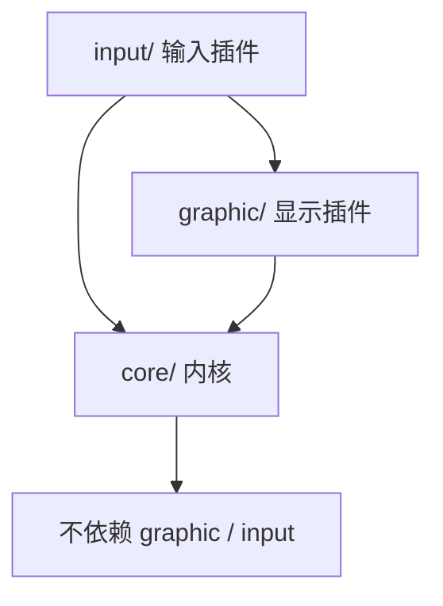
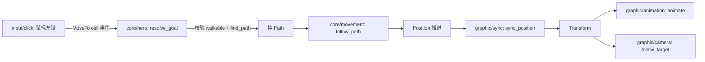

## Context

现状五个域（`map`/`hero`/`movement`/`animation`/`camera`）中，`hero` 与 `map` 把游戏数据、显示数据、输入处理混在同一模块；主角的权威位置只有 `Transform`（世界像素），移动系统直接补间像素；点击系统在自己内部做可通行校验与寻路。动机见 proposal.md - Why。

约束：Bevy 0.19（钉住）；插件三层分类原则（内核是普通模块，可整体替换的实现抽成插件）；域组织规范（侧面子目录、register 约定、归属判定）。

## Goals / Non-Goals

**Goals:**

- core / graphic / input 三方代码边界；内核不引用插件具体类型（编译期可验证）。
- 内核以连续格坐标 `Position` 为权威位置；像素换算、Y 翻转、z 层全部归入 graphic。
- 行为与现状逐帧一致：渲染分层、动画帧、移动手感、点击寻路不变。

**Non-Goals:**

- 不交付第二套显示或输入实现；MUD 文字显示仅作为边界设计的检验参照。
- 不改任何游戏行为、数值与素材。
- 地图数据文件化（后续 change 处理）。

## Decisions

### Decision 1: 三方目录与依赖方向



```
src/
├── core/
│   ├── map/        GridMap、TileKind、pathfinding（纯格子语义，无像素概念）
│   ├── hero/       Hero 标记、生成、目标格寻路
│   └── movement/   Position、Path、follow_path、step_duration
├── graphic/
│   ├── map/        chunk 渲染、贴图重排、地形动画、像素换算
│   ├── hero/       精灵、动画帧表（对 Added<Hero> 补挂显示组件）
│   ├── animation/  AnimState/AnimClips/AnimTimer、animate
│   ├── camera/     MainCamera、CameraTarget、follow_target
│   └── sync/       Position → Transform 同步
└── input/
    └── click/      鼠标点击 → MoveTo 事件
```

`map`、`hero` 横跨两侧，同名共存，靠顶层目录区分。`input` 依赖 `graphic`（相机投影与像素换算，见 Decision 4 的取舍说明）。内核各域沿用裸函数 `register` 约定；graphic、input 各有一个总 register 调用子域 register。

### Decision 2: 权威位置为连续格坐标

`core/movement/components/position.rs` 定义 `Position(Vec2)`：1 单位 = 1 格，x = 列、y = 行（向下为正，与地图数组一致）。整数坐标即格中心，`position.round()` 即所在格；非整数坐标只在移动过程中出现，是平滑移动的唯一来源。

- `follow_path` 推进 `Position`，不再触碰 `Transform`；`Path` 的 `step_from`/`step_target` 改为格坐标。每步时长模型不变（直走/斜走时长不同、直线速度恒定，还原原版手感——参考 pixel-dungeon `HeroSprite.java` 的移动节奏）。
- `GridMap` 删除像素换算（`cell_center`/`world_to_cell`），只保留格子语义 API（`get`/`walkable`）；格坐标 ↔ 像素的换算函数归入 `graphic/map/utils/`。
- `graphic/sync/systems/sync_position.rs` 每帧把 `Position` 写入 `Transform`：`x = pos.x × TILE_SIZE`，`y = -pos.y × TILE_SIZE`，保留既有 z。不额外取整——连续像素补间与现状逐帧一致（原版 PD 的移动同样是连续像素而非格跳）。
- `animate` 的朝向判断改用格坐标：`Path.step_target` 与 `Position` 的差值符号决定 `flip_x`（参考 bevy `examples/2d/sprite_animation.rs` 的帧动画组织，翻转逻辑现状已有）。

### Decision 3: 输入意图为事件，校验回归内核



- 新增事件 `MoveTo(IVec2)`（目标格）。事件是跨侧协议数据类型，由内核持有；域组织规范没有 events 侧面，本次扩展一个 `events/` 侧面，落 `core/hero/events/move_to.rs`。
- `input/click`：左键 → `viewport_to_world`（查询 graphic/camera 的 `MainCamera`，参考 bevy `examples/2d/2d_viewport_to_world.rs`）→ 像素换算为格 → 发 `MoveTo`。
- `core/hero/systems/resolve_goal.rs`：读 `MoveTo` → `walkable` 校验 → `find_path` → 挂 `Path`。可通行校验从输入侧回归内核，"点击不可通行格不产生移动"的行为不变。

### Decision 4: input 直接依赖 graphic（经确认的取舍）

点击换算需要相机投影，方案备选是内核持有 `CellPicker` trait、graphic 注册实现。采用更简单的直接依赖：input 查询 graphic 的相机组件与换算函数。代价是换 MUD 文字显示（无相机）时 input 需配套替换——实际上文字显示的输入本来就不是屏幕指向，配套替换是合理代价。内核协议不因此沾染显示概念。

### Decision 5: hero 生成拆为内核生成 + 显示补挂

- `core/hero/entities/hero.rs`（Startup）：spawn `Hero` 标记 + `Position(HERO_START)`。
- `graphic/hero`：系统查询 `Added<Hero>`，补挂 `Sprite`、`TextureAtlas`、`AnimClips`、`AnimTimer`、`AnimState`、`CameraTarget` 与初始 `Transform`（z = `LAYER_ACTOR`）。显示数据（warrior 12×15 精灵表、tier 0 帧表、IDLE/RUN 帧序列）留在 `graphic/hero/constants/`，帧表还原原版（参考 pixel-dungeon `HeroSprite.java`：idle 在 0/1 间呼吸，run 循环 2–7）。
- 该模式即"内核生成游戏实体、显示插件注册外观"的协议实例，未来怪物等实体沿用。

### Decision 6: 装配与执行顺序

`main.rs` 装配：DefaultPlugins → core 各域 register → graphic register → input register，以及跨域执行链：

```
input::click → core::resolve_goal → core::follow_path
→ graphic::sync_position → graphic::animate → graphic::follow_target
```

`resolve_goal` 消费本帧的 `MoveTo` 事件，`sync_position` 在 `follow_path` 之后、`animate`/相机之前，保证显示侧每帧读到最新位置。

## Risks / Trade-offs

- [input 依赖 graphic：换成无相机的显示实现时 input 需配套替换] → 取舍已经确认（Decision 4）；input 对 graphic 的依赖收敛为相机组件与一个换算函数两个接触点。
- [`Position` 与 `Transform` 两份位置可能不一致] → `Transform` 的 x/y 每帧被 `sync_position` 从 `Position` 重写，不再是位置真相来源；z 由显示侧生成时设定并保持。
- [`Added<Hero>` 补挂若排在渲染之后会出现首帧裸实体] → Startup 生成与首帧 Update 之间不发生渲染，且执行链显式编排，无可见问题。
- [目录大规模移动期间编译断点较多] → 一次性迁移，以 `cargo check` 收敛；现有 `grid_map`、`pathfinding` 单元测试保持不变作为回归网。

## Migration Plan

一次性重组：先移 core（纯数据与逻辑，测试先行通过），再移 graphic 与 input，最后改装配与执行链。验证方式：`cargo test` 全绿 + 运行游戏手动确认点击移动、动画、相机跟随、水面效果与现状一致。无存档与数据迁移。
