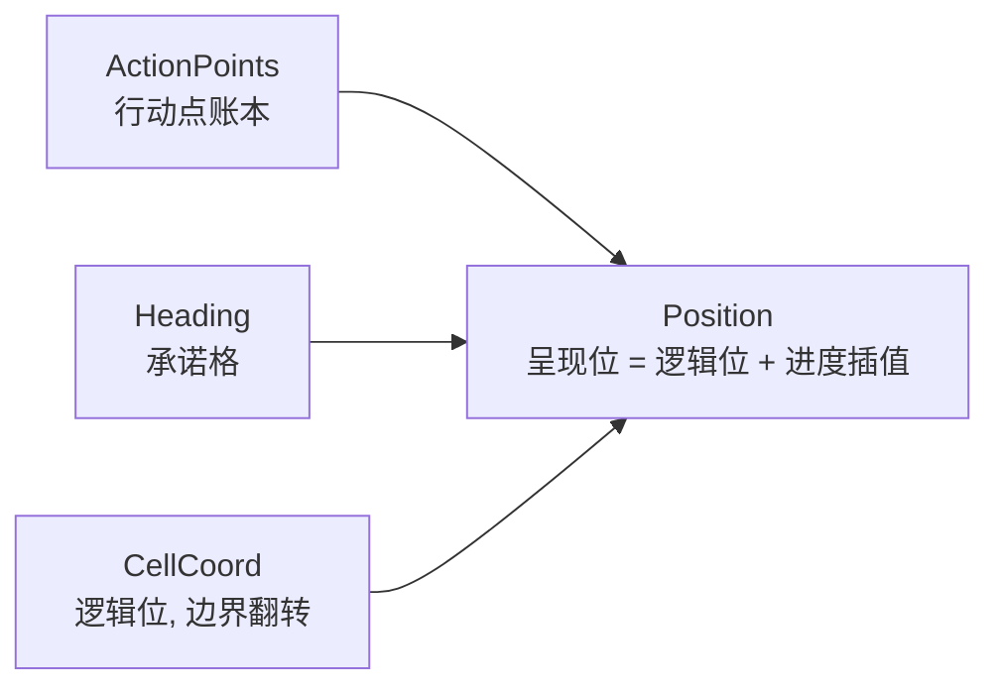
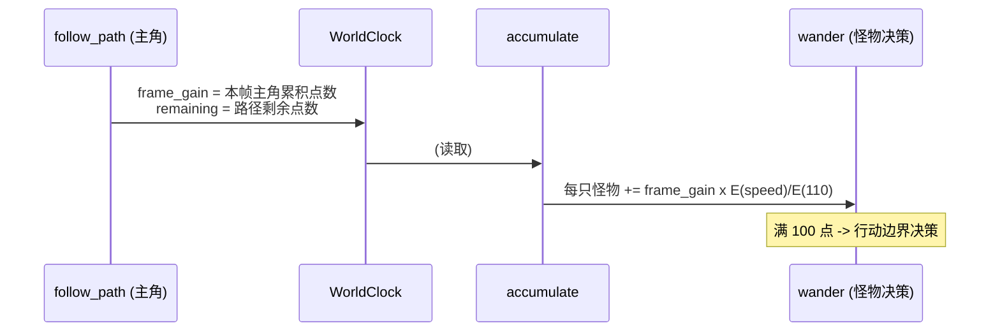
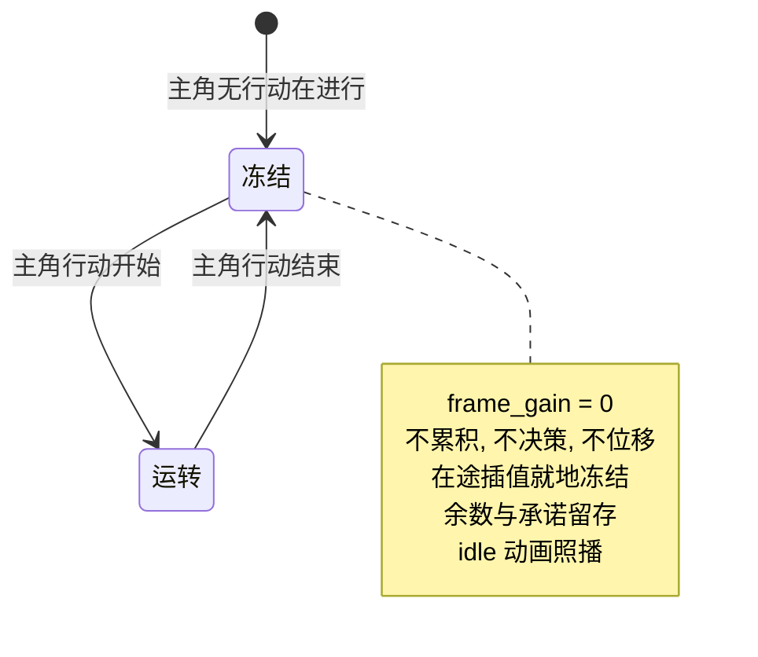

# Design: world-clock

## Context

现状骨架与约束（动机见 proposal.md）：

- `follow_path`（src/core/movement/systems/follow_path.rs）：主角的步进由帧 delta 累积驱动，位置即累积进度的插值；逻辑位在步完成时翻转。
- `core/mod.rs`：`CorePhase` 链（`GameLoop::Core` 集合内）；排序与门控只在各根模块。
- 怪物出生携带 `(MonsterIndex, RaceIndex, Speed, ActionPoints, CellCoord, Position)`。

关键参考事实：

| 事实 | 出处 |
|---|---|
| 行动点速率表 `extract_energy[300]`：110 = 标准 10 点/tick，高速饱和 49 | tome2 `src/tables.c:1124` |
| 玩家每 tick 累积、满 100 行动 | tome2 `src/dungeon.c:4752`, `4836` |
| 怪物同款累积/行动/扣 100 | tome2 `src/melee2.c:7718-7728` |
| 移动八方向消耗相等 100 | tome2 `src/cmd1.c:4672` |
| 行动点留存即 delay 留存 | PD `src/com/watabou/pixeldungeon/actors/Actor.java:38-46` |
| 移动 tween 每格固定 0.1s、方向无关；多动合并为一次滑动 | PD `src/com/watabou/pixeldungeon/sprites/CharSprite.java:53,136-141` |
| 老鼠携带 `RAND_25` 旗标 | tome2 `lib/edit/r_info.txt` N:86 |

**实施中途的模型切换**：第一版按"行动触发 tween"实现（怪物满 100 行动一次、发一格 tween）。2.5 倍速实测暴露失控积压（tween 在帧边界重对齐，每批丢零头）与逻辑位双写。遂按用户提出的模型重写：位置是行动点账本的纯函数——不另起动画时钟，漂移在构造上不存在。

## Goals / Non-Goals

**Goals:**

- 门控世界时钟：主角驱动、冻结语义、行动点模型。
- 相对速度关系与 tome2 逐项一致，可测：主角每格，速度 s 的怪物累积 E(s)×10 点。
- 主角平滑度由结构保证：主角步进不读任何怪物状态。
- 逻辑位置始终整格；主角路径走完时怪物停在整格上。
- 帧率抖动、速度中途变化不引入累积误差。

**Non-Goals:**

- 显式"等待"动作、战斗、追击 AI、主角速度词表字段、NPC。
- 主角逻辑位翻转到步开始的 PD 式时序（战斗立项时按判定需求定）。

## Decisions

### D1 行动点账本与速率表

行动点连续累积（f32），每满 100 点为一个行动边界，跨越时扣除 100、余数留存。速率表为 tome2 `extract_energy[300]` 原表（`constants/action_point_rate.rs`），词表 speed 直写原值（110 = 标准）。行动消耗恒为 100，速度只影响累积速率。

浮点精度论证：行动点恒低于 200（边界即扣），f32 在该量级的误差远低于任何可见单位；账目不设上限累加的部分不存在——跨越即扣。

### D2 位置是行动点账本的纯函数

一切生物的呈现位置由账本推导，不另起动画时钟：



- 怪物持有 `Heading`（承诺格）：决策时设置，到达时清除。`interpolate` 系统（`CorePhase::Present`）每帧把 `Position` 写为 `逻辑位 + (点数/100) × 方向`。
- 逻辑位 `CellCoord` 只在行动边界翻转，一切判定只读它。
- 主角不挂行动点组件：其 `follow_path` 步进度本身就是同一公式（步进度 ≡ 点数/100）。
- 参考：PD `Char.pos`（整格）+ sprite 双层；本设计进一步——连 sprite 都是账本的读出。

**单一推导**：`Position` 对怪物只有 `interpolate` 一个写入方，对主角只有 `follow_path` 一个写入方。第一版的失控正源于 tween 自带时钟与账本各走各的。

### D3 主角驱动与同步累积



- `follow_path` 对带 `ClockDriver` 的实体（主角）发布每帧累积量与路径剩余量。
- `accumulate`（`CorePhase::Settle`）按速率比值同步累积到每只怪物。帧率抖动只改变单帧累积量，不改变总量——平滑度由构造保证。
- 斜走与直走消耗相等：主角斜走一步真实时长 ×√2 但点数同为 100，世界按点数同步，自动满足 tome2 同价语义。
- 主角速度中途变化（未来的 slow/haste）：`follow_path` 逐帧重算步时长，累积斜率即帧即变，账目无误差。

### D4 冻结语义



- 主角无 `Path` → 该帧 `frame_gain = 0` → 世界零累积。冻结是账本的冻结，位置由账本推导，自然就地冻结。
- 冻结帧可能停在两格之间——读作暂停帧；D5 的预判保证主角路径走完这种正常冻结永远落在整格上。
- 门控源结构预留多源（长动作、麻痹等受迫耗时都是"主角在累积"），v1 只有移动。

### D5 行动边界决策与预判

怪物在每满 100 点的边界：先完成当前承诺（逻辑位翻转），再决策下一行动——RAND_25：25% 随机方向（可通行邻格均匀），75% 原地不动；行动点消耗与是否移动无关（tome2 原样，撞墙耗一次行动）。

预判公式：

```
可走完 = 主角剩余点数(remaining) x E(speed)/E(110) >= 100 - 余数
```

不满足则不发起位移。效果：主角路径走完时，所有怪物停在整格上，只持有余数。边界情况：主角中途改目标会打乱预判，怪物可能冻在半格——呈现层瞬间，可接受。

### D6 第一版机制的删除清单

| 机制 | 删除原因 |
|---|---|
| 行动触发 tween（一格一 Path） | 动画自带时钟，与账本各走各的 |
| 连动批量（一次行动完多次） | 补帧量化零头的丁，新模型不需要 |
| `TweenResidual` 零头结转 | 同上 |
| `constant_cell_time` | 同上 |
| `StepCompleted` 消息 + `credit` 按步分发 | 被每帧同步累积取代 |
| "动画没完不发新行动" | 没有独立动画了，无需纪律 |

教训：呈现层一旦允许走自己的钟，就要不断打补丁追平账本；位置直接从账本推导则一劳永逸。

### D7 域落位与编排

```
src/core/time/
  constants/    action_point_rate.rs   速率表原表 (300 项)
  components/   action_points.rs       行动点账本 (f32)
                speed.rs               速率 (词表解析入组件)
                clock_driver.rs        时钟驱动者标记 (协议组件)
  resources/    world_clock.rs         帧进度 + 剩余量
  systems/      accumulate.rs          按比值同步累积
src/core/movement/
  components/   cell_coord.rs          逻辑位 (自 map/types 挪入)
                heading.rs             承诺格
                path.rs / position.rs  主角路径 / 呈现位
  systems/      follow_path.rs         主角步进 + 发布世界时钟
                interpolate.rs         怪物呈现位推导
src/core/monster/
  systems/      wander.rs              RAND_25 边界决策 + 预判
src/core/random/
  resources/    random_source.rs       可种子化随机流
```

编排（只在 core 根模块）：`CorePhase` 链扩为 `Sense → Plan → Act → Settle → React → Present`——Act 步进（follow_path），Settle 累积（accumulate），React 决策（wander），Present 推导呈现位（interpolate）。

### D8 终局数据模型方向（记录）

race/class/monster 三表字段对齐 tome2：

| 我们的表 | 对齐 | 字段（终局） |
|---|---|---|
| race.ron | player_race（types.h:1133） | id + 物种修正：六维/技能/生命骰/抗性（全可选；怪物家族长期零修正） |
| class.ron | player_class（types.h:1329） | id + 六维/技能/成长修正、生命骰、法术参数 |
| monster.ron | r_info | id + kind 数值束：speed/hp骰/AC/攻击/旗标/经验/深度/掉落 + race + 可选 class/unique |

取值规则：终值 = kind 束 + race 修正 + class 修正，出生期合成后解析入组件。词表层不对称（玩家六维 vs 怪物 kind 束），运行期组件对称。race 词表是否按玩家/怪物拆分已登记 OPEN_ISSUES #2，角色属性体系立项时裁决。

## Risks / Trade-offs

- 主角中途改目标会打乱预判，怪物可能冻在半格 → 呈现层瞬间，主角再动即续上；正常游玩极少触发。
- 行动点用 f32：理论上长会话有浮点误差 → 账本恒低于 200（边界即扣），误差远低于可见单位。
- 冻结帧停在半格的观感（主角中断时） → 读作暂停帧；若将来不可接受，再议"冻结时插值归零"的呈现规则。

## Open Questions

- 主角逻辑位翻转到步开始（PD 原样）与否——战斗立项时按判定需求定。
- 长动作（祈祷类）的剩余量发布方式：同一 `remaining` 公式扩展，立项时定。
